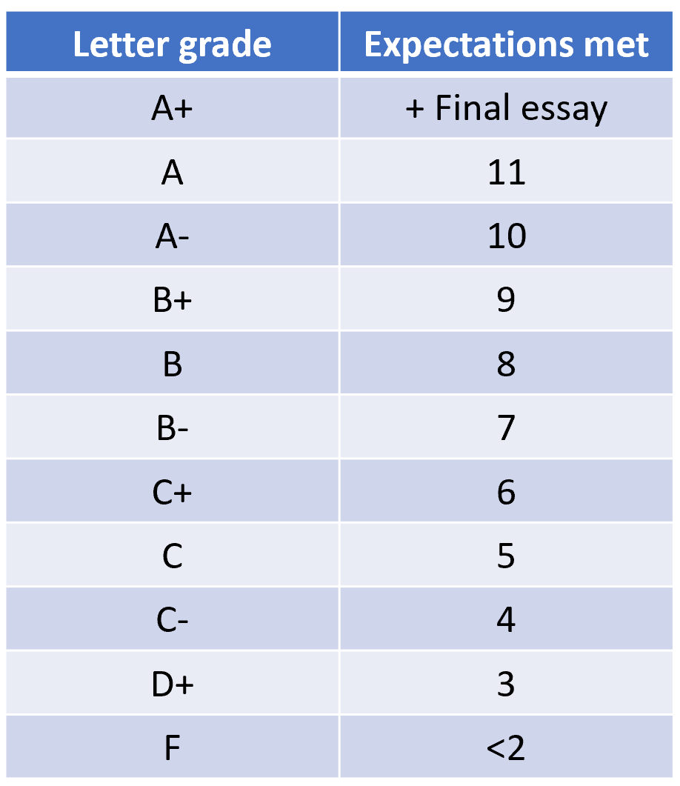

# Class expectations {-}

This will be an inherently difficult class, given the mathematical nature of its content and the disparity in skills among students. However, the course is set such that I assume no basic prior understanding of programs, nor major mathematical skills.

This is an introductory, not advanced, class on stats. In general, I expect that at the end of the class you can design an experiment, collect, handle and analyze your data; oh, and do professional plots. Primarily using R. 

Next, I outlined the specific expectations. If you can already meet these expectations, this class then will be too basic for you, and you probably will benefit of a more advanced course. If not, then this class is for you, and I will help you meet this standards.

### 1. Scientific method {-}
It is expected that when faced with a problem, you can design a robust experiment to solve or identify the given problem. 

This includes identifying dependent and independent variables,provide proper treatments and controls,  collect data, know about replication, independence, etc.

### 2. Data manipulation {-}
You will know basic methods to load or create databases in R, plus basic functions to manipulate data, like sorting, filtering, merging, pivoting, etc.

### 3. Data display {-}
You will know how to do publication quality plots. Basic plots like scatterplot, histogram, boxplot, and maps.

### 4. Descriptive stats {-}
You will know how to calculate basic metrics of central tendency and variability in your data.

### 5. Correlation {-}
You will know how to run and interpret the results of a correlation analysis.

### 6. Regression {-}
You will know how to run and interpret the results of a regression analysis.

### 7. Hyphothesis testing {-}

You will know how to: State hypotheses, 

### 8. One sample test {-}

Run a one sample test using the Z-Score and the T-score, 

### 9. Two sample test {-}

Run a two sample test using the Z-Score and the T-score, 

### 10. More than two sample test {-}

Run an ANOVA, 

Run a post-hoc test, 

Test for assumptions (outliers, normality, homogeneity of variances).

## Grading {-}
Grading in this class is not a subjective matter. At the end of this class, you should be able to look back at your work and assess the number of expectations that you meet to satisfaction. 

By satisfaction, I mean you should be able to answer any question as it relates to the 10 expectations above, as well as to apply any learned statistical method to different versions of related problems.

The number of expectations that you satisfy are proportional to your expected grade. 

To give extra reward to  students that  followed the instructions at the start of the class, collected data methodically and analyzed them at the end, doing the final essay adds 10% to your grade. 

Only those that deliver the final essay in addition to meeting all 10 expectations will earn an A+. The table below indicates the expected grade for given number of expectations:


```{r, out.width = "70%", echo= FALSE, fig.align = 'center',fig.cap = 'Grading and expectations'}

```

For you to make a self-assessment, I suggest you review each final homework on each chapter. If you feel confident to defend the work you did, not simply copying and pasting, but knowing what each line of code does, then you should assume you dominate to satisfaction the given expectation.

Please formulate questions for each expectation, and answer them your self. A question, I may ask to confirm that you meet an expectation, could be as simple as "tell me why you know this topic"?. In this case, you can formulate questions and answer them.

At the end of the class, I will ask you what grade do you think you deserve, and which topics you do not want me to ask you about. I will simply ask random questions about the topics you claim you know to confirm that your requested grade is legit, and that will be your grade.

Depending on the time left in the class, you will be able to take your assessment test several times. 

As much as you are worry about a grade, my worry is to ensure that you walk away from this class knowing what we planned to learn at the start. So I want you to study and try as many times as we can for you to get the best grade you deserve.

I have to disclaim that, in my teaching philosophy, grading is not  among my ultimate expectations but rather knowing that you learned the content of this class. 

I am confident that in 10 years time you will not remember the grade you got in this class, but you may well remember the methods you learned, may be even have a dream job in which the skills from this class are helping you, and hopefully you will remember that professor Mora challenged you to be the best of you.


