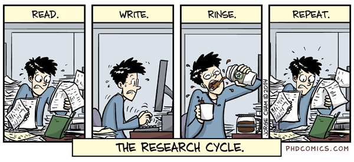

# The scientific method

```{r, out.width = "50%", echo= FALSE, fig.align = 'center',fig.cap = 'Knowledge and ignorance'}
knitr::include_graphics("images/calvin-and-hobbes-on-ignorance.gif")
```

The scientific method is an approach by which **robust** knowledge is acquired. The approach can be applied to diverse situations, not only science.

You probably learned about the scientific method in the third or fourth grade, but I like to refresh the general concepts as I commonly see students formulating experiments for which there is not clear question, doing analyzes whose results will not answer the question, etc.

Knowing the exact protocol of how to go from question to answer will avoid you wasting time into what I call rabbit holes; basically, a lot of effort put into work that does not help the ultimate goal you proposedd.

## The problem {-}

The first step in the scientific method is when you observe a problem. However, defining a problem is not as trivial as you may think. 

There is some complexity to the process between the first time you observed a problem to the time you specifically define the problem you want to solve with the scientific method.

Let's use a real case example. 

Let's assume that you just joined one of the many organizations in Hawaii interested in land restoration.

```{r, out.width = "100%", echo= FALSE, fig.align = 'center',fig.cap = 'Carbon Neutrality Project'}
knitr::include_graphics("images/LandRestoration.jpg")
```

One of the first observations you will make is that the speed at which we cut down trees is much faster than the speed at which we plant trees. As a matter of fact, in Honolulu, we cut down over 15,000 trees a year, but only about 4,000 thousand trees are planted.

```{r, out.width = "100%", echo= FALSE, fig.align = 'center',fig.cap = 'Invasive Guava forrest in Hawaii'}
knitr::include_graphics("images/GuavaForrest.jpg")
```

A second observation you would likely make is that we are loosing land to many introduced species like guava, halekoa, albizia, several grazes, etc. Those species are very aggressive and are secluding/pushing to the brick native species. 

With those observations in mind, your first likely question is how do you make the approach of land restoration more efficient? 


### Narrow the problem {-}

That simple question of how to make restoration more efficient can take you into tens of different pathways, which again, brings into attention the importance of keeping focus and methodic.

Lets assume that you choose to focus on the production of seedlings, as many seedlings die after planting and they are not cheap.

```{r, out.width = "100%", echo= FALSE, fig.align = 'center',fig.cap = 'A few problems with seedling production'}
knitr::include_graphics("images/Seedlings.jpg")
```


### Search prior knowledge {-}

The second step in the scientific method is to find out what has been already done about this problem.

You need to collect information to better define what the problem is. Do not start working on the first idea that occurs to you. May be some else thought of your idea already, may be there are better ideas, may be other ideas give you an even better idea.

Ultimately, you should not risk getting into a rabbit hole other people already checked for you, or worse off reinventing the wheal.

```{r, out.width = "100%", echo= FALSE, fig.align = 'center',fig.cap = 'Search information'}
knitr::include_graphics("images/LiteratureReview.png")
```

Searching for prior knowledge can be done in different ways.

You can start with a general [Google](https://google.com "Googles's Homepage") search. In the example about restoration, you can ask a simple question like "why seedling mortality is so high". Ask questions like you will ask to a person. The more specific you get the better. 

Because most information in the web likely has been collected without using the scientific method, you should be cautious when using such information. The reason to consider the web as a general source of information is that it contains the cumulative experiences of millions of people, which bring me to another source of information, which is gaining from the expertise of other people. Find people working on your problem, and ask the same questions you asked in Google.

Upon gathering prior knowledge in the form of experiences via webpages or interviews, you need to scale up the quality of information you search for using [Google Scholar](https://scholar.google.com/ "Scholar's Homepage"). 

```{r, out.width = "100%", echo= FALSE, fig.align = 'center',fig.cap = 'Scholar Page'}
knitr::include_graphics("images/Scholar.png")
```


[Google Scholar](https://scholar.google.com/ "Scholar's Homepage") is a search engine of scientific publications. There are many other databases you can use to look for papers like [PubMed](https://pubmed.ncbi.nlm.nih.gov/ "PubMed's Homepage") and [Jstor](https://www.jstor.org/ "Jstor's Homepage"), but Scholar alone will likely be enough. Several studies have shown that almost any search in Scholar returns the same papers as searches in more specific databases.


```{r, out.width = "100%", echo= FALSE, fig.align = 'center',fig.cap = 'PDFs in Scholar'}
knitr::include_graphics("images/ScholarPDF.png")
```

While those databases may give you the title and summary of the paper (i.e., so call citation), finding the full paper is another deal.

When freely available in the web, Google Scholar will provide the PDF of papers in the hyperlink highlighted with the red square in the figure above. 

If you have an email student account, you can also try to get the PDF via your local library, which link is provided besides each citation in Google Scholar (green square in figure above). These links are only available when you do the search within your university's network.

You can also click on the "All versions" tab (Highlighted with the red arrow in the image above); commonly there are PDFs there as well. 

If you are not in a rush, you can click on the citation, which will take you to the web-page of the journal, get the email address of the author and send that person a message asking for the PDF. 

There is also a web page commonly shared among students called [Sci-Hub](https://sci-hub.se/ "Sci-Hub"), which contains PDFs of almost any paper. There is another one that provides books [Z-Library](https://z-lib.org/ "Z-Library"). I am not familiar with the legality of these projects, but you should be aware they exists. You can read about Sci-Hub  [Here](https://en.wikipedia.org/wiki/Sci-Hub "Sci-Hub"), and about Z-Library [Here](https://en.wikipedia.org/wiki/Z-Library "Z-Library").

Again, it is very important that you know your sources of information. And apply common sense, when you use such information.


```{block2, type='rmdexercise'}
Please do the following exercise:

Using the words "How many species are there on Earth", do a search in [Google](https://google.com "Googles's Homepage") and in [Google Scholar](https://scholar.google.com/ "Scholar's Homepage"). 

Check out the first ten citations on each search.

1) What differences do you see? 
2) What are the social implications of these differences?
```

Obviously, after you find the PDFs of papers, you have to read them. Some papers may provide new citations for you to look for.

The step of information/literature search should be taken with much seriousness. You really want to be sure you know well what is already known out there; You need to become an expert on whatever is that you want to work on. Having a good understanding of the prior cumulative knowledge will allow you to quickly judge if something is worth working on or not. It will also give you ideas into how to do or not to do things.


Pasteur famously said, “chance only favours the prepared mind”. Given what I told you about him, why do you think it is important, then, to know the literature well?

```{r, out.width = "100%", echo= FALSE, fig.align = 'center',fig.cap = 'An information search is demanding, if done well'}

```


### Back to defining the problem  {-}

After the non-trivial exercise of looking for prior information, you should probable go back to re-defining what the problem is, being as specific as you can.

If you were to actually replicate the example before about forest restoration, you will find that one, among many problems, with seedlings is that you probably want healthy seedlings grown at the nursery to maximize survival after planting. 

Having seedlings growing fast can also reduce the time they spend in the nursery reducing overhead costs. Tall and healthy seedlings can better cope with the stress after planting, and escape above and below ground competition with weeds.

You would probably also found that water and food (in the form of nutrients) is critical to making seedlings grow faster and healthier. If you did a good information search, certainly, you also found out about the importance of soil microbes, specifically Mycorrhizae.


```{r, out.width = "100%", echo= FALSE, fig.align = 'center',fig.cap = 'Mycorrhizae in roots'}

```

[Mycorrhizae](https://en.wikipedia.org/wiki/Mycorrhiza) is a group of species of fungi that finds home on the roots of trees, creating mutualistic relationships with the tree. They break down organic matter and nitrogen compounds that can be adsorbed faster by the seedling. 

At this point, it will likely become clear that an obvious question to ask is if this Mycorrhizae has any effect on your seedlings.


## The hyphotesis {-}
```{r, out.width = "100%", echo= FALSE, fig.align = 'center',fig.cap = 'The hyphotesis'}
knitr::include_graphics("images/phd021414s.gif")
```

=o

The third step in the scientific method for solving a problem is to define the hypothesis.

Once you have a clear question, and you are relatively certain that no one has asked the question before, or answer it insufficiently, you should move to the next phase of the scientific method, which is to formulate your question more specifically.  It could be as simple as:

**Does Mycorrhizae increase the body size of plants?**


For the purpose of the scientific method you need to be very specific in what you want to study. See for instance, how the question is explicit about fungi, affecting specifically the body size of plants. There are a few other nuances about formulating a question, that we will talk about when we deal with designing the experiment.


You could also reformulate your very specific question in the form of an hypothesis, like:


**Mycorrhizae has a significant positive effect on the body size of plants**


You should now note in the hypothesis version of the question that you now include an expectation that the effect will be positive. The other addition in the hypothesis is the word "significant", meaning that any effect you find is "considerably" larger than the effect you would find if you were not to use Mycorrhizae.

Mathematically, the hypothesis has to be defined between two alternatives you can choose from: 1) the "Null hypothesis" and 2) the "Alternative hypothesis".

### The null hypothesis *H0*  {-}
The null hypothesis is denoted by the symbol *H0*. It commonly  represents a statement of “no effect,” “no difference”.

In the restoration example,

*H0* is Mycorrhizae has no significant effect on the body size of plants

### The alternate hypothesis *H1*  {-}
The alternate hypothesis is denoted by the symbol *H1*. It commonly represents any hypothesis that differs from the null hypothesis. It should be defined in such a way to be accepted only when the null hypothesis is rejected.

In the restoration example,

*H1* is Mycorrhizae has a positive significant effect on the body size of plants.


## The experiment {-}
The process of developing an experiment to answer a question or test a hypothesis is called "Experimental Design", and it is full of nuances (commonly called "demonic intrusions") that could render your entire work meaningless, so designing a good experiment is critical to obtain robust data.

Before we design an experiment, it is important to know several terms.


k

### Population, sample, subject  {-}
Three important terms for you to know in experimental design are the subject/individual, the sample and the population.

Population refers to every individual of interest. The sample refers to only some of the individuals of interest. When you quantify a given variable in an entire population that is called a *census*. Any statistic based on an entire population is called "point stimate".

Drag terms where you think they belong.

<div id="h5p-container-7"></div> 
<script>
  (function() {
    let h5pContainer = document.getElementById("h5p-container-7"); 
    let h5pJsonPath = 'H5P_Unzip/07_terms-7'; 

    if (!document.getElementById('h5p-bundle-js')) {
      let script = document.createElement('script');
      script.id = 'h5p-bundle-js';
      script.src = 'libs/h5p/main.bundle.js';
      h5pContainer.parentNode.insertBefore(script, h5pContainer.nextSibling);
    }

    window.addEventListener("load", function() {
      const options = {
        h5pJsonPath: h5pJsonPath,
        frameJs: 'libs/h5p/frame.bundle.js',
        frameCss: 'libs/h5p/styles/h5p.css',
      }
      new H5PStandalone.H5P(h5pContainer, options);
    });
  }) ();
</script>


You need to appreciate that statistics from the samples can vary from sample to sample, whereas statistics from the population are fixed for the given population. For instance, in the figure above, yellow birds represent 1 out of ten birds (i.e., 10% of the sample) in the sample outlined with a solid line. Yet in another sample (outlined with a dotted purple line), out of ten individuals there are two yellow birds (i.e., 20%).

It is important that you appreciate the differences between the sample and the population, because at times those differences is exactly what you want to measure and test. Say you know that the average heart rate of people is 80 beats per minute but yours is 90 beats per minute. Is your rate significantly higher that it is expected?
In this case, you can compare your hearths rate to that of the average population. 
Later on we will study how to test this mathematically.


### Variables  {-}

In experimental design, the word "Variables" can mean several things, so it is important to be specific. 

**The dependent  variable**
The dependent  variable, for instance, is a characteristic of the individual to be measured or observed. This is also called the "response variable". In other words, the dependent  variable is the attribute of the system you will expect to change, and which you plan to measure.  In the case of the restoration hypothesis, it will be the "body size" of the plants.

**The independent  variable**
The independent variable is what we will manipulate in the experiment. It can also be called a factor. In the case of the restoration hypothesis, it will be the presence or absence of Mycorrhizae. You can also use different concentrations of Mycorrhiza. Collectively, all the concentrations would be called the independent  variable, and each concentration could be call a "level". Each likely level in the independent variable can also be called a treatment.

**Quantitative variable**
Variables are also used when referring to the type of data you collect. If what you measure in the individuals is numerical (i.e., it can be measured with numbers, for instance, height or weight), it will be called a quantitative variable.

**Qualitative variable**
A qualitative variable describes an individual by placing the individual into a category or group (for instance, male or female).


### The control and treatment {-}


```{r, out.width = "80%", echo= FALSE, fig.align = 'center',fig.cap = 'The population'}
knitr::include_graphics("images/control.jpg")
```


In experimental design, when testing the effects of a given independent variable, it is important to see what happens to individuals in the absence of the effect of such an independent variable. 

Individuals in the group that are not subject to the independent variable are called collectively the "control" group. The groups created by individuals that are exposed to the independent variable are collectively called a "treatment" group.

Any difference in the response variable between the control and the treatment will be attributed to the independent variable. 

Say that individuals in the control group were on average 100g, while those on a given treatment were 120g. 

From this comparison, you can see that the treatment created a 20% increase in weight. 

Of course, not all individuals will have exactly the same weight (the so-call variability), and later on, we will see how to use that variability with statistical methods to determine if such a different is statistically significant or not. 


### Replication  {-}
In experimental design, replication refers to the number of independent individuals in a control or treatment upon which you test your hypothesis. Replication is a critical element in experimental design because it determines the robustness of your conclusion. 

Drag terms where you think they belong.


<div id="h5p-container-8"></div> 
<script>
  (function() {
    let h5pContainer = document.getElementById("h5p-container-8"); // div tag ID
    let h5pJsonPath = 'H5P_Unzip/08_experiment-8'; // YOUR H5P FILE (THIS IS A FOLDER PATH)

    if (!document.getElementById('h5p-bundle-js')) {
      let script = document.createElement('script');
      script.id = 'h5p-bundle-js';
      script.src = 'libs/h5p/main.bundle.js';
      h5pContainer.parentNode.insertBefore(script, h5pContainer.nextSibling);
    }

    window.addEventListener("load", function() {
      const options = {
        h5pJsonPath: h5pJsonPath,
        frameJs: 'libs/h5p/frame.bundle.js',
        frameCss: 'libs/h5p/styles/h5p.css',
      }
      new H5PStandalone.H5P(h5pContainer, options);
    });
  }) ();
</script>


h

In almost any experiment there will be random variation in the response.  Thus, an observed difference between the control and treatments could be mistakenly attributed to a cause-and-effect relationship when the source of the difference may just be random variation.  In short, the difference may simply be due to the noise rather than the signal.  This type of error is affected considerably by the amount of replication you have.

Let's use an example. If nothing is wrong with a coin, you know that the probably of head or tail is the same at 50%. However, if you test this hypothesis with one replicate, let's say it landed in tails, then you will conclude that tails occur 100% of the times. 

If you try for a second time, and lands on tails again, your conclusion remains the same. If it is heads, now you have to change your conclusion as now either side has a 50% change. 

Let's say you try again, and regardless of where it lands, your probability for either side of the coin now changed to 75%. 

You can continue doing this over numerous trials, and eventually the probability will rest at about 50% for either side of the coin, again if nothing is wrong with the coin.

From the example above, you can see how reduced replication can lead to variation in the conclusions.


Let's review the effect of replication mathematically in an exercise, in which I measured the weight of all 1000 seedlings in my nursery. In this case, I have done a census as I measured every single individual. I plotted the number of seedlings at each weight, obtaining the following figure:


```{r chunk-label, echo = FALSE}
Population=rnorm(n=1000,mean=100,sd =10)  # 1000 individuals
MeanPopulation=mean(Population)
hist(Population,main="",xlab="Weight seedlings (g)",ylab="Number of seeldings")
##abline(v=100, col="red",lwd = 3)
```

The average weight of individuals in my population was `r round (MeanPopulation,2)`


Now let's see what will happen when I take samples of different sizes from that population.

```{r, echo = FALSE}
SampleSize=seq(100, 1000, by=100)
Results=data.frame()
for (i in SampleSize){
  for (trial in 1){#take 100 random samples from the population
    Sample=sample(Population, size=i)  # 1000 individuals
    MeanSample=mean(Sample) 
    Merge=c(x=i,y=MeanSample)
    Results=rbind(Results,Merge)
}
}
colnames(Results)=c("x","y")
plot(col="blue",Results$y~Results$x,xlab="Sample size (Number of seedlings)",ylab="Average weight of sample (g)")

abline(h=MeanPopulation, col="red",lwd = 3)
```

In the figure above, each point is the average of a sample with the number of individuals shown in the x-axis. The red line is the true average of the population.

From the figure above, you can see how samples with fewer number of replicated individuals have much larger variability in the mean weight than samples with more individuals. 

Basically, the variability in the samples reduces as I increase the size of replicated individuals. If my population was 1,000 individuals, the closer my sample is to that number, the more accurate the results from my sample.

To better visualize the relationship between the number replicates and variability, let's do the same take 100 samples at each sample size:


```{r, echo = FALSE}
SampleSize=seq(100, 1000, by=100)
Results=data.frame()
for (i in SampleSize){
  for (trial in 1:100){#take 100 random samples from the population
    Sample=sample(Population, size=i)  # 1000 individuals
    MeanSample=mean(Sample) 
    Merge=c(x=i,y=MeanSample)
    Results=rbind(Results,Merge)
}
}
colnames(Results)=c("x","y")
plot(col="blue",Results$y~Results$x,xlab="Sample size (Number of seedlings)",ylab="Average weight of sample (g)")

abline(h=MeanPopulation, col="red",lwd = 3)
```

Again, you can see how samples with fewer replicated individuals are more variable than samples with many replicated individuals.

There is not a set number of replicates you should use for an experiment as the optimum depends on the degree of variability in the variable you are measuring. Later on we will quantify the optimum sample size for a given population.

Sample size and replication are confusing terms and could at times be interrelated. Say that you want to compare a group of individuals to population, in this case each individual will be replicated and all together they will be your sample size. 

However, if your experiment requires to take multiple samples, each sample with a given number of individuals, then each sample should be treated as independent measures, and in this case, each sample is a replicate.

Remember, a replicate needs to be independent from each other.

### Pseudo-Replication  {-}
One important assumption when you use statistics is that your replicates have to be independent (i.e., one replicate should not depend on another), and this can be tricky at times.


```{r, out.width = "100%", echo= FALSE, fig.align = 'center',fig.cap = 'Pseudo Replication'}

```


Let's assume that you want to do an experiment with fishes to see if certain diet is better than other. You already identified that the optimum sample size was 1,000 fish. So, you put 1000 fishes in one aquarium and 1000 fishes in another aquarium, you feed the fish with the different diets, and later on, you measure how heavy the fishes are.

<div id="h5p-container-3"></div> 
<script>
  (function() {
    let h5pContainer = document.getElementById("h5p-container-3"); 
    let h5pJsonPath = 'H5P_Unzip/03_replicates-3'; 

    if (!document.getElementById('h5p-bundle-js')) {
      let script = document.createElement('script');
      script.id = 'h5p-bundle-js';
      script.src = 'libs/h5p/main.bundle.js';
      h5pContainer.parentNode.insertBefore(script, h5pContainer.nextSibling);
    }

    window.addEventListener("load", function() {
      const options = {
        h5pJsonPath: h5pJsonPath,
        frameJs: 'libs/h5p/frame.bundle.js',
        frameCss: 'libs/h5p/styles/h5p.css',
      }
      new H5PStandalone.H5P(h5pContainer, options);
    });
  }) ();
</script>


The example above is a typical example of pseudo-replication. You may think you have 1,000 replicates, but in reality you only have one, which is each aquarium with fish. 

In this case, the response you find on each fish is not independent as all fishes in one aquarium are equally affected by whatever happens in the aquarium.

Why do you only have one true replicate?. Why data from this experiment be reliable?

There is famous paper by  [Hurlbert](https://www.uvm.edu/~ngotelli/Bio%20264/Hurlbert.pdf) in Ecological Monographs in 1984 that outlines the many things that can go wrong due to pseudoreplication.


```{r, out.width = "100%", echo= FALSE, fig.align = 'center',fig.cap = 'likely confusions to emerge due to Pseudo Replication'}

```


### Randomness  {-}
Another issue to be mindful of when doing experiments is to ensure that any other variable that you cannot test is applied randomly to the individuals in your experiment. 

The effect of variables that you cannot control or that you do not even know are called "demonic intrusions". Basically, these variables can introduce evil effects to your response variable, but this can be controlled by ensuring you do everything randomly.

Let's use an example to clarify this.

Let's image that you are to run an experiment with two treatments, each with 100 replicated aquarium. Say that you put all the aquarium from one treatment on one side of the lab and the other 100 aquarium from the other treatment on the other side of the lab. 

What type of demonic intrusion could you think of in this case?

I could image that the side of the lab facing the sun in the morning could be less hot than the aquariums on the other side. May be on one side they get more light than the other. May be there are windows, and thus different airflow, affecting oxygen in the water....this list can go on and on. 

All these variables can affect how your fish in the aquarium grow. As a consequence, in your results you may find a difference between fishes from different aquariums that are not due to the diet but to any of these demonic intrusions, resulting from you putting all aquariums of one treatment on one side of the lab, and the other treatment on the other side.

Time to feed could be another non-control variable.. Could fish feed in the morning be less stress than fish feed in the afternoon?. 

The list of potential artifacts is long, but any likely effect can be avoided by ensuring that any aspect setting up the experiment is done randomly. For instance, locating the aquariums randomly in the laboratory. 

### Design experiment  {-}

With all considerations above, here are eight rules you need to enforce as you design your experiment ([From PeerJ](https://peerj.com/preprints/2455v1/))


1.Begin by identifying a hypothesis for the topic you are interested in. Testable predictions generated will allow you to formulate a hypothesis. The hypothesis is an explanation of how you think a system works based on observation.  The hypothesis will be either accepted or rejected based on the data collected.

2.Define parameters for the experiment by being clear and concise in your wording. By clearly defining terms, you can focus in on experimental methods and avoid ambiguity. This ensures that the results will be more accurate and there will be less flexibility in the experimental design, again increasing accuracy (Hurlbert, 1984).

3.Decide if you would like to perform a mensurative or manipulative experiment. A mensurative experiment involves making measurements at different times or in different areas. A manipulative experiment involves physically altering a treatment group, and thus always has two or more treatments (Hurlbert, 1984). 

4.Choose an appropriate sample size that is fitting for the results you wish to obtain. Generally, a smaller sample size produces results that are inaccurate for generalization. A smaller sample size will also produce a smaller effect size measure, which is the efficacy of the treatment, and thus should be avoided (Ionnidis, 2005). 

5.Introduce a control group. In biology, systems tend to exhibit temporal change, which could be an influencing third variable. In order to isolate any changes to the experimental treatment alone, a control is necessary.  

6.Randomize assignment. By randomizing sample units to different treatment groups, experimenter bias is avoided. Randomization is a critical facet of the experimental design as it intersperses the samples being tested (Hurlbert, 1984). 

7.Replicate! The number of replicates necessary will vary with design, however it ensures precision in experiments (Oksanen, 2001).

8.Ensure samples are dispersed in space or time to avoid pseudoreplication. This ensures replicates are statistically independent. Often, experimenters will make inferences based on the data collected and quantify samples from the same unit as independent, however in reality the samples come from the same unit, thus it is not a genuine replication (Oksanen, 2001). 

i

## Data collection {-}
Once you have designed and started to run your experiment you need to start measuring your response variable (the so call data).

It is important that you are systematic, methodic and organized as you collect data. Create a logbook to document any observation you may have, any change in the variables, responses on the individuals, etc. Document date and time for each observation. And do not lose the logbook.

It is critical that you have several copies of your data on different places. Almost everyone has a terrible experience losing data. In my case, I lost my log-book in an airport. Hard drives fail, computers get stolen, etc. Account for any possibility; the last thing you want is to lose all the data from an experiment.


## Analyze your data {-}
Once you finish your experiment and you have all your data nicely organized. You will have to relay on mathematics to draw a conclusion. This step is called "Hypothesis testing", and there are numerous methods that you can use. In the following chapters,we will introduce several statistical methods that you may use to test if your hypothesis is correct or not.

## Vizualize the data {-}
A great scientific story is that one that can be told with a simple figure. Latter on, we will introduce several types of figures that you can use to visualize your data. 


```{r, out.width = "100%", echo= FALSE, fig.align = 'center',fig.cap = 'All impacts of climate change on diseases in one figure'}

```

## Write report {-}
If you do not publish your results, it almost as if you did not do the research. Your paper needs to be clear, and detailed as to ensure any other person can replicate your study and find your same results.


Due to issues related to poor experimental design, statistical test or lack of clarify on what was done, it has been found that a considerable amount of scientific studies are difficult to replicate. 

A 2016 poll of 1,500 scientists reported that 70% of them had failed to reproduce at least one other scientist's experiment (50% had failed to reproduce one of their own experiments), leading to what is currently call a [replicability crisis](https://www.scientificamerican.com/video/is-there-a-reproducibility-crisis-in-science/).


## Excercises {-}

```{block2, type='rmdwarning'}
Depending on your Internet connection, exercises may be slow to load. There are two exercises in this section. 
```


### Exercise 1 {-}
The scientific method<span style="color: orange;">d</span> process.

Drag boxes on the right into the boxes on the left in the order you think a question should be answered using the scientific method.


What process will you follow to answer a question with the scientific method?


<div id="h5p-container-2"></div> 
<script>
  (function() {
    let h5pContainer = document.getElementById("h5p-container-2"); // div tag ID
    let h5pJsonPath = 'H5P_Unzip/02_itns-01-steps-research-process-2'; // YOUR H5P FILE (THIS IS A FOLDER PATH)

    if (!document.getElementById('h5p-bundle-js')) {
      let script = document.createElement('script');
      script.id = 'h5p-bundle-js';
      script.src = 'libs/h5p/main.bundle.js';
      h5pContainer.parentNode.insertBefore(script, h5pContainer.nextSibling);
    }

    window.addEventListener("load", function() {
      const options = {
        h5pJsonPath: h5pJsonPath,
        frameJs: 'libs/h5p/frame.bundle.js',
        frameCss: 'libs/h5p/styles/h5p.css',
      }
      new H5PStandalone.H5P(h5pContainer, options);
    });
  }) ();
</script>


### Exercise 2 {-}
Key terms in statistics


<div id="h5p-container-4"></div> 
<script>
  (function() {
    let h5pContainer = document.getElementById("h5p-container-4"); // div tag ID
    let h5pJsonPath = 'H5P_Unzip/04_itns-01-glossary-4'; // YOUR H5P FILE (THIS IS A FOLDER PATH)

    if (!document.getElementById('h5p-bundle-js')) {
      let script = document.createElement('script');
      script.id = 'h5p-bundle-js';
      script.src = 'libs/h5p/main.bundle.js';
      h5pContainer.parentNode.insertBefore(script, h5pContainer.nextSibling);
    }

    window.addEventListener("load", function() {
      const options = {
        h5pJsonPath: h5pJsonPath,
        frameJs: 'libs/h5p/frame.bundle.js',
        frameCss: 'libs/h5p/styles/h5p.css',
      }
      new H5PStandalone.H5P(h5pContainer, options);
    });
  }) ();
</script>


## Homework {-}

```{block2, type='rmdexercise'}
Please do the following exercise:

Based on the content of this chapter, think about a problem you have observed and create a flow chart outling the steps you will take to do a relibable experiment. 

Using a small figure or sketch to draw a likely experiment, and name its parts.

Do this in a single sheet of paper.
```
