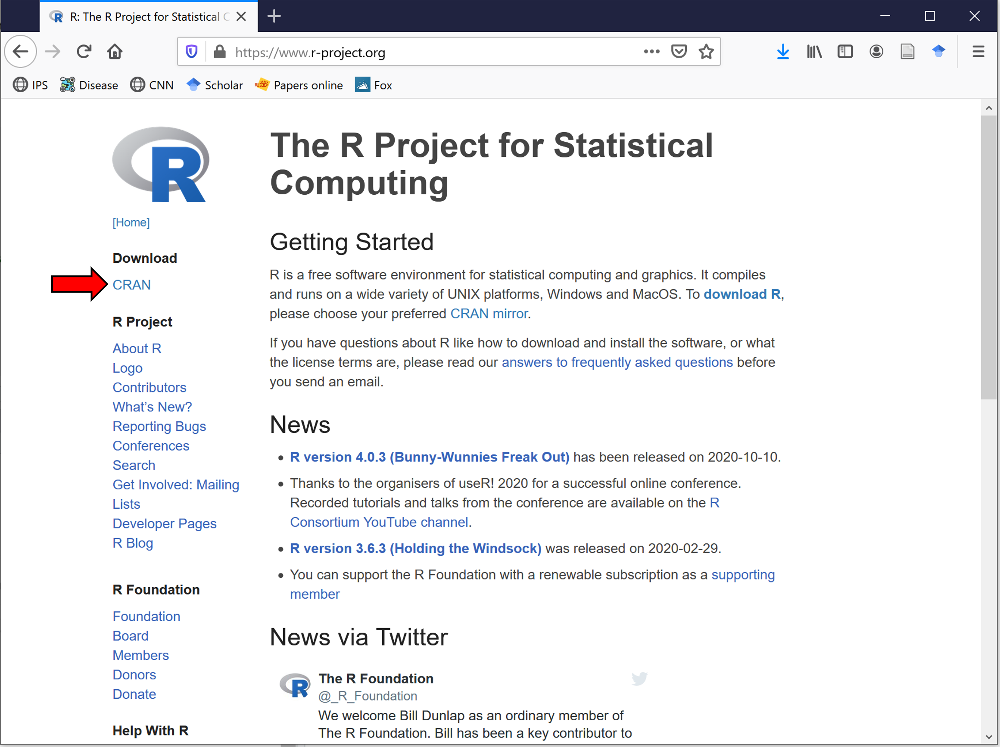
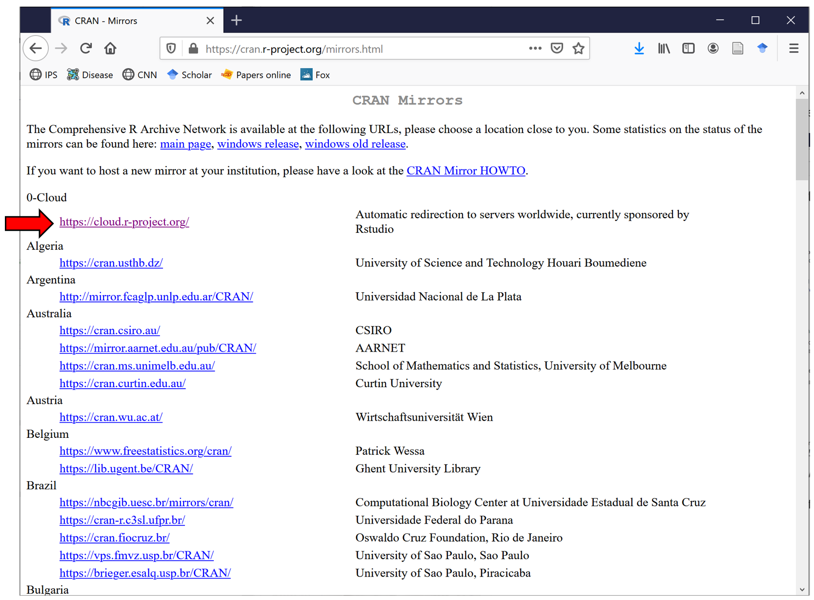
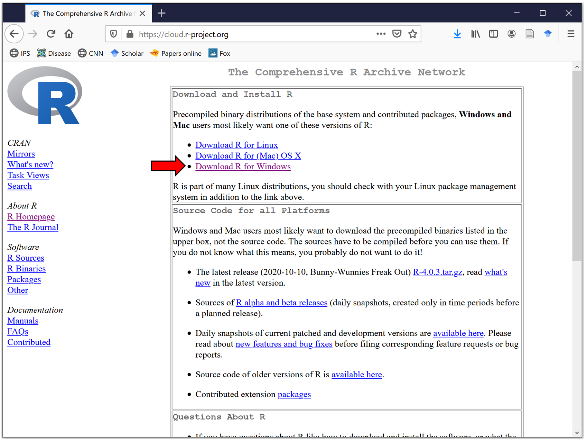
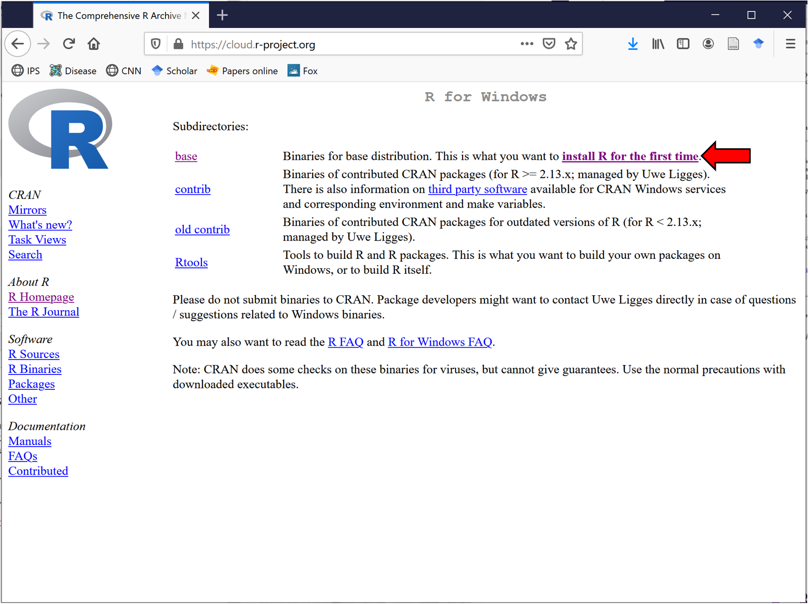
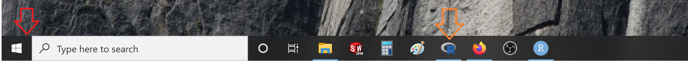
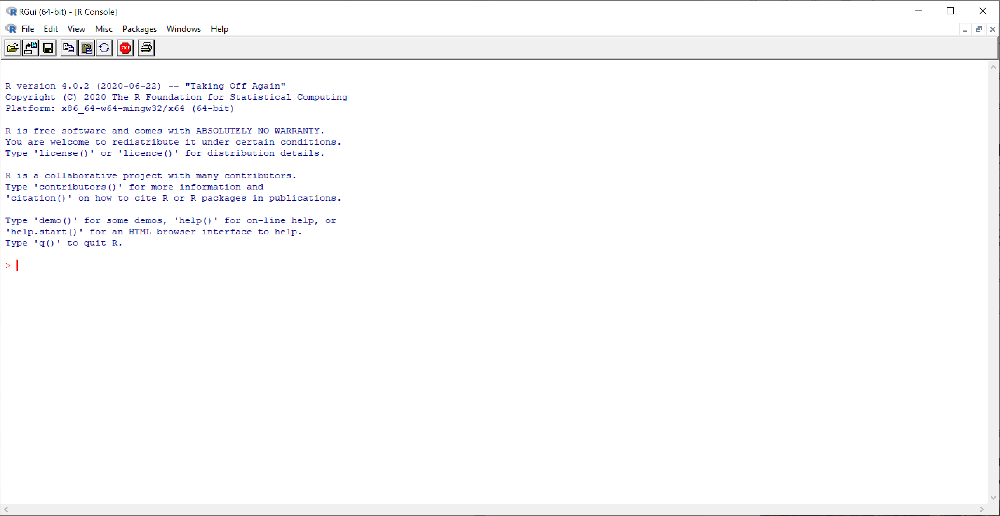
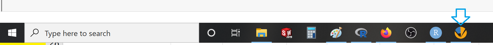
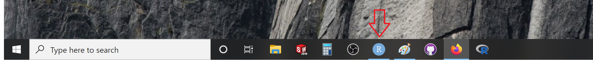
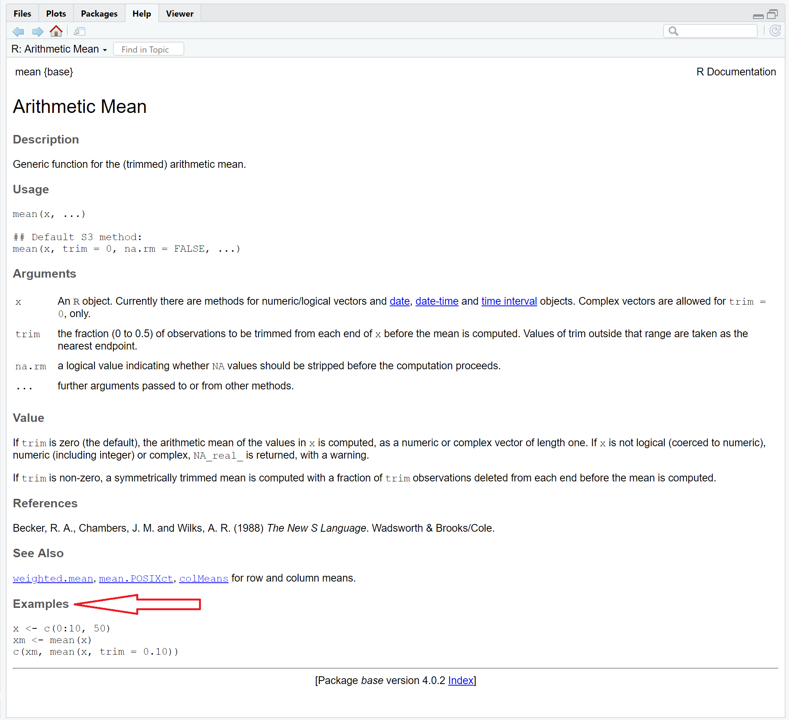

# Installing programs
We are going to take a break of stats for the following two chapters to install and learn some basics about R.

<center>
<iframe width="560" height="315" src="https://www.youtube.com/embed/zFFonOicjeo" frameborder="0" allow="accelerometer; autoplay; clipboard-write; encrypted-media; gyroscope; picture-in-picture" allowfullscreen></iframe>
</center>


## Installing R {-}

As mentioned earlier, R is free and it can be downloaded from [Here](https://www.r-project.org/).

Once in that page click on CRAN (see red arrow in the figure below).

```{r, out.width = "80%", echo= FALSE, fig.align = 'center',fig.cap = 'RProject Webpage'}

```

Next select the mirror. Mirrors are servers around the world that maintain copies of R and all the packages. You can click on the "0-Cloud", but any mirror will be fine (see image below)

```{r, out.width = "80%", echo= FALSE, fig.align = 'center',fig.cap = 'Installing R'}

```

Next,select the system of your computer. I recommend you use Windows. There are only small differences between systems, and it should work the same in any system. But if you have Apple, you are on your own. There are several perks in Apple, not a big deal, but be aware that due to compatibility and settings, issues may emerge.

```{r, out.width = "80%", echo= FALSE, fig.align = 'center',fig.cap = 'Installing R'}

```

Next, download the executable file of R, which is indicated in the read arrow in the figure below.

```{r, out.width = "80%", echo= FALSE, fig.align = 'center',fig.cap = 'Installing R'}

```

Once downloaded, the file should be in the "Downloads" folder. Double click on it and accept all the default settings. The R icon should now appear at the bottom your tab or Windows menu (See arrows in image below).


```{r, out.width = "80%", echo= FALSE, fig.align = 'center',fig.cap = 'Installing R'}

```

Click on the icon, and welcome to R. Crazy how that screen does not look like much but it is a portal to a world of opportunities.


```{r, out.width = "80%", echo= FALSE, fig.align = 'center',fig.cap = 'Installing R'}

```


## Tinn-R {-}

Once you run a line of code in R, it cannot be un-done. So very commonly, you have to re-run lines of code. 

For this reason, it is better if you write your code in a text editor program, and then running it R. 
You can save the text file, and next time, simply copy and paste. 

You can save your R code in any word processor. Notepad from Windows is just fine. You can also use Microsoft Word, but be mindful that that software commonly capitalizes the first letter in each new line. R is case sensitive, so Word is not worth the trouble. 

I personally use Tinn-R. It allows you to save your codes in a single file, gives you hints into your code, etc.

Please install Tinn-R from [here](https://sourceforge.net/projects/tinn-r/).

```{block2, type='rmdwarning'}
**R** is case sensitive. "A" is different from "a" in R!
This simple rule is at the core of most bugs in R!
```

To create a file in Tinn-R, click on the Tinn-R icon (see arrow in image below). Once there, click on "File", then on "New". This will create a clean sheet for you to start writing your codes. You will use this type of sheets to save your codes, as you move along.

```{r, out.width = "80%", echo= FALSE, fig.align = 'center',fig.cap = 'Installing Tinn-R'}

```


## R-Studio {-}
There is also a very popular GUI (Graphical User Interface) called R-Studio, which allows you to run R while having the functionality of Tinn-R.

Please know that R is not R studio. In R-Studio, R is almost hidden in the background, so it is important that you still know how to run R without R-Studio. 

With that said, R-studio facilitates considerably the learning of R, the downside is to think that R-studio is R.


You can download R-studio from [here](https://rstudio.com/products/rstudio/download/); use the free version. Follow the instructions of the page to install the software.

After installation R-Studio should appear as the icon in the image below.

```{r, out.width = "80%", echo= FALSE, fig.align = 'center',fig.cap = 'R-Studio'}

```

The next video show you for how to use R-Studio.

<center>
<iframe width="560" height="315" src="https://www.youtube.com/embed/ghhIu98Sxc4" frameborder="0" allow="accelerometer; autoplay; clipboard-write; encrypted-media; gyroscope; picture-in-picture" allowfullscreen></iframe>
</center>


## Installing packages {-}

Part of the power of R is that tools developed by users around the world can be integrated into the R's general functionality.  Such tools are integrated into containers called packages, and deposited into the R repository for anyone to use. There are so many tools already developed that chances are there is a packages for anything you may need. 


```{block2, type='rmdwarning'}
The directory of available R-packages is available [here](https://www.rdocumentation.org/taskviews). You can click on any available package to learn more about it, including instructions on how to use them.
```


The primary way to install a package is using the command:


```{r, echo= TRUE, error=TRUE, message=FALSE}
# install.packages("raster")
```
Between brackets should be the name of the package you want to install. You will be prompted to select a mirror. If this is the first time installing a package, you will also be asked to select a folder where to install the packages. I suggest you accept the default suggestions that are provided.

Once installed in your local harddrive, you need to load the packages into your console every time you want to use it. To do so, you use the command:


```{r, echo= TRUE, error=TRUE}
library("raster")
```

Between quotations is the name of the raster. Rlease remember that R is case sensitive.

## Asking for help {-}
You can access help on any specific R function using the question mark sign, followed by the name of the function. For instance, to ask for help on the mean, you type:


```{r, echo= TRUE, error=TRUE}
# ?mean
```

A window with available help on the function will pop-up (like the one in the image below). 

```{r, out.width = "80%", echo= FALSE, fig.align = 'center',fig.cap = 'Asking for help in R'}

```

One super nice thing about R's help is that it provides examples on how the function should be used. See, for instance, the image above, an example (indicated with the red arrow) on how to use the mean function in R. You can simply copy those lines of commands and paste them in your console. This becomes very useful, as you can simply adjust that given code to your given data.


## Exercise {-}


Please install R and R-studio in your computer. Then install and load the package "raster". Run the example below.

```{r, echo= TRUE, error=TRUE}
library (raster)

# check for help by simply typing the question mark followed by the function name (like: ?raster)

#load a raster already saved in the raster package
f <- system.file("external/test.grd", package="raster") #file direction

#turn it into a raster
r <- raster(f)

#plot the raster
plot(r)
```
