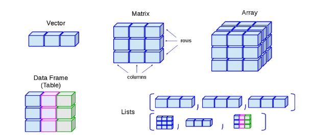
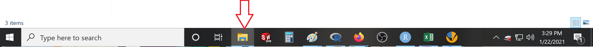
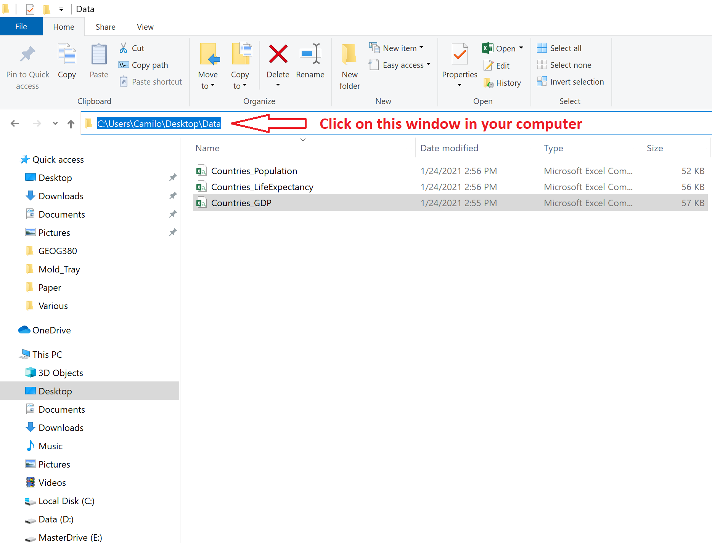
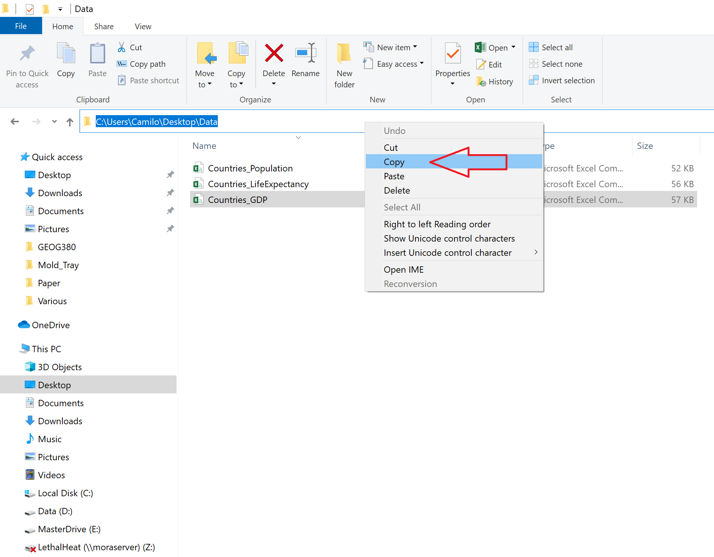
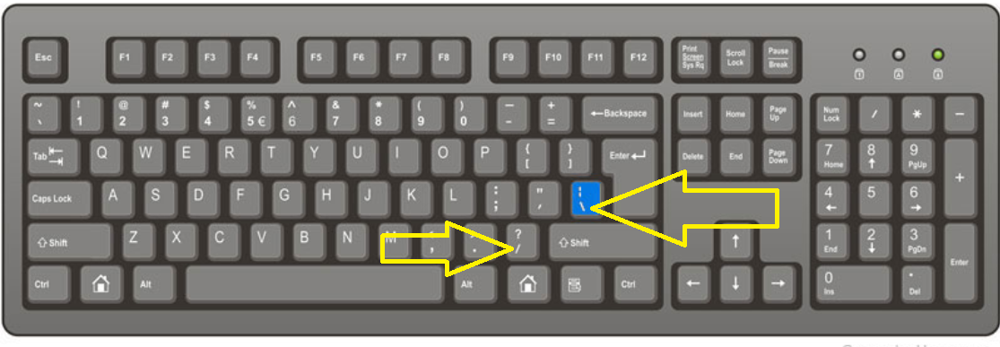
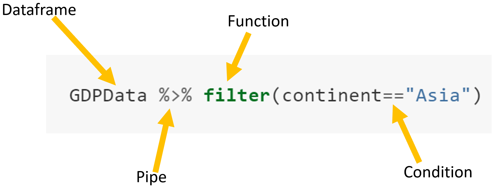
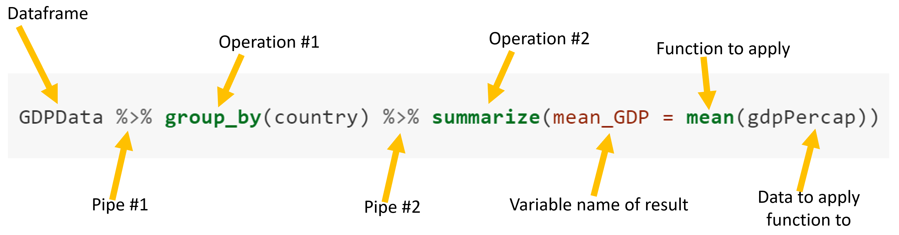
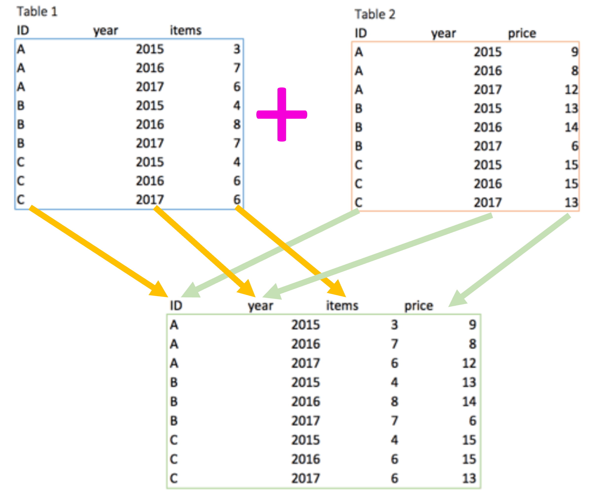
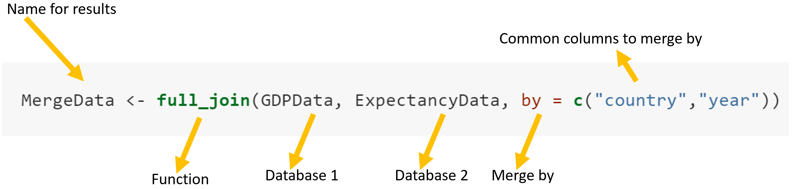

# Basics on data manipulation in R {}


```{r, out.width = "80%", echo= FALSE, fig.align = 'center',fig.cap = 'R console'}
knitr::include_graphics("images/R.png")
```


You should think of R as an advance scientific calculator like the ones you used in high school. Basically, there is a set of basic functions already installed in R, which you can use with your data.

You can also install packages, which gives you access to additional functions. 

Use Google to find what packages may have the functions you need. Say you want to do a genotypic analysis. Simply Google "R packages to do genotypic analysis". If you want to do animations, search "how to do an animation in R".

## Variables  {-}

Variables in R are names used to storage objects that you can manipulate. For instance, let me create a variable "A", whicha I want it to be the value 1. Basically, in the R console I type:

```{r, echo= TRUE}
A=1
```

then click "Enter". That command, just created a variable A, which has a value of 1.

To check, type "A" +"Enter".


```{r, echo= TRUE}
A
```

Let's now create a variable called B, which is equal to 2. 

```{r, echo= TRUE}
B=2
```

I can now use those two variables to see what happens when I add them:

```{r, echo= TRUE}
A+B
```

You cal also create a new variable based on other variables. For instance:


```{r, echo= TRUE}
C=A-B
C
```
You can check all the variables you have created using the command ls()


```{r, echo= TRUE}
ls()
```

As you can see, up to this moment I have created three variables, named A, B and C.


```{block2, type='rmdwarning'}
With rare exceptions, each line of command in R is independent.
```

You should try now. Open R in your computer or use the console below. The console below is exactly what you have in R in your computer. We will use this type of window in a few instances in this book, but I recommend you do your practices in your own computer.

Create a variable called D=10 and other called z=5, and calculate thhe difference between D and z.

<iframe src="https://mora.shinyapps.io/Console/?showcase=0" width="100%" height="300px">
</iframe>


## Comments  {-}


```{block2, type='rmdwarning'}
Comments are text you use to describe your code. They have to be preeceded with the number sign (#). Any line command after # will not be run by R
```


As you start coding, it is always a good practice that you explain with your own words what each line of code is intended for.

I cannot tell you the number of times, I have gone back to my old codes and ask myself, what was the purpose of this line. What was I thinking at that time?

To ensure codes can be easy understood later on, we use comments. R comments are text added to your code, which R  does not process.

Any comment in R has to be preceded with the number sign (#). For instance:

```{r, echo= TRUE}
A=10 # Here I used R to show how to create a variable
B=20 # In this case, i wanted my variable B to be 2
A+B
```
w


## Operators  {-}

### Assignment operators  {-}

As you noted in my previous page, I used the equal sign (=) to assign a value to a letter variable; that is called an assignment operator. Another more broadly recommended assignment operator is  >-, which is used like this:


```{r, echo= TRUE}
a<-10 # in this case I used <- as the assigment operators
```

Note that in the code above I use >- instead of =

I can verify this, by typing a in the R console and then hitting enter.


```{r, echo= TRUE}
a
```

### Arithmetic operators  {-}
R is preloaded with a lot of built-in mathematical operators. Here are some basic ones:


```{r comment='',, echo= FALSE,  warning=FALSE}
library("kableExtra")
Function= c("+","-", "*", "/", "^","log(x)","log10(x)","abs(x)","sqrt(x)","ceiling(x)","floor(x)","round(x, digits = 0)","rep(x, times = 1)", "seq(from, to, by= )","sample(x,n,replace=T)")

Description=c("Addition","Subtraction","Multiplication","Division","Exponent ","Natural log","Common log","Absolute value","Square root", "Round to largest integer", "Round to smallest integer","Round number to given number of digits","Repeat a number a given number of times","Create a sequence of numbers","Select n random numbers from vector x")

Table=data.frame(Function,Description)
knitr::kable(Table, "simple")
```


Lets say I have a variable a=145.677, but I one to stimate the largest integer of that number, then

```{r, echo= TRUE}
a=145.677
b=ceiling(a)
b
```

Give a try to some of these operators, yourself. 

<iframe src="https://mora.shinyapps.io/Console/?showcase=0" width="100%" height="300px">
</iframe>

Any time you need an operator, but you do not know what is it in R, simply ask your friend Google. Say you want to calculate the cosine of a number?. Simply search in Google "How to calculate a cosine in R".


### Character operators {-}
At times, you do not want to handle numbers but words. R also has functions for that.


```{r comment2='',, echo= FALSE,  warning=FALSE}
library("kableExtra")
Function= c("substr(x, start=n1, stop=n2)","grep(pattern, x , ignore.case=FALSE, fixed=FALSE)","sub(pattern, replacement, x, ignore.case =FALSE, fixed=FALSE)","strsplit(x, split)","paste(..., sep='') ")

Description=c("Extract or replace substrings in a character vector","Search for pattern in x","Find pattern in x and replace with replacement text","Split the elements of character vector x at split","Concatenate strings")

Table=data.frame(Function,Description)
knitr::kable(Table, "simple")
```

Lets try a few examples:
```{r, echo= TRUE}
a="camilo1989" #here I have a character variable, but want to remove that number, so
b=gsub("1989", "", a) #here I replace the value indicated in between the first quotations, for what is in between the second quotations, in this case nothing.
b
```


```{block2, type='rmdwarning'}
Characters are always between quotations and this is done to differentiate from variable names. 
Say I have a variable I called data but I also have a word I want to use called data as well. In this case data by ilfset will be the database, but "data" will be recongnized as chracaters. Later on we will get to this.
```


The function paste is another function that you will use a lot.

```{r, echo= TRUE}
a="camilo" #here I have a character variable, that I want to concatenate with another one. 
b="1989" #second variable.
c=paste(a,b,sep="_") #here I merge a and b, and separate them with an underscore
c
```

If you want nothing to separate the words, put nothing between the brackets in sep, like this
```{r, echo= TRUE}
c=paste(a,b,sep="")
c
```
## Custom made functions {-}

As you become better at coding, you probably want to start creating your own functions. You can even create functions, that use other functions. Think of it like a lego game, in which you have thousands of functions (legos) that you can use to create whatever you want. Just as the Legos game, creating functions is very simple.

The structure of an R function is as follow:


```{r, out.width = "80%", echo= FALSE, fig.align = 'center'}
knitr::include_graphics("images/Function.png")
```


1. You have the name you want for your function
2. What arguments are needed for your function
3. Between {} you place what you want to do with your arguments
4. Outline what you want to output from your function

Let's have an example. Say, I have two numbers (12.78454 and 1.34893439), which I want to first multiple, then divide the result by 2, then estimate the cosine, then multiple by pi, then estimate the ceiling; and I want to do this four times with different starting numbers. So lets start coding this,


```{r, echo= TRUE}
a=12.78454              #I place  first number in a variable, so I do not have to retype all numbers
b=1.34893439            #same for second number
Multiple_AB=a*b         #first command I have to do. Create new varaible multiplying a and b
Divide= Multiple_AB/2   #second command is to divide the output by 2
Cosine= cos(Divide)     #third command is to estimate the cosine in the results
PI=Cosine*pi            #four command is to multiply result by pi
Cealing=ceiling(PI)     #finally, estimate the largest integer
Cealing                 #here is the result of that operation above
```

If you see the code above, I wrote 8 lines of code to get the result for the first two set of numbers. If I want to do the same for say three other set of numbers, I will have to write 24 lines of code, not to mention the chance for error. 

Since the general operation is same for all cases, you can simply create a function, which will reduce the lenght of the code, while ensuring you use exactly the same procedure for all numbers. Let's do it,


```{r, echo= TRUE}
CamilosFunction <- function(argument1, argument2) { #Argument 1 and 2, are the two numbers I have to run in my function
Multiple_AB=argument1*argument2         #first command I have to do
Divide= Multiple_AB/2                   #second command is to divide the output by 2
Cosine= cos(Divide)                     #third command is to estimate the cosine in the results
PI=Cosine*pi                            #four command is to multiply result by pi
Cealing=ceiling(PI)                     #finally, estimate the largest integer
return (Cealing)                        #here is the result of that operation above
}                 
```

If you see, all I did was to copy my entire process from the first set of values, and replace a and b, for the arguments in my function, add the {} and name my function. I just created a function, called CamilosFunction, that requires two values, to do the process indicated above, and return the result. Lets see,

```{r, echo= TRUE}
a=12.78454
b=1.34893439
CamilosFunction (a, b) #here is my function, which run many commands and give me a single result.
```
You can now reuse your function with different numbers, each time requiring only one line of code.

```{r, echo= TRUE}
CamilosFunction (12.78454,10002.78454) 
CamilosFunction (120.78454,102.78454) 
CamilosFunction (912.74,10002.78454) 
```

Create your own function now. In which you take three numbers (4,2,3), calculate their average, then multiple the result by 4, then estimate the sin, and finally calculate the square.

## Data structure types {-}

R provides numerous ways to hold data. Let's check some of them.


```{r, out.width = "100%", echo= FALSE, fig.align = 'center'}

```


### Vectors {-}
A vector is a collection of values. We call the individual values "elements" of the vector.

We can make vectors with c( ). c means “combine”. Say you have three numbers 1,4,5 and you just do not want to type them every time. you can then put the numbers in a vector.


```{r, echo= TRUE}
c(1,4,5) #here I have a vector with three numbers
```

You can also run operations in a vector. Lets use the example above, in which I want to multiply each value in that vector by 2.

```{r, echo= TRUE}
a=c(1,4,5) #here create a variable that contains my vector of three numbers
a*2        #here I multiply my variable (vector with three numbers)  by 2.
```

### Matrix {-}
You can merge multiple vectors to create a matrix. You can merge the vectors by columns using the function cbind or by rows using the function rbind. Lets do an example to clarify.


```{r, echo= TRUE}
Vector1=c(1,4,5)                          #here I have vector 1 with three numbers
Vector2=c(56,42,93)                       #here I have vector 2 with three numbers
ColumnMergedVector=cbind(Vector1,Vector2) #I use cbind to merge the vector by column
ColumnMergedVector
```

See in the result above, how each vector became a column. 

May be you prefer to merge them by rows

```{r, echo= TRUE}
RowMergedVector=rbind(Vector1,Vector2) #I use rbind to merge the vector by rows
RowMergedVector
```
You can now see how the two vectors were merged by rows.

### DataFrames  {-}
Dataframes are the most common type of data structure in R. It is has similar topology to a matrix, but it is more diverse in the types of data it can use. Dataframes, are like the "Sheet" version in Excel.  To create a dataframe you use the data.frame function. Lets do an example.

s

```{r, echo= TRUE}
DataFrame=data.frame(Vector1,Vector2) #I use data.frame to merge two vectros of data
DataFrame
```

Dataframes also allow you to rename the column and row names, and there different ways to do that. Here is one,


```{r, echo= TRUE}
colnames(DataFrame)=c("Height","Width") #Here I rename the two columsn in the dataframe, with the names used in a vector. 
DataFrame
```

You are probably asking yourself what is the difference between a matrix and a data.frame?. Here are some differences:


```{r, echo= FALSE,caption = "Differences between matrix and data.frames in R."}

Differences=data.frame(
Matrix=c("Collection of data sets arranged in a two dimensional rectangular organisation", "It’s m*n array with similar data type.","It has fixed number of rows and columns.","The data stored in columns can be only of same data type.", "Data types are homogeneous."),
                       
Dataframe=c("Stores data tables that contains multiple data types in multiple column called fields.","It is a list of vector of equal length. It is a generalized form of matrix.","It has variable number of rows and columns.","The data stored must be numeric, character or factor type.","Data types are heterogeneous.")  	                     
 	                     )
 	 	
knitr::kable(Differences)

```

## Loading your own data into R{-}
R also allows you to import your own data from a diversity of formats. Here we will use the most basic one, which is to import .csv files (the so-called comma delimited data). In this type of file, data are listed by rows, with the number between commas in a row indicating the columns.

To load a .csv file in R, you use the command read.csv(). Between brackets you put the path to where the file is located. You write that path between quotation. It sounds complicated, but it is simple. Let's just try an example.

1. Create a folder in your local desktop called "Data". It is good practice to keep your data and codes in separated folders that you can then easily identify by the name alone. 

2. Download a csv file from [here](https://raw.githubusercontent.com/Camilo-Mora/GEO380/main/Datasets/Countries_GDP.csv). Right click on the page and click on "Save page as" in the pop-up window. Name the file "Countries_GDP.csv", and navigate to the "Data" folder you just created to save the file in there. Click "Save". That file should now appear in your "Data" folder.

3. Now that you have the csv file in your local hard-drive, you can load it into R. For this you need to do a couple things. First, get the path to where the file is at. For this, click on your windows explorer (that is the button that looks like a folder in your desktop, see image below)


```{r, out.width = "100%", echo= FALSE, fig.align = 'center',fig.cap = 'Windows explorer'}

```

Navigate to the folder Data where you saved the file, and put the mouse cursor in the selectable window (See arrow in image below). That will reveal the path where the file is saved in your computer.


```{r, out.width = "100%", echo= FALSE, fig.align = 'center',fig.cap = 'Getting path to file'}

```

Next, right click on that same window, and click on Copy. That will copy the path to your file (See image below).

```{r, out.width = "100%", echo= FALSE, fig.align = 'center',fig.cap = 'Getting path to file'}

```

Open R, right click anywhere inside the main window of R and click on "Paste". It should look something like this:


```{r, out.width = "100%", echo= FALSE, fig.align = 'center',fig.cap = 'Getting path to file'}
knitr::include_graphics("images/PathInR.png")
```
Now you need to replace each back-slash for a forward-slash in your path. The position of those keys in my keyboard are shown in the image below.


```{r, out.width = "100%", echo= FALSE, fig.align = 'center',fig.cap = 'Slash keys in keyboard'}

```

So the path to the file should be change from this:

```{r}
# "D:\GEO380\Datasets\"
```


to this:

```{r}
# "D:/GEO380/Datasets/"
```


Now, to the path of the folder in which you have the file, you need to add the file name, like this:


```{r}
# "D:/GEO380/Datasets/Countries_GDP.csv"
```


I have to tell you that when I got started in R. A colleague sent me a file and told me to open his file in R. It sounded simple at the time, but it took me two days to figure out all these tiny things about setting the file correctly. Back in those days the internet was not so full of useful tutorials about how to do this. Ok, let's keep going.

Now add to your path the R function that is used read csv files, which is "read.csv()", like this:


```{r}
# read.csv("D:/GEO380/Datasets/Countries_GDP.csv")
```


I suggest you attach this file to a variable name, so you can call it later.


```{r}
GDPData=read.csv("D:/GEO380/Datasets/Countries_GDP.csv")
```


That is it, now you have loaded your data into R. Check it out by looking at the top part of the database


```{r}
head (GDPData)
```


By the way, if you know that the csv file in the web will not be deleted or moved, you can read the data from the web directly using the URL to the file, instead of the path. Like this,


```{r}
GDPData=read.csv("https://raw.githubusercontent.com/Camilo-Mora/GEO380/main/Datasets/Countries_GDP.csv")
```


## Calling elements in a data frame  {-}
Ok, now that you know how to store data in R. We need to learn how to see the data. To see a given data container, you can simply typeb its name and click enter. For instance,


```{r, echo= TRUE}
DataFrame
```

This is an ok way to see your data if the data container is not too big. However, if you have lots of data this command will fill up your screen. Instead, you can use the function head or tail, which will let you see the top five or the bottom five rows in a dataframe. Lets see.

Let me  first create a medium size dataframe:
```{r, echo= TRUE}
DataFrame<- data.frame( x1 = c(rep(1,250)),     # in Column 1 I repeat the number 1 for 25 times
                        x2 = seq(1:250), #Column 2 I create a sequence of numbers from 1 to 25
                        x3 = sample(seq(1:1000),250)) # select 25 random numbers between 1 and 10000
```


In the code above, I just create a dummy dataframe with three columns and 250 rows using functions we already described in the chapter on arithmetic operators.

If I try to see the full database, I just type the name of the dataframe and click enter. However,  as you will notice calling the full dataframe will use a lot of your screen space because it will attempt to display all the data. 

```{r, echo= TRUE}
DataFrame
```


#### Head  {-}

Alternatively, you can just check the top rows using the head function. Like this:

```{r, echo= TRUE}
head(DataFrame)
```
#### Tail  {-}
Or the bottom rows using the tail function. Like this:

```{r, echo= TRUE}
tail(DataFrame)
```

#### Index  {-}
You can also check specific elements of the dataframe using the index function, which in R is indicated with the square brackets [row,column]. The number to the left of the comma will be the row  number, and the number to the right the column number. If you do not add a number, it will display all columns or all rows. For instance, check what number is in column 3 in the 2th row?


```{r, echo= TRUE}
DataFrame[2,3]
```

<iframe src="https://mora.shinyapps.io/QuestionsChapter3/" width="100%" height="400px">
</iframe>

#### Calling columns by name  {-}

To call a column by name in a dataframe, you use the dollar sign $ to merge the name of the dataframe with the name of the column, like this,


```{r, echo= TRUE}
head(DataFrame$x3) #here I only display the top values of the column Country_Name
```


## Filter data  {-}
A recurring task in data analytics is to filter data, this means to select specific subsets/chucks of your data. Filters can be used to create new variables, to apply new functions, to see specific data, etc. There are numerous ways to filter data in R, but here we wall use the function filter in the package "dplyr".

```{r, echo= TRUE, message=FALSE,warning=FALSE}
# install.packages("dplyr")     #First, I install the package dplyr and tidyverse, since I have not installed it previously
# install.packages("tidyverse") 

library(tidyverse) #next I load the packages into the current section of R.
library(dplyr)            
```

Now, lets check the first few rows in the GDP database we loaded earlier, 

```{r, echo= TRUE, message=FALSE,warning=FALSE}
tail(GDPData)             #lets look at the column head of the GDP data we loaded earlier.
```

From the subset of the data above, you can see that the GDPData database has four columns, and from the "year" column, you can tell that the data of GDP (gdpPercap) is repeated for each year. Hmm, but what if I just want to see the data for countries in Asia?. For that we use the function filter.

The syntax of the filter function reads like this:

```{r, out.width = "100%", echo= FALSE, fig.align = 'center',fig.cap = 'Filter function'}

```


```{block2, type='rmdnote'}
Pipes, %>%, are a powerful tool for doing sequential operations. Commonly it requires tthe tidyverse package. In the next section you will better see the use of pipes.
```

Now that you know the syntax of the filter function from the dplr package, lets test it.

```{r, echo= TRUE, message=FALSE,warning=FALSE}
GDPData %>% filter(continent=="Asia")       
```

From the results above, you can see how only data from Asia were selected.

## Pivot table  {-}
Pivottables are a functionality originally developed in Excel, which allows you to summarize data by attributes. Lets do an example to see how this work.


```{r, echo= TRUE, message=FALSE,warning=FALSE}
tail(GDPData)             #lets look at the column head of the GDP data we loaded earlier.
```

If you look at the GDP database above, you will see that the data also includes the years of the GDPs. What if I want to summarize the data by country? Say for each country, I just want the average of all GDPs of the different years?. For that we use the function summarize from the dplr package. Like this:


```{r, echo= TRUE,, message=FALSE,warning=FALSE, results='hide'}
GDPData %>% group_by(country) %>% summarize(mean_GDP = mean(gdpPercap))
```


Ok, now let that code talk to you. Code is like reading a book; you read from the first word forward to start making a visual representation of that the sentence is saying. 

Coding is not different. Lets take the code above and read it from left to right, like in the image below. In the image below you can see what each part of the code is saying. 

```{r, out.width = "100%", echo= FALSE, fig.align = 'center',fig.cap = 'Filter function'}

```

It is a good practice for you to read the code. Lets tray to translate the code above (look at the image above as we do the translation). Here I go....first I take the dataframe called GDPData, then  I group that dataframe by country, then I summarize the data on GDP by the mean values, oh, and I want the resulting mean to be called mean_GDP. Easy right!.


## Merge data  {-}
One other very common operation in R coding is to merge dataframes by common attributes (i.e., common column). 

In the section about Data structure types, we sow how to merge matrices or dataframes using the rbind or cbind functions, which work when the different databases can be paired by simply appending one database to the other. For instance, when the columns are in exact order in the two databases. 

Here we will use the merge function, or so call full_join from the dplr package, which works for cases when the data cannot be paired by simply appending one database to another. For instance, when the columns and/or rows are not in the exact order.


```{r, out.width = "100%", echo= FALSE, fig.align = 'center',fig.cap = 'Merging function'}

```


Let's use an example. As you know we have already loaded in this current section of R a database of the GPDs of the countries in the world. 


What if I now collect another database about the average life expectancy per country, and want to put those two databases together? 

Since the data comes from difference sources, chances are that they differ in the number of columns, in the order of the columns, in the number of rows, etc. Basically, you cannot use rbind or cbind in this case.

You could do that pairing of the two database by brutal force, copying  the data from each country from one database, and pasting it in the same row for the given country in the other database. Say that operation takes you ten seconds for each country, and there are 250 countries, then that job will take you about 40 minutes, not to mention the chance for errors. 

Oh, but remember that each country has 40 years of data. So multiplyy the 40 minutes times 40 years, and you end up copying and pasting for more than a day. Alternatively you have R do the merging for you. Lets try it.


First, lets load the data on the life expectancy, which I have placed in my Github folder
```{r}
ExpectancyData=read.csv("https://raw.githubusercontent.com/Camilo-Mora/GEO380/main/Datasets/Countries_LifeExpectancy.csv")
```

It is good practice to always check at least a portion of the database to check it has been loaded correctly,

```{r, echo= TRUE, message=FALSE,warning=FALSE}
tail(ExpectancyData)      #lets look at the column head of the Expectancy data we just loaded.
```

Lets check the GDP database as well.


```{r, echo= TRUE, message=FALSE,warning=FALSE}
tail(GDPData)            #lets look at the column head of the GDP data we loaded earlier.
```

Ok, we now have two databases loaded in R, one for the data on GDP and the other for the data on life expectancy. Lets merge them together, like this:


```{r, echo= TRUE, message=FALSE,warning=FALSE,results='hide'}
MergeData <- full_join(GDPData, ExpectancyData, by = c("country","year"))
```

Now lets try to read, that line of code, like this:

```{r, out.width = "100%", echo= FALSE, fig.align = 'center',fig.cap = 'Merging function'}

```

If I translate this...basically, create a new dataframe called MergeData, in which I want to merge in full the database on GDPData and ExpectancyData by their common attribute country and year. 


```{r, echo= TRUE, message=FALSE,warning=FALSE}
tail(MergeData)            #Check the results
```

## Subsetting columns  {-}

From the new database I just created, you can see how there are some columns that came with the original databases, which I do not need and do not I want to use. For this, you can create a new database with only the columns you want or delete the columns you do not like. Lets try.


### Deleting columns  {-}
This is the simplest approach. Basically, I set the column I want to delete to NULL. Like this,


```{r, echo= TRUE, message=FALSE,warning=FALSE}
MergeData$X= NULL            #with this code I delete the column called X, which is probably an index number used by one of the data sources
```
Now, you try to delete the column "continent.x".

### Selecting columns  {-}
Obviously, if you have many columns that you do not need, deleting columns may take a while, as you have to type each column name you want to delete. Alternatively, you can simply select the columns you need. Like this,


```{r, echo= TRUE, message=FALSE,warning=FALSE}
SelectedColumns=MergeData[, c("country","year",  "gdpPercap", "lifeExp" ) ]
```

This syntax should be familiar to you already. As it is the indexing function we used earlier [rows, columns].

If you read the code above, basically....I created a new database called SelectedColumns, which takes the database MergeData and select all rows (because there is nothing to the left of the comma) and the four columns listed in the vector after the comma.


```{r, echo= TRUE, message=FALSE,warning=FALSE}
head(SelectedColumns)
```

f

## Adding results to databases  {-}
Up to this point, we have simply manipulated the data other people collected. What if we now want to do our own analysis with such data? Piece of cake...

...lets tray, for instance, a new index, in which I want to see how much does it cost a year of life in each country. Basically, all I have to do is to divide how much each person does in each country (i.e., GDP per capita) by the life expectancy of people in each country. Like this,


```{r, echo= TRUE, message=FALSE,warning=FALSE}
SelectedColumns$ValueofLife = SelectedColumns$gdpPercap / SelectedColumns$lifeExp 
```

WE cant translate the code above as, a a column called ValueofLife to the dataframe SelectedColumns, in which I divide gdpPercap by lifeExp.

Lets check the results, 
```{r, echo= TRUE, message=FALSE,warning=FALSE}
head(SelectedColumns)
```

Lets do a quiick summary to see the average per country,


```{r, echo= TRUE, message=FALSE,warning=FALSE}
SelectedColumns %>% group_by(country) %>% summarize(mean_valueOfLife = mean(ValueofLife))
```

Have a look at the result above. Isn't it fascinating how in Afghanistan we could increase the life expectancy by one year by simply having people making $21.8 dollars more!

## Exercise {-}

<iframe src="https://mora.shinyapps.io/Quiz_4/" width="100%" height="1000px">
</iframe>


## Homework {-}
Do the following exercise:

Open a new file in Tinn-R. and write the R code to do the following:

1. Load the GDP and life expectancy databases, which we already loaded. Also add a database called, "Countries_Population.csv", which is in the same path you used for the other two databases thata re online in my Github folder.

2. Merge the three databases, by country and year.

3. Remove all unnecessary columns (you only want country, year, GDP per capita, life expectancy and population).

4. Calculate the total GDP of each nation (basically, multiple per capita GDP by the number of people).

5. Calculate the average Total GDP of each country.

Save the necessary code in Tinn and have it ready for next class.

