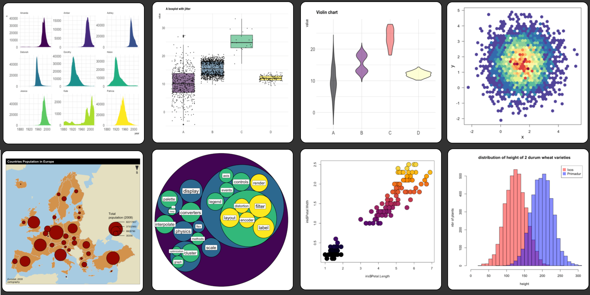
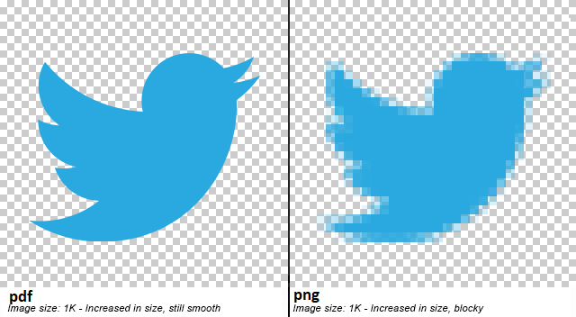

# Basic plots 

Making good quality plots is fundamental to the successful delivery of a scientific finding. The best story is the one that can be told with figures o. 

Not surprising, making good figures is a demanding endeavor of the scientific process, and there are at least two steps to it.

First, you need to decide on which type of figure best illustrates the point that you what to make. It is not about deceiving the reader, but rather use the most convincing available figure. Of course, each problem will have different needs, so you just need to be familiar about the different types of figures available, to better know which is the best figure for your own case problem.

```{r, out.width = "100%", echo= FALSE, fig.align = 'center',fig.cap = 'R plots'}

```

R has several built-in functions to do all sorts of plots. You can even create your own types of plots. Some packages even allow you to create plots online, where people can interact with the data. Others let you animate the data.

You can check a gallery of R plots [here](https://www.r-graph-gallery.com/all-graphs.html).


```{r, out.width = "100%", echo= FALSE, fig.align = 'center',fig.cap = 'Animated R plot'}
knitr::include_graphics("images/AnimatedPlot.gif")
```


Second, it is the issue of the standards of the figure. This relates to the editorial guidelines you need to follow to deliver your figure. 

Each scientific journal has different guidelines for figures. 

Some journals allow you to place multiple figures together, others like the letters to be of a given size and font type, other journals only like black and white, others want the figures on certain dimensions, etc.

So you need to know the guidelines that are specific to the journal you want to publish on to ensure your figures are up to standard. 

If you are not publishing a paper, it will still be good for you to follow the guidelines of figure formatting for any journal, so you know your figures are up to the most professional standards required in the field.

Regardless of the guidelines for the specific journal, it is important that your figure is clear enough to be understood. Here are some key conditions for any figure:


1. Ensure that the axes have names. e.g. Human population.

2. Ensure that between brackets the axes have units. e.g. Human population (Number of people)

3. Ensure that your axes have tickmarks.

4. Ensure all data are displayed. If you constraint the values shown in your axes. Be sure you do not remove data by accident.

5. Ensure the lines of the axes are black color. At times the axes colors are grey. The problem with this setting is that when printed, such axes may not appear, depending on how good your printer is.

6. Ensure the thickness of the axes is at least 1 point. At times the lines are thin, and this creates problems with printing as well.

7. When possible use black and white for your figures. While color is very common, many people take photocopies of papers or reports and they are very common in black and white. So in those cases any color figure will have troubles.


p

Lets check how to do some of the most common types of plots in R.

## Scatterplots {-}

Scatterplots allow you to see patterns of variation between two variables. To create a plot in R, simply type plot(y~x). Lets say I want to plot the second and third column in a dataframe.


```{r, echo= TRUE}
#Lets create some dummy data
DataFrame<- data.frame( x1 = c(rep(1,250)),     # in Column 1 I repeat the number 1 for 250 times
                        x2 = seq(1:250), #Column 2 I create a sequence of numbers from 1 to 250
                        x3 = sample(seq(1:1000),250)) # select 250 random numbers between 1 and 10000
#Now lets plot columns 2 and 3 of that data
plot(DataFrame[,2]~DataFrame[,3])
```


```{r, echo= TRUE}
#You can also plot by column name using the $ sign as indicated earlier to call a column
plot(DataFrame$x2~DataFrame$x3)
```

Now it comes the different settings needed to format the figure. Almost any attribute of a figure in R can be formatted. 

Next, I will show you how to format a few parameters. Once you know how to format a given parameter of a figure, you should be able to format any other parameter. Obviously a figure has tens of parameters you can modify, so you should not expect to know them all by memory, but you should be able to know how to find the given parameter, which by know you know it is by asking your friend Google. 

Let's modify a few parameters from the figure above.

For instance, what about the axis names? You can add axis names using the command xlab or ylab inside the plot command, like this:

```{r, echo= TRUE}
plot(DataFrame[,2]~DataFrame[,3],xlab="Years", ylab="Precipitation")
```

What about the different type of symbols?

```{r, out.width = "100%", echo= FALSE, fig.align = 'center',fig.cap = 'R plot symbols'}
knitr::include_graphics("images/RPlotSymbols.png")
```


R offers 25 different symbol types (Figure above), which you can call using the parameter pch, like this:

```{r, echo= TRUE}
plot(DataFrame[,2]~DataFrame[,3],xlab="Years", ylab="Precipitation", pch=22)
```


```{block2, type='rmdnote'}
Other characters can be used to specify pch including “+”, “*“,”-“,”.“,”#, “%”, “o”. Or simply any character you put between the quotations (“”) in the pch parameter.
```


What about colors for those points?. That is controlled using the col parameter. Like this,


```{r, echo= TRUE}
plot(DataFrame[,2]~DataFrame[,3],xlab="Years", ylab="Precipitation", pch=22, col="red")
```

For some symbols you can also control the filling color, using the bg parameter. Like this,


```{r, echo= TRUE}
plot(DataFrame[,2]~DataFrame[,3],xlab="Years", ylab="Precipitation", pch=22, col="red", bg="blue")
```

You can also control the size of the symbols using the cex parameter. Like this,


```{r, echo= TRUE}
plot(DataFrame[,2]~DataFrame[,3],xlab="Years", ylab="Precipitation", pch=22, col="red", cex=2)
```

Remember, there are tens of parameters you can modify in a plot. So you need to know exactly the standards required in the journal you want to publish to ensure you deliver the best figures required.

## Histograms {-}
Histograms are a very important type of plot as it lets you see the frequency in which certain values appear in your data. This type of plot is also call a frequency distribution. To create a histogram in R, you use the command hist(x), where x, is the vector of data you want to plot.

Lets create a frequency distribution of the GDP (Gross Domestic Producto) of countries in the world, using the csv file we loaded earlier,


```{r, echo= TRUE, error=TRUE}
#lets reload the data, just in case you have not loaded it
GDPData=read.csv("https://raw.githubusercontent.com/Camilo-Mora/GEO380/main/Datasets/Countries_GDP.csv")

head(GDPData)   #now lets check the data

hist(GDPData$gdpPercap) #now lets create a frequency of number of countries by GDP
```

Just as with the scatterplot, you can improve the appearance of the figure. Lets start with the axis name.


```{r, echo= TRUE, error=TRUE}
hist(GDPData$gdpPercap, xlab="GDP countries in USDollars")
```

What about that title?. Not pretty, ah?. That is a default in R. To remove it, we set the "main" parameter to NULL, like this:


```{r, echo= TRUE, error=TRUE}
hist(GDPData$gdpPercap, xlab="GDP countries in USDollars",main=NULL) 
```

Most journals do not allow you to put tittles in your plots.

If you want to rather keep the tittle, but have a different tittle, you replace NULL with the title you want, like this:

```{r, echo= TRUE, error=TRUE}
hist(GDPData$gdpPercap, xlab="GDP countries in USDollars",main="Countries of the World") 
```

## Density plots {-}
At times, when you use scatterplots with many data points, chances are that some points will overlap, and then create a misleading visual representation of the data as any overlapping data points will appear as a single point. 

A better representation of the data in this type of case is the use of density plots, in which the space of the entire plot is gridded into equal size cells, and the number of point overlapping on each cell counted and that is what is displayed. Let's do an example.


```{r, echo= TRUE, error=TRUE}

#lets create a dummy dataset of many points
# Create data
x <- rnorm(mean=1.5, 5000)
y <- rnorm(mean=1.6, 5000)

#lets plot that data
plot(y~x)
```

From the figure above you can tell that it is hard to make sense of any pattern because many points overlap. One solution to this is to use a density plot. And there are different packages to do so. Here we will use the hexbin package.

```{r, echo= TRUE, error=TRUE}
# Packages
library(hexbin)
library(RColorBrewer) #This library allows you to create color scales, we will see this later.
 
# Make the plot
bin<-hexbin(x, y, xbins=40) #hexbin is the function to grid the points in the plot. You can use different number of grids.
my_colors=colorRampPalette(rev(brewer.pal(11,'Spectral'))) #this is the color scale
plot(bin, main="" , colramp=my_colors , legend=F )  #now lets plot the hexbin/grid

```

Now you can see the same data, but plotting the hexbin/grid. You can play with different setting of the hexbin package, by typing ?hexbin in the R console.

You can also display both plots side by side using the par function. 


```{r, figures-side, fig.show="hold", out.width="50%"}
par(mar = c(4, 4, .1, .1))
plot(bin,colramp=my_colors)  #hexbin plot
plot(y~x)                    #Scatter plot
```


## Plotting maps {-}
R also provides powerful tools to analyze geographical data. Pretty much anything you can do in ARCgis, you can do in R; the key difference is that in R is free!. 

Let's see how to plot a map in R. Lets start by getting some spatial data. 

I collected the global data on human population from  [here](https://sedac.ciesin.columbia.edu/data/set/gpw-v4-population-count-rev11/data-download#). That page is full of other types of global scale data you may find interesting.

Here we will use the package raster for the purpose of loading and plotting the map.

```{r,raster}
library (raster)
GlobalPopulation=raster("https://raw.githubusercontent.com/Camilo-Mora/GEO380/main/Datasets/GlobalHumanPopulation2020.tif") #load the raster.
```

In the code above, I create a variable called GlobalPopulation that has the global data on human population. 

Note that to load the data of the raster, you use the same method you used before to load the .csv file. That is, using the path the file, preceded by the command that reads the file.

In this case, you use the command raster to read the file rather than read.csv. as the data you want to load is a raster and not a csv file.


To plot the raster, all you have to do is to plot that variable, like this:

```{r,PloRraster}
plot (GlobalPopulation)
```

You can use a different color scale using the RColorBrewer library. Lets try, 

```{r,ColorScaleraster}
library(RColorBrewer)  #this library allows you to create your own scales
#Lets create a color scale between yellow and red colors
ColorScale <- colorRampPalette(c("yellow","red"))
plot(GlobalPopulation,col =ColorScale(100)) #plot human population with 100 color in my scale
```

There are also premade color blind friendly scales. The most commonly used  is called viridis. Here are the different options of scales it has to offer:


```{r, out.width = "100%", echo= FALSE, fig.align = 'center',fig.cap = 'Viridis color scales'}
knitr::include_graphics("images/Viridis.png")
```

Lets now plot our map, using the magma scale

```{r,VirtidisRaster}
library(viridis)
plot(GlobalPopulation,col =magma(1000)) #plot human population with 100 color in my scale
```
Hmm, not to pretty ah?. why do you think the map does not look that good?


Well, the reason is that there are some places in the world with soo many people that makes the rest of the world look by comparison like if the world was empty. Here the problem is the scale of comparison. 

In cases where the extremes of the data are to far a part, it is recommended to log transform your data, which brings some of those extremes closer. Let's see what log-transforming does,


```{r,LogRaster}

plot(log(GlobalPopulation),col =magma(1000)) #log transform human population
```

Now you can better appreciate the patterns of variation, but you need to be mindful that the data are logarithmic.

R also allows to reproject the data into different projection types. You should be aware that there are many issues with displaying maps in different projections, that is topic for another course.

```{r,ProjectingRaster}

Raster <- projectRaster(GlobalPopulation, crs='+proj=moll', over=T) #reproject raster to mollweide projection
 
plot(Raster)         
          
```

Hmm that raster of the world's population is missing an outline of the world. For that, there is a package called maps. Let's try.


```{r}
library(maps) # this library offers several choices for background maps

worldmap <- map("world", plot=F,interior = F)   #create map of the world
plot(worldmap) #check the map
```

Hmm that packages provides the outline of the world as points. But really we want lines. Ok, we can use the maptools to convert points to lines

```{r,PointToLines}
library(maptools)    #library to convert points to lines
worldmapLines <- map2SpatialLines(worldmap, proj4string=CRS("+proj=longlat +datum=WGS84")) 
plot( worldmapLines)     #check the map
```


Great, now you have a raster of the world's human population and an outline of the world. Let's put them together          
          
```{r}
 plot(GlobalPopulation)      #first plot your raster
 plot(worldmapLines,add=T)   #then add the outline of the world on top.
```         
```{block2, type='rmdexercise'}
Find out the command to remove the color scale shown in the map above. Tip: type "How to remove color scale of plot raster in r"
```


## Animated plots {-}

What about animated plots?. If you recall the database on socio-economic data from countries in the world, you will notice that each variable was collected at different years. What year to display?. Well you can display them all and see how any pattern will change over time using an animated plot that displays each year sequentially. For animated plots, we will use the ggplot2 and the gganimate libraries/packages. i


```{r}
#first lets bring the data.
ExpectancyData=read.csv("https://raw.githubusercontent.com/Camilo-Mora/GEO380/main/Datasets/Countries_LifeExpectancy.csv")
GDPData=read.csv("https://raw.githubusercontent.com/Camilo-Mora/GEO380/main/Datasets/Countries_GDP.csv")

#lets merge those two databases, using the dplyr packaged that we used earlier.
library(dplyr)  #load package to merge database

#merge the databases
MergeData <- full_join(GDPData, ExpectancyData, by = c("country","year"))

```

As it is customary, lets check the data were loaded and display correctly.

```{r}
tail (MergeData)
```

It seems data were loaded fine. The three variables of interest here are gdpPercap (GDP per capita),  lifeExp (life expectancy), year and continent. (note that continent is double, because that column was on each of the dataset we merged, and we did not specific to do the merging by continent as well).

Lets create an animated plot of that data. Since the code needed will require several lines, it is recommended that you create the code in Tinn-R firts. Once it is done, copy and paste in the R console.

```{r, echo= TRUE, message=FALSE,warning=FALSE,results='hide',eval = FALSE}
# for the figures we will need 
    library(ggplot2)      #this package is to do all sorts of plots
    library(gganimate)    #this package does the animation
 
# Make a ggplot, but add frame=year: one image per year
    ggplot(MergeData, aes(gdpPercap, lifeExp, color = continent.x)) +
      geom_point() +
      scale_x_log10() +
      theme_bw() +
# gganimate specific bits:
      labs(title = 'Year: {frame_time}', x = 'GDP per capita', y = 'life expectancy') +
      transition_time(year) +
      ease_aes('linear')

# Save at gif:
    anim_save("AnimatedPlot.gif")
```

The code above generate the plot below, which should now appear in your working folder.

```{block2, type='rmdnote'}
You can find out your working directory by typing getwd() in your R console. 

You can also set the working folder to a different path using the setwd(); in between brakets you put the path to the folder you want R to deposit any result from your codes. 

For instance, setwd("D:/GEOG380"), sets my working directory to a folder called GEOG380 in my D harddrive.
```


```{r, out.width = "100%", echo= FALSE, fig.align = 'center',fig.cap = 'Animated R plot'}
knitr::include_graphics("images/AnimatedPlot.gif")
```

## Saving plots {-}

Of course, if you do a plot in R is because you want to use it somewhere else. The quick and very dirty way to get a figure from R is to use the simple PrintScreen in your keyboard, which will create a figure of whatever you have in your screen at the moment. You can then right click on any software, like Paint, Word, PowerPoint, etc. and click Paste to display the figure.

Of course, R offers a large suite of formats to save plots. Here we will save the figures as a PDF using the function "pdf". Basically, the function pdf requires you to write the name you want for your file (e.g. "RPlot.pdf"), how big you want the plot, the size of the letters, and few other options. Type ?pdf to see additional settings.

The way to save any figure in R is like this: Firsts, you write the line of code indicating the type of file you want to save as. That creates a clean sheet, where you can place your plot or plots. Once done with your figure or figures, you need a line of code called dev.off(); that closes the sheet and save the file. Lets try,

```{r, echo= TRUE, message=FALSE,warning=FALSE,results='hide'}
pdf("RPlot.pdf", width = 3, height = 3,pointsize=8,paper="letter")
plot(bin,colramp=my_colors)  #hexbin plot
dev.off()
```

If you now check your working folder, there should be a file called RPlot.pdf, which has the figure you just created. Of course, you can edit the figure as you like, as we showed in the Scatterplot section.

The benefit of l saving files as PDF is that the resolution is never affected. You can zoom in into a PDF file and the resolution is always the same. In turn, other types of figures like jpeg, gif, png, etc. you need to define the resolution in advance, and if you zoom in into those type of figure formats you will notice the pixelation.


```{r, out.width = "100%", echo= FALSE, fig.align = 'center',fig.cap = 'Pixelation effect of figure format'}

```


## Excersice {-}

Now that you know how to manipulate data and do some basic figures. For this chapters exercise, please find the guidelines for figures in the journal Nature and do a plot according to the standards required for that journal.

Plot the relationship between GDP and population size, using the databases that have been provided to you already, and include of the basic criteria for figures mentioned at the start of this chapter.
