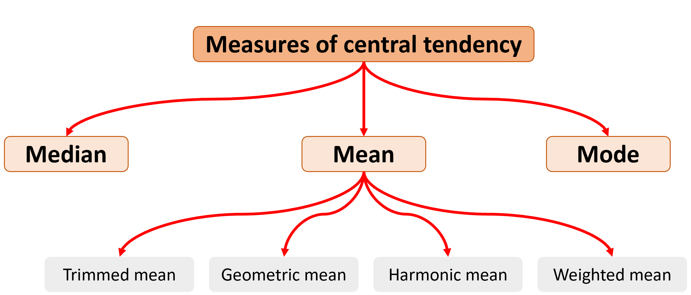
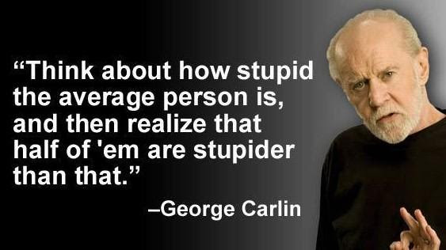
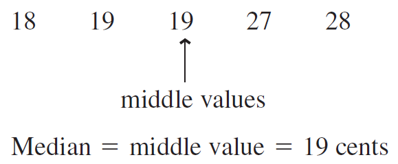
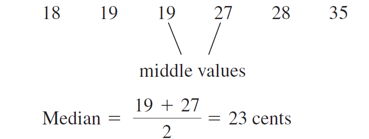
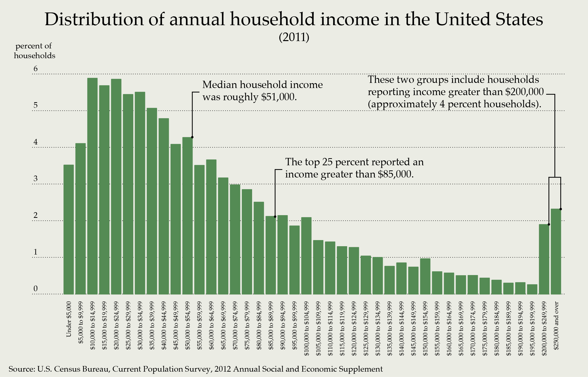
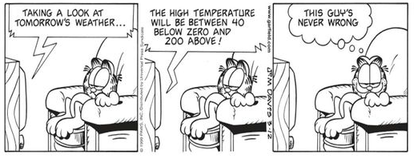
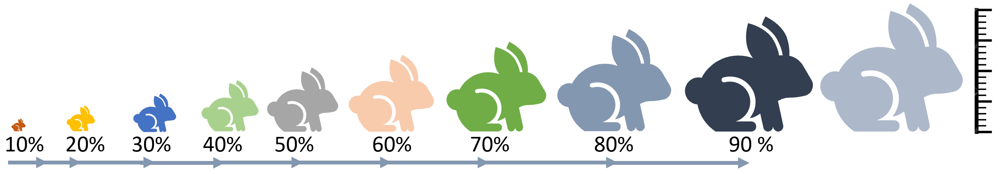
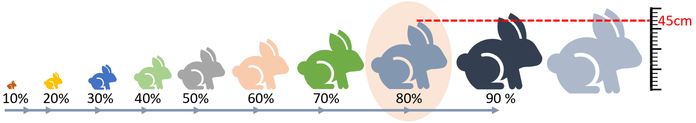
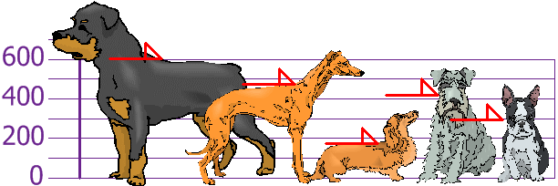

# Descriptive statistics
<iframe width="560" height="315" src="https://www.youtube.com/embed/OLCReYns0dQ" frameborder="0" allow="accelerometer; autoplay; clipboard-write; encrypted-media; gyroscope; picture-in-picture" allowfullscreen></iframe>

Ok, guys, by now you know how:

1. to set a question, 
2. reformulate the question based on your literature review, 
3. set up an error proof experiment, 
4. enter and manipulate data in R and
5. do some basic plots in R. 

Nice, ah?.

Now we move on to the analysis of any data you collect. That process is called **inference**; basically, drowning a conclusion based on the numbers and your interpretation of those numbers.

iii

```{block2, type='rmdnote'}
Inference is defined as the process of drawing conclusions based on evidence and reasoning.
```


Once you finish an experiment and collect your data, there are a few things to do:

First, you need visualize the data, using plots you learned how to do in the prior chapter.

Second, you need to use a set of available metrics to describe your data in general. You need to get the big picture first. Those BIG picture metrics are called **DESCRIPTIVE STATISTICS**.

Say you get hired to analyze the visiting times of costumers in a store. The manager wants to ensure his costumers are always being attended to so he wants to hire more people at pick hours. 

To tackled this problem, you probably want to record the time people walk into the store. Let's say 100 people came in a day. 

If you want to report your findings to the manager, you cannot just go and tell him, the first costumer came at 7 am, the second at 7:10, the third at 8:20 am....(one hour later)...and the 100th costumer came in at 7:00pm.

Very likely there is a pattern in that data, but the manager cannot really perceived it when the data are presented in raw form. So the manager cannot really make any decision to solve his problem based on what you did, so he may not have a reason to keep you.

Really what you want to do is to describe that data for him, as to facilitate his decision.

The metrics used to describe data overall are called **descriptive statistics**. Such metrics are commonly divided into those dealing with what is at the middle of your data (the so-call metrics of **central tendency**) and those dealing with how variable your data are (the so-call **metrics of dispersion**).


## Data distributions {-}

As mentioned several times in this class, the first thing to always do when analyzing data is to create a visual representation. You need to see what are the general tendencies in your data, and for that we commonly start with the frequency distribution.

Lets image that the plot below is the number of seedlings (points) at each height in my nursery. Interesting, ahh?. That type of distribution is called bimodal (there are two peaks in the data). Clearly, there is something going on in my nursery, some seedlings are doing particularly better than others.


```{r , echo=FALSE, message=FALSE, warning=FALSE}
library(ggplot2)
p<- ggplot(faithful, aes(x = waiting))+ xlim(0,100) +
geom_dotplot(binwidth = 1.5,fill="purple",color="black")  +
scale_x_continuous(name="Height seedlings (cm)", limits=c(0, 150)) +
  theme_bw()   +
theme(panel.border = element_blank(),
                     panel.grid.major = element_blank(),
                     panel.grid.minor = element_blank(), 
                     axis.line.x = element_line(colour = "black"),
                     axis.line.y = element_blank(),
                     axis.title.y=element_blank(),
                      axis.text.y=element_blank(),
                      axis.ticks.y=element_blank())
p

```

p

The distribution below is called a **uniform distribution**, any number is just as likely.

```{r, echo=FALSE,message=FALSE,warning=FALSE}
#lets create some data
DATA=runif(1000, min = -1, max = 1)
hist(DATA, xlim=c(-1,1) ,ylim=c(0, 200),main = NULL)

```

<iframe src="https://cmora.h5p.com/content/1291859658914550888/embed" aria-label="9. Randon distribution" width="1088" height="637" frameborder="0" allowfullscreen="allowfullscreen" allow="autoplay *; geolocation *; microphone *; camera *; midi *; encrypted-media *"></iframe><script src="https://cmora.h5p.com/js/h5p-resizer.js" charset="UTF-8"></script>


o

The distribution below is called a left distribution. I know, it is weird how the data tend towards the right but it is called a left distribution. It is also called negative  or asymmetrical distribution. Because it has only one peak, it can also be call unimodal distribution.
```{r, echo=FALSE,message=FALSE,warning=FALSE}
set.seed(3)
SkewedData <- rbeta(10000,25,2)*10000 #Lets create some dummy data that are skew

hist(SkewedData, main = NULL,breaks = 30, ylim=c(0,1500),)
```


In the figure below, you can explore different distributions,

<iframe src="https://mora.shinyapps.io/Distributions/" width="100%" height="600px"></iframe>


## Central tendency {-}

Central tendency refers to metrics that attempt to describe what is in the middle of your data. The main metrics of central tendency are the mean (also called average), the median, and the mode.


```{r, out.width = "100%", echo= FALSE, fig.align = 'center',fig.cap = 'Measures of central tendency'}

```

l

Let's create some dummy data to see what these metrics are intended to show, how to interpret them and when to use them.


```{r , message=FALSE,warning=FALSE}
set.seed (10)
y <- rnorm(1000) # the function rnorm allows you to create a random set of numbers from a normal distribution

#lets now plot that data using the hist function, you already know how to use:
hist(y, main = "Normal Distribution",breaks = 30)

```

### The arithmetic mean {-}
The arithmetic mean is the average of the numbers. It is easy to calculate: add up all the numbers, then divide by how many numbers there are. 

Mathematically, it is expressed as:


\begin{equation}
\bar{X} = \frac{\sum_{i=1}^n X_i}{n}
\end{equation}

```{block2, type='rmdimportant'}
The mean of a sample is denoted wit the letter $\bar{X}$; at times it does not include the horizontal bar above the letter.

The mean of a population is at times denoted with the lowercase letter $u$, at times it is not cursive. They are both calculated the same way.
```

The symbol that looks like a pacman, $\sum_{}$, is call **summation**. The lower letter $i$ indicates that the summation starts from the first number (i.e., i=1), and the higher letter *n*, means the last number. $Xi$ means each value. In short, the numerator of the equation above says: sum all values starting from the first one until the last one. $n$ indicates the sample size or total number of values in your database (if it is was the average of a population, you will likely see capital letter $N$ instead of the lowercase $n$ ).


```{r, out.width = "100%", echo= FALSE, fig.align = 'center',fig.cap = 'The stupid mean'}

```

y


In R, the mean is calculated with the function mean.

```{r , message=FALSE,warning=FALSE}
MEAN=mean (y, na.rm = FALSE)  #here I calculate the mean, and assign it to a variable.
MEAN           #to display the variable, simply type it, and click enter

```


You may have noted that I added 'na.rm = TRUE' in the mean function. This command is used as a caution to calculate the mean even if you have empty values. Lets check,


```{r , message=FALSE,warning=FALSE}
VectorMissingAValue <- c(12,7,3,4.2,18,2,54,-21,8,-5,NA)#here I created a vector of values, incluidng a missing value NA (NA in R stands for Not Available)
mean (VectorMissingAValue)  #If I calculate the mean of a vector with missing values I get
```

Now, if you include the command 'na.rm = TRUE', that will re-do the calculation excluding any missing value.


```{r , message=FALSE,warning=FALSE}

mean (VectorMissingAValue,na.rm = TRUE)  
```


```{block2, type='rmdcaution'}
In most R functions, it is important to include the command 'na.rm = TRUE', which means to exclude any missing value. If for any reason your data has empty cells or missing values, falling to include the 'na.rm = TRUE' command will result in an error....again this will be a problem only when you are missing data.
```


Alright, lets keep going. You can visualize the mean in the histogram using the function *abline*, and put a name using the *text* function, like this:


```{r , message=FALSE,warning=FALSE}
hist(y, main = NULL,breaks = 30, ylim=c(0,100),)
abline(v=MEAN, col="red",lwd=5) #abline put a line in a figure...you use v for vertical and h for horizontal, the value that proceeds is where the line will be drawn.


text("Mean",x=MEAN,y=100, col="blue") #the text function places a label on your figure at the given x and y position you like...there are several other parameters you can control. You can also use the function *legend*, which allows you more controls, including background colors.
```

### The trimmed mean {-}
There are several variations to calculate the mean, for instance the trimmed mean. One of the problems with the arithmetic mean is that it can be strongly impacted by extreme values. In those cases, it is recommend to trim the extremes and calculate the mean on the resulting values. 


Commonly, a %5 trimmed mean should satisfy. As its name indicates, you remove the top and bottom 5% of the data, and calculate the mean on those values.


Lets try a simple example. Say you measured the time it took 20 students to run 100m.


The individual values in seconds were 10, 20, 23, 23, 22, 20, 25, 22, 20, 25, 22, 20, 25, 20, 21, 21, 23, 21, 24, and 120. 

To calculate this in R, I put all values in a vector and calculate the mean, 


```{r  message=FALSE,warning=FALSE}
vals=c(10,20,23,23,22,20,25,22,20,25,22,20,25,20,21,21,23,21,24,120)
  
  mean(vals)
```


But from the data, you can tell that one student was very fast (only took 10 secs) and another one was very slow (he took 120secs). Lets try a 5% trimmed mean,

First, you sort the data from smallest to largest,


<span style="color: red;">10</span>,20,20,20,20,20,21,21,21,22,22,22,23,23,23,24,25,25,25,<span style="color: red;">120</span>


Now you remove the first and last (i.e, 5% of 20 is 1, so you delete the bottom and top one records, red numbers in the array). 

Now calculate the mean of the resulting data or the so-call 5% trimmed mean:

```{r , message=FALSE,warning=FALSE}
Trimmedvals=c(20,23,23,22,20,25,22,20,25,22,20,25,20,21,21,23,21,24)
  
mean(Trimmedvals)
```

The 5% trimmed mean is `r round(mean(Trimmedvals),2)` compared to the arithmetic mean `r mean(vals)`.


### The weighted average {-}

Sometimes we wish to average numbers, but we want to assign more importance, or
weight, to some of the numbers. For that we used the weighted average, which is calculated as:

\begin{equation}
Weighted \ average= \frac{\sum_{i=1}^n (X_i * w)}{\sum_{i=1}^n  w} 
\end{equation}


where $Xi$ is a data value and w is the weight assigned to that data value.

Lets try an example.

Suppose your professor tells you that your grade will be based on a midterm and a final exam, each of which is based on 100 possible points. However, the final exam will be worth 60% of the grade and the midterm only 40%. How could you determine an average score that would reflect these different weights? The average you need is the weighted average.

If you scored 83 in your midterm and 95 in your final, what will be your final grade?.


\begin{equation}
Weighted \ average= \frac{(83*40)+(95*60)}{(40+60)} 
\end{equation}

So your final grade will be `r round((((83*40)+(95*60))/(40+60)),2)`. Your average is high enough to earn an A, which I hope you all get in my class!. And if you have been paying attention, here are two tokens: jj


### The median {-}
The median (also referred to as the 50th percentile) is the middle value in a sample of ordered values. Half the values are above the median and half are below the median.

To calculate the median, you start by sorting all values from lowest to highest, the *median* is the value in the middle.

When your set of numbers is odd, the median is the single value in the middle of the sorted list. Below is a vector of values indicating the price of different candy. 

```{r, out.width = "100%", echo= FALSE, fig.align = 'center',fig.cap = 'Median calculation for odd number of values'}

```

When your set of numbers is even, you have a problem because there will be two numbers right in the middle of the sorted vector. In this case you report the arithmetic mean of the two values in the middle. 

```{r, out.width = "100%", echo= FALSE, fig.align = 'center',fig.cap = 'Median calculation for even number of values'}

```


y

In R, the median is calculated with the function median.

```{r , message=FALSE,warning=FALSE}
MEDIAN=median (y)  #here I calculate the mean, and assign it to a variable.
MEDIAN           #to display the variable, simply type it, and click enter

```

p

Let's plot the median with the mean value to the histogram we were doing before.

```{r , message=FALSE,warning=FALSE}
hist(y, main = NULL,breaks = 30, ylim=c(0,110),)

#lets plot the mean
MEAN=mean(y)
abline(v=MEAN, col="red",lwd=5) 
text("Mean",x=MEAN,y=110, col="red",pos=4) #pos=4 means, to place the text to the right of the coordinates xy.

# now the median
abline(v=MEDIAN, col="blue",lwd=3, lty=2) #I plot the median in blue to distinguish from the mean
text("Median",x=MEDIAN,y=100, col="blue", pos=2) 
```


### The mode {-}

The mode is simply the most common value in all of your data. 

R does not have a standard in-built function to calculate mode. So we create a user function to calculate the mode of a dataset. This function takes a vector as input and gives the mode value as output.


```{r , message=FALSE,warning=FALSE}
getmode <- function(v) {   # the function will take a vector of values
   uniqv <- unique(v)      #select all the unique values in the vector 
   uniqv[which.max(tabulate(match(v, uniqv)))] #stimate the number of times each value appears and return the largest
}

```

Now let's use our new function


```{r , message=FALSE,warning=FALSE}
MODE=getmode(y)  #here I calculate the mode, and assign it to a variable.
MODE           #to display the variable, simply type it, and click enter
```

Unlike the mean and the median, the mode can also be used with character data (i.e., words). For instance, you want to know what is the most common name in the USA?. For that you can use the mode.

```{r , message=FALSE,warning=FALSE}
# Create the vector with characters.
NAMES <- c("Peter", "Carl", "Darrell", "John", "Peter")

getmode(NAMES)  #here I calculate the mode, and assign it to a variable.

```


Let's plot our mode in the histogram with the mean and the median we were working on before.


```{r , message=FALSE,warning=FALSE}
hist(y, main = NULL,breaks = 30, ylim=c(0,110),)

#lets plot the mean
abline(v=MEAN, col="red",lwd=6) 
text("Mean",x=MEAN,y=110, col="red",pos=4) 

# now the median
abline(v=MEDIAN, col="blue",lwd=4, lty=2) #I plot the median in blue to distinguish from the mean
text("Median",x=MEDIAN,y=100, col="blue", pos=2) 

#now let's plot the mode
MODE=getmode(y)
abline(v=MODE, col="orange",lwd=4, lty=3) #I plot the median in blue to distinguish from the mean
text("Mode",x=MODE,y=90, col="orange", pos=4) 

```

You should have noted that the mean, median and mode are almost the same in this case. That is because the data are normally distributed (follow a normal distribution).

Let's see what happens when the data are skew.

```{r , echo=FALSE,message=FALSE,warning=FALSE}
set.seed(3)
SkewedData <- rbeta(10000,25,2)*10000 #Lets create some dummy data that are skew

hist(SkewedData, main = "Left skew (negative) distribution",breaks = 30, ylim=c(0,1500),)

#lets plot the mean
MeanSkewedData=mean(SkewedData)
abline(v=MeanSkewedData, col="red",lwd=6) 
text("Mean",x=MeanSkewedData,y=1500, col="red",pos=2) 

# now the median
MedianSkewedData=median(SkewedData)
abline(v=MedianSkewedData, col="blue",lwd=4, lty=2)
text("Median",x=MedianSkewedData,y=1400, col="blue", pos=4) 

#now let's plot the mode
ModeSkewedData=getmode(SkewedData)
abline(v=ModeSkewedData, col="orange",lwd=4, lty=3) #I plot the median in blue to distinguish from the mean
text("Mode",x=ModeSkewedData,y=1300, col="orange", pos=4) 

```


k

The reverse happens with a right or positive distribution:
```{r , echo=FALSE,message=FALSE,warning=FALSE}
set.seed(3)
SkewedData <-rbeta(10000,2,35)*10000 #Lets create some dummy data that are left

hist(SkewedData, main="Right skew (positive) distribution", xlab="", breaks=30, xaxt = "n", ylim=c(0, 1600))

#lets plot the mean
MeanSkewedData=mean(SkewedData)
abline(v=MeanSkewedData, col="red",lwd=6) 
text("Mean",x=MeanSkewedData,y=1600, col="red",pos=4) 

# now the median
MedianSkewedData=median(SkewedData)
abline(v=MedianSkewedData, col="blue",lwd=4, lty=2)
text("Median",x=MedianSkewedData,y=1500, col="blue", pos=2) 

#now let's plot the mode
ModeSkewedData=getmode(SkewedData)
abline(v=ModeSkewedData, col="orange",lwd=4, lty=3) #I plot the median in blue to distinguish from the mean
text("Mode",x=ModeSkewedData,y=1400, col="orange", pos=2) 

```

If you see the two skewed distributions above, you will notice how the mean is pulled by the extreme values of the distribution. That is a critical consideration of the arithmetic mean, it is affected by extreme values or so-call **outliers**.


So a basic rule of thumb is to look at the mean and the median. If they’re the same you can just use the mean, that’s more easy for the average reader to understand. If they differ significantly report them both, or just report the median

With skew distributions is when it becomes important the distinction between the mean and the median. Lets check an example in which you can deceive a conclusion based on reporting only the mean. 
 


```{r, out.width = "100%", echo= FALSE, fig.align = 'center',fig.cap = 'Income distribution in the USA'}

```

The figure above shows the household income of people in the USA. Clearly, the data follows a right distribution. In this distribution, the mean is larger than the median or the mode. So if you report the mean only, it may create an illusion that most people get paid well in the USA, when in reality most get paid much less. 

In this case, the mean increases primarily as a result of the wealthy becoming wealthier. If we are concerned about how the average American is doing, median is actually a better measure to understand their status.

The figure below summarizes the central tendency metrics by the type of data distribution.

```{r, out.width = "100%", echo= FALSE, fig.align = 'center',fig.cap = 'Central tendendy metrics in skew distributions'}
knitr::include_graphics("images/Distribution Skews.png")
```


<iframe src="https://cmora.h5p.com/content/1291859672197108718/embed" aria-label="11. Symbol sample mean" width="1088" height="637" frameborder="0" allowfullscreen="allowfullscreen" allow="autoplay *; geolocation *; microphone *; camera *; midi *; encrypted-media *"></iframe><script src="https://cmora.h5p.com/js/h5p-resizer.js" charset="UTF-8"></script>

## Dispersion {-}

Dispersion refers to describing the spread of your data. And there are different metrics that may help you describe the variability in your data.

### The minimum and the maximum {-}
The most basic metrics of the data dispersion are the minimum and the maximum. As their names indicate they are the lowest and the highest values in your data. 

In R, the minimum and maximum are calculated with the function min and max, respectively.

Let's plot them:


```{r , message=FALSE,warning=FALSE}
hist(y, main = NULL,breaks = 30, ylim=c(0,110),)

#lets plot the mean
abline(v=MEAN, col="red",lwd=6) 
text("Mean",x=MEAN,y=110, col="red",pos=4) 

# now the median
abline(v=MEDIAN, col="blue",lwd=4, lty=2) #I plot the median in blue to distinguish from the mean
text("Median",x=MEDIAN,y=100, col="blue", pos=2) 

#now let's plot the mode
abline(v=MODE, col="orange",lwd=4, lty=3) #I plot the median in blue to distinguish from the mean
text("Mode",x=MODE,y=90, col="orange", pos=4) 


#now let's plot the minimum
MINIMUM=min(y)
abline(v=MINIMUM, col="dark grey",lwd=4, lty=3) #I plot the median in blue to distinguish from the mean
text("Minimum",x=MINIMUM,y=90, col="dark grey", pos=4) 

#now let's plot the maximum
MAXIMUM=max(y)
abline(v=MAXIMUM, col="dark grey",lwd=4, lty=3) #I plot the median in blue to distinguish from the mean
text("Maximum",x=MAXIMUM,y=90, col="dark grey", pos=2) 
```

### The range {-}

Another simple metric to describe the dispersion in your data is called the **range**.u The range is the difference between the smallest and the largest number in your data. Of course, within the range everything is possible, so while descriptive and useful in many situations, it is not always the best indicator of inference.


```{r,fig.margin = TRUE, out.width = "100%", echo= FALSE, fig.align = 'center',fig.cap = 'The effect of the range'}

```


### The percentile {-}
A percentile indicates the percentage of values that are smaller than the given value.

For example, if you score 75 points on a test, and are ranked in the 85th percentile, it means that 85% of students that took that exam did worse than you. The way to report  it is like this: "the 85th percentile was 75 points".

How is the percentile calculated?. Simple,

1. Rank the values in your database from smallest to largest, we called this the sorted vector.

2. Multiply the number of values in your database by the given percentile you want to find as a fraction (If you want the 90th percentile, the fraction is 0.9), we call this resulting number the index or $Xth$ point

3. Now go back to your sorted vector, starting from the first number in that vector move to the right until the value located at the Xth point. The value located at the Xth point is your given percentile.


Lets do an example,

Take my population of ten rabbits below, and say I want to know the 80th percentile height of my rabbits?

```{r,fig.margin = TRUE, out.width = "100%", echo= FALSE, fig.align = 'center',fig.cap = 'My rabbit population'}

```

Because I am interested in height, I measure their heights. Say they were  37, 15, 35, 36, 5, 40, 41, 68, 45, and 56cm (I am  making these numbers up, so do not overthink the size of my rabbits).


I sort my rabbits by height. Say their sorted heights are 5, 15, 35, 36, 37, 40, 41, 45, 56 and 68cm.


```{r,fig.margin = TRUE, out.width = "100%", echo= FALSE, fig.align = 'center',fig.cap = 'My rabbits sorted by height'}

```


Next, I multiply the percentile of interest (80th) as a fraction (i.e., 0.8) by the number of rabbits (10). So the 80th percentile height is the height of whatever rabbit is sitting in 8th position. In this case the number is 45. So the 80th percentile of my rabbit population is 45cm.

```{r,fig.margin = TRUE, out.width = "100%", echo= FALSE, fig.align = 'center',fig.cap = 'The 80th percentile'}

```

In R, the percentile value in an vector of values is calculated with the function quantile. Basically, you need to enter the array of values, and the quantile you need (as a fraction).

Lets take the height of my rabbits above. 

```{r , message=FALSE,warning=FALSE}
MyRabbits=c(37, 15, 35, 36, 5, 40, 41, 68, 45, 56) #vector of rabbit height, it does no

quantile(MyRabbits, .8,type = 1)                  # the type parameter allows you to use different ways to approximate the value. check ?quantile  for more details
```


### The quantile {-}
The quantiles are specific percentiles that divide the data in equal amounts. Quantiles can take different names. For instance, quartiles break the data in four groups, deciles in ten groups, and percentiles in 100 groups.

Lets take the quartile example. In this case, the data needs to be broken in four groups, so the breaking points will be 0.25, 0.5, and 0.75. Those break points will create four different categories in which I can group my data (0 to 0.25], (0.25 to 0.5], (0.5 to 0.75] and (0.75, 1]. They can also be called the 1st quartile, 2nd quartile, 3rd quartile and 4th quartile. You can see those indexes at times being called Q1, Q2, Q3, and Q4.

Lets display the quartiles for a normal distribution.  


```{r , message=FALSE,warning=FALSE}
library (RColorBrewer)
library(dplyr)
library(scales)
set.seed(3)  


dt <- data.frame(x=rbeta(20000,100,100)*20000)             #Lets create some dummy normal data
dt$x <- rescale(dt$x,to = c(1, 100), from = range(dt$x))   #I rescale the data from 1 to 100 to better visualize the percentage results


dt=dt %>% arrange(x)                  #Sort values from smallest to largest
dt$Position=1:nrow(dt)                #Rank each value from smallest to largest
dt$y=(dt$Position/nrow(dt)) *100      #Assign the percentile position of each value

#Create colors to make the plot look nicer
ColSca <- brewer.pal(9, 'YlOrRd')   #Create a vector of nice colors in the  YlOrRd color scale
ColSca <- colorRampPalette(ColSca)  #create a color ramp for the colors above
Colors= ColSca(110) #create list of 100 colors in the ramp above

#create histogram
hist(dt$x, col=Colors,main = NULL,breaks = 100, ylim=c(0,800),xlab="Percent", ylab="Frequency")  

#calculate and add the quartiles and their names to the histogram.
Prob=c(0.25,0.5,0.75,1)  # this is the list of values that define my four quartiles
Quartiles=quantile(dt$x,Prob ,type = 1)  #calculate the quartiles of my data

abline(v=Quartiles, col="grey",lwd=4, lty=1) #I plot the quartiles

# now lets put names 
Names=c("Q1", "Q2", "Q3", "Q4")   #vector of names for my quartiles
text(Names,x=Quartiles,y=800, col="black", pos=2) #place quartile names at y=800 and x= quartile values

```


### The variance {-}
The variance measures how far a set of numbers is spread out from their average value. Put in another way, the variance measures the average degree to which each number is different from the mean. 

<iframe width="560" height="315" src="https://www.youtube.com/embed/Zr73e_XEug0" frameborder="0" allow="accelerometer; autoplay; clipboard-write; encrypted-media; gyroscope; picture-in-picture" allowfullscreen></iframe>


For a sample, the variance is calculated as:


\begin{equation}
Variance = s^2=\frac{\sum_{i=1}^n (X_i-\bar{X})^2}{n-1}
\end{equation}


For a population, the variance is calculated as:


\begin{equation}
Variance = σ^2=\frac{\sum_{i=1}^n (X_i-u)^2}{N}
\end{equation}

```{block2, type='rmdimportant'}

The parameter  $(X_i-\bar{X})^2$ is called *sum of squares*. Becuase each value is compared to the mean, if you do not square it, the result will be zero because the negative values will cancel the positive values. Squaring the difference between $(X_i-\bar{X})$ will make the quantity nonnegative.

```


A few things you may have notice about these two equationss.

1. The equations are almost identical to the arithmetic mean. Indeed, they are. The variance can be thought of as the average of the differences from each value to the mean.

2. When calculating the variance of a population we use the capital letter N but lowercase letter n when it is a sample.

3. The variance of a population is defined with the letter $σ^2$; for a sample it is the lowercase $s^2$.

4. When calculating the variance of a sample, the denominator is n-1 but for a population is N. Since a random sample usually will not contain extreme data values (large or small), we divide by $n-1$ in the formula for s to make s a little larger than it would have been had we divided by n. It is called the unbiased estimate for s. If we have the population of all data values, then extreme data values are, of course, present, so we divide by N instead of $n-1$.


Let's calculate the variance using a neat example, I took from [Here](https://www.mathsisfun.com/data/standard-deviation.html).


Here a group of children measured the height of their dogs in mm.

```{r, fig.margin = TRUE,out.width = "100%", echo= FALSE, fig.align = 'center',fig.cap = 'Sample of dogs heights'}

```

The heights (at the shoulders) are: 600mm, 470mm, 170mm, 430mm and 300mm. 

Next, you calculate the sample mean height, which is 394 mm (green line in figure below). 

```{r , message=FALSE,warning=FALSE}
HeightOfDog=c(600, 470, 170, 430 , 300)

mean(HeightOfDog)
```
j

```{r, out.width = "100%", echo= FALSE, fig.align = 'center',fig.cap = 'Sample of dogs heights'}
knitr::include_graphics("images/Variance 2.gif")
```


Next, for each dog, you calculate the difference of its height to the mean (Basically, the height between the red and the green line below),


```{r, out.width = "100%", echo= FALSE, fig.align = 'center',fig.cap = 'Sample of dogs heights'}
knitr::include_graphics("images/Variance 2.gif")
```


Let's isolate the individual differences:


```{r, out.width = "100%", echo= FALSE, fig.align = 'center',fig.cap = 'Sample of dogs heights'}
knitr::include_graphics("images/Variance 3.gif")
```


Following the equation of the variance for a sample, you square each difference, then add them and divide them by the sample size minus one.


\begin{equation}
Variance = s^2=\frac{206^2 + 76^2 + (−224)^2 + 36^2 + (−94)^2}{5-1}
\end{equation}


\begin{equation}
Variance = s^2=27130mm^2
\end{equation}


In R, the variance is calculate with the function var,

```{r , message=FALSE,warning=FALSE}
HeightOfDog=c(600, 470, 170, 430 , 300)

var(HeightOfDog)
```


Hmm, right?. The simplest variance to understand is when variance = 0, which means all values are the same. In reality, however, variance results are normally large numbers that are hard to interpret intuitively. But the variance allows you to calculate the standard deviation, which is actually much easy to comprehend.  

### The standard deviation {-}
The standard deviation is calculated as the square root of the variance, and has the same units as the mean.


\begin{equation}
Standard \ deviation= S = \sqrt {s^2}
\end{equation}


In R, the standard deviation is calculated with the function sd,

```{r , message=FALSE,warning=FALSE}
HeightOfDog=c(600, 470, 170, 430 , 300)

sd(HeightOfDog)
```

You can also try the square root of the variance,

```{r , message=FALSE,warning=FALSE}
sqrt(var(HeightOfDog))
```

Basically, SD= 164mm.

Now lets interpret that number....


In a normal distribution, 95% of the observations are within 2SD from the mean. So 95% of the dogs in the sample should between 394-(164mm x 2) and 394+(164mm x 2) or between 66mm and 722mm. 


<iframe src="https://cmora.h5p.com/content/1291859671689652408/embed" aria-label="10 Standard deviation" width="1088" height="637" frameborder="0" allowfullscreen="allowfullscreen" allow="autoplay *; geolocation *; microphone *; camera *; midi *; encrypted-media *"></iframe><script src="https://cmora.h5p.com/js/h5p-resizer.js" charset="UTF-8"></script>


In the example with the dogs, we have the problem of low sample size. If you recall an earlier chapter, the problem with low samples is that the variability increases as the sample size decreases and that is reflected in the standard deviation (SD).

Lets try the standard deviation in a large sample size.

```{r , message=FALSE,warning=FALSE}
y <- rnorm(1000) # the function rnorm allows you to create a random set of numbers from a normal distribution

#lets now plot that data using the hist function, you already know how to use:
hist(y, main = NULL,breaks = 30,ylim=c(0,120))

SD=sd(y)
Mean=mean(y)

#plot the mean
abline(v=(Mean), col="blue",lwd=4)
text("Mean",x=Mean,y=100, col="Blue", pos=4) 

#add two standard deviations 
abline(v=(Mean+(SD*2)), col="red") 
text("+2 SDs",x=(Mean+(SD*2)),y=100, col="red", pos=4) 


#minus two standard deviations 
abline(v=(Mean-(SD*2)), col="red") 
text("-2 SDs",x=(Mean-(SD*2)),y=100, col="red", pos=4) 
```

In the figure above, ~95% of the data should be between those two red lines. 

### The coefience of variance {-}

The coefficient of variation (CV) is another metric of dispersion. It is the ratio of the standard deviation to the mean. It is commonly given as a percentage. Basically,

\begin{equation}
CV = \frac{Standard \ deviation}{\bar{X}} *100
\end{equation}

Higher values indicate that the standard deviation is relatively large compared to the mean.

Lets try an example, a pizza restaurant measures its delivery time in minutes. The mean delivery time is 20 minutes and the standard deviation is 5 minutes. 

Thus, the coefficient of variation is 25% (some people may give it as a fraction, 0.25). This value tells you the relative size of the standard deviation compared to the mean. In this example, the standard deviation is 25% the size of the mean.

If the value equals one or 100%, the standard deviation equals the mean. Values less than one indicate that the standard deviation is smaller than the mean (typical), while values greater than one occur when the S.D. is greater than the mean.


## Exercises {-}

Some of these questions may take a while to load depending on your internet connection.

Assign the names to each distribution.
<iframe src="https://cmora.h5p.com/content/1291859668702561478/embed" aria-label="5. Distribution Shapes" width="1088" height="637" frameborder="0" allowfullscreen="allowfullscreen" allow="autoplay *; geolocation *; microphone *; camera *; midi *; encrypted-media *"></iframe><script src="https://cmora.h5p.com/js/h5p-resizer.js" charset="UTF-8"></script>


<span style="color: white;">o</span>


Take the following numbers (8 2 7 2 6), using the R console below estimate the mean, median, and mode, the standard deviation and 80th percentile.

<iframe width='100%' height='300' src='https://rdrr.io/snippets/embed/' frameborder='0'></iframe>


Now lets check some equations:
<iframe src="https://cmora.h5p.com/content/1291859667339391198/embed" aria-label="12. Drag the names to the correct equations for central tendency and dispersion" width="1088" height="637" frameborder="0" allowfullscreen="allowfullscreen" allow="autoplay *; geolocation *; microphone *; camera *; midi *; encrypted-media *"></iframe><script src="https://cmora.h5p.com/js/h5p-resizer.js" charset="UTF-8"></script>


## Homework {-}


Using Tinn-R or R-Studio, write down a code that:

1. Creates a sample of 1000 points from a normal distribution, and place them in a data.frame, with one column named X.

2. Estimate the mean, median and mode of variable X; have these individual values stored in their own variable names.

3. Estimate the standard deviation and place it in its own variable name.

4. Make a histogram of the data you created in numeral one. Adjust parameters of the figure to the guidelines for good figures.

5. Place the mean, median, mode and 2SDs from the mean as vertical lines. Make the color lines distinctive.

6. Name the vertical lines above. Work with the XY position of the 'text' so the labels look nice.

7. Save the code and email it as a homework.


