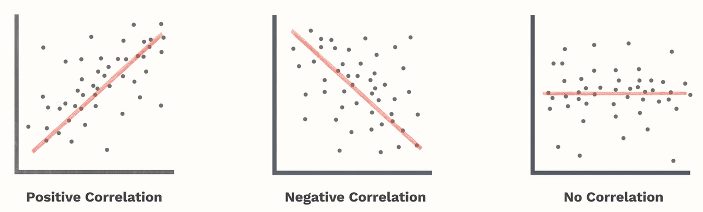
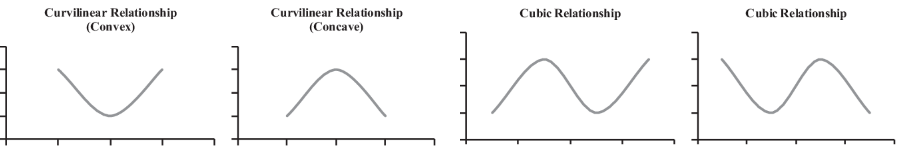
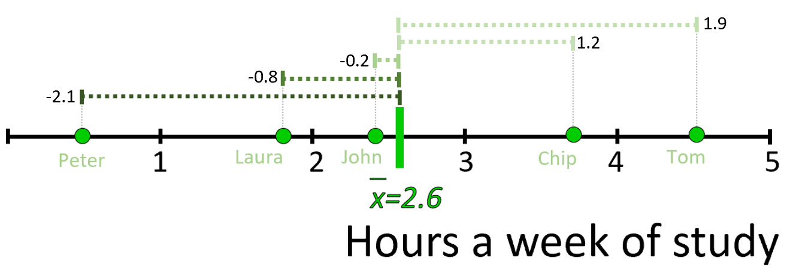
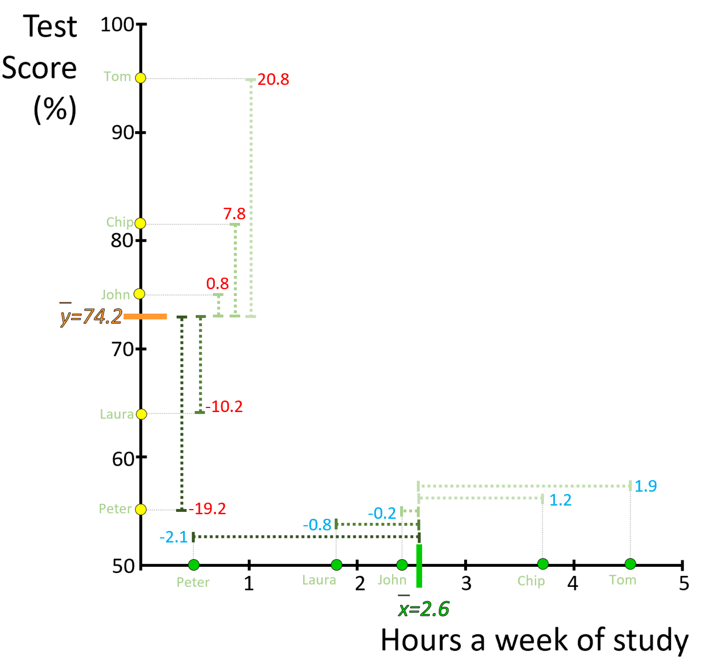
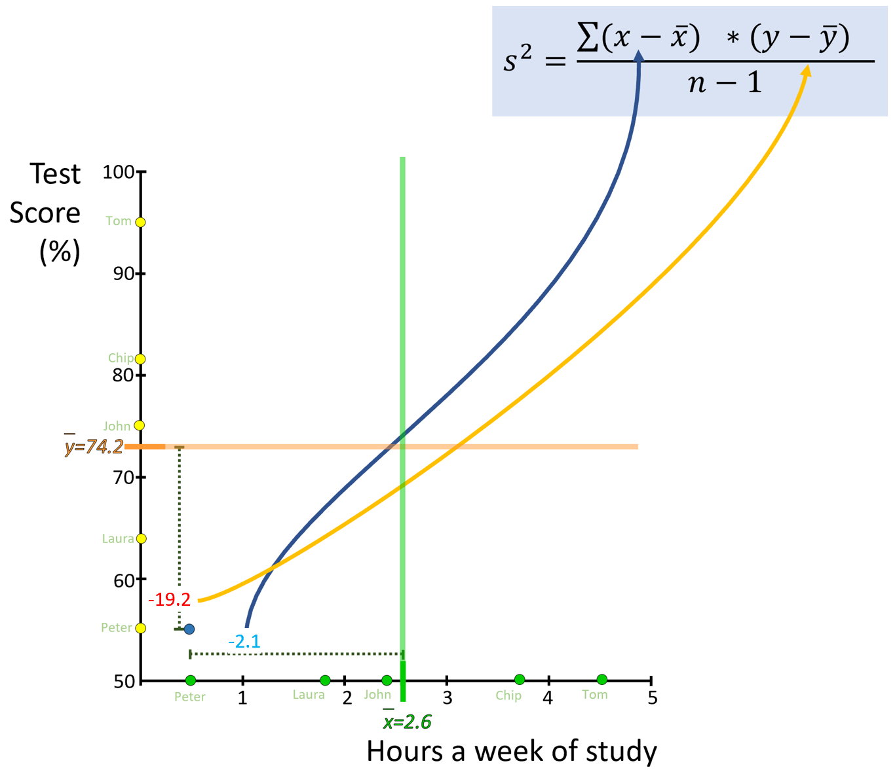
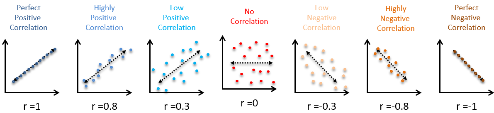
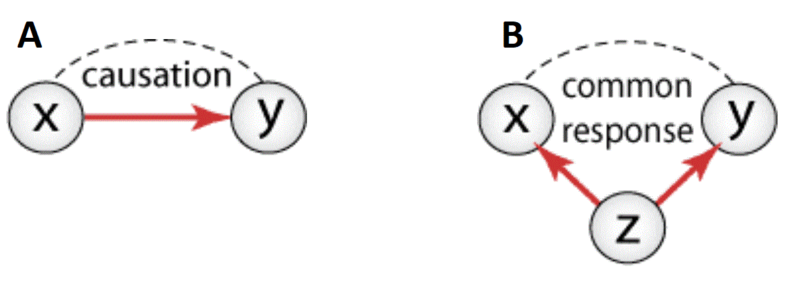
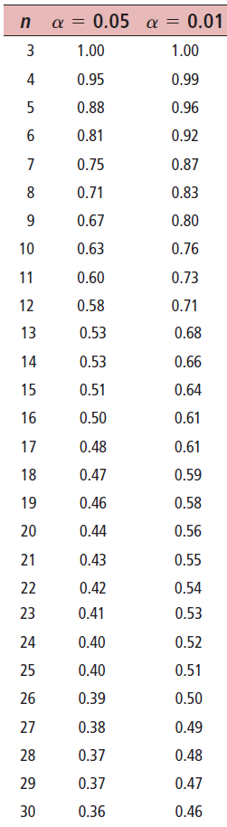

# Correlation {}

One of the core goals in statistics is to calculate the strength of the relationship between two variables. That goal can be applied to a broad diversity of research questions.

Say you did an experiment to test the effect of temperature on plants and say you have plantss growing at different temperatures. In this case, you probably would like to relate temperature to a dependent variable like say plant size. 

Instead, you may be interested to see how rain affects the common cold, in which case you may wish to relate the amount of daily rainfall and the daily number of hospitalizations by cold....

The possibilities are endless...but at the end of the day...all of them come down to simply assessing the strength of the relationship between two variables. For this specific purpose, we use the correlation and/or the regression analysis.

.

**Expectation for this chapter**

At the end of this chapter, it is expected that you:

1. Can create a publication quality R scatterplot to visualize the relationship between two variables.

2. Define the type of relationship between two variables (e.g., positive, negative, non-linear, non-existent).

3. Calculate the coefficient of correlation between two variables and understand what it tells you about the relationship between the two variables.


Alright, a lot to cover, so let's get started.


## Visualization of relationships  {-}
When looking into correlations and relationships the main display tool is the scatterplot. 

You already know how to use the scatterplot from Chapter 4. From that chapter, you should also already know the criteria for a plot to meet the standards required for publication. 


For the purpose of displaying a correlation and/or regression between two variables, the key consideration is if you assume if one variables influences the other.

From Chapter 1, the section on Experiments, you learned that the variable that influences another variable is called **the independent variable**. The one variable that is affected is called the **dependent variable**.

If the purpose of your study does not involve assessing if one variable influences the other, then it does not matter what variable you use for the X- or Y-axis.

However, if your study assumes that one variable influences another one, the independent variable is located in the X-axis, while the dependent variable should be located in the Y-axis.

Let's get to work in R. Let's work on an interesting relationship I sow in the New York Times, between the people that voted for Donald Trump by State and the degree of higher education at those States.

First, download the two databases from [Here](https://raw.githubusercontent.com/Camilo-Mora/GEO380/main/Datasets/TrumpVoters.csv) and [Here](https://raw.githubusercontent.com/Camilo-Mora/GEO380/main/Datasets/US-Pop-HigherEducation.csv).


Next, load the data into R (remember Chapter 3, section about loading your own data).

```{r, message=FALSE,warning=FALSE}
TrumpVoters_by_State <- read.csv("D:/GEO380/Datasets/TrumpVoters.csv") #Fraction of people by State that voted for Trump
HigherEducation_by_State <- read.csv("D:/GEO380/Datasets/US-Pop-HigherEducation.csv") #Fraction of people by State that have higher education degrees
```


Next check the data were loaded correctly and review the structure of the data:


```{r, message=FALSE,warning=FALSE}
head (TrumpVoters_by_State)
```

Review the same for the second database:

```{r, message=FALSE,warning=FALSE}
head (HigherEducation_by_State)
```

The data appear to have loaded correctly. But I have the data I want in two different data.frames, so I have to merge them. In this case, I have one variable in common to the two data.frames that I can use to merge them by; that is the variable State. So, let's merge our two data.frames by State.

p
i
```{r, message=FALSE,warning=FALSE}
Data=merge(TrumpVoters_by_State,HigherEducation_by_State,by="State")
```


```{block2, type='rmdimportant'}
When merging databases, things can get tricky as you need to have at least one column in common to merge by. You need to ensure that in both databases, each field uses the same names for the data.

For instance, say you have a common column call *state*, but in one database the data are shown by full names but in the other by abbreviate name. 

In this case, the merge function will return an empty database, because the two databases do not have variables that can be matched.

In such cases, you need to modify the original databases to ensure the two data.frames share a common variable, with similary named data. 
```

Let's review the new merged database:
u
```{r, message=FALSE,warning=FALSE}
head (Data)
```


Ok, now lets plot the data. In this case, I think the fraction of people that voted for Trump could be function of how educated they were, not the other way around; that would be like saying that Trump affected the degree of education of each State....hmm...when I say like that is does not sound that unlikely, ah?.

This distinction is important because you need to determine which variable goes in the Y axis, and which one on the X-axis. 

If I think, the votes for Trump were influenced by the level of their education, them level of education will be the independent variable and then it will be located in the X-Axis. In this reasoning, The percent of the State's population that voted for trump will be the dependent variable, and so, it should be located on the Y-axis. Lets do that plot:

```{r, message=FALSE,warning=FALSE}
plot(Data$TRUMPVoteAsFraction~Data$BachelorDegreePerStateAsFraction, ylab="Trump voters by State (Fraction)",xlab="High degree education (Fraction of population)")
```

Hmm, from this visualization alone you can tell something is cooking here...the least educated states voted for Trump more so than States with more educated populations. Let's explore this relationship in more detail, as a case example.

## Linear relationships  {-}
Generally speaking two variables can related in three difference "fashions": linear, non-linear, or non-related. There are different mathematical approaches to tackle each type of relationship. Here we will cover only linear relationships, but I want you to learn to at least identify the other types. 

Let's start with the linear relationships. Linear relationships, as the name sort of indicates are better described by a straight line. This type of relationships can be further separated between **positive**  relationships, in which Y-increases as X-increases and **negative**  relationships, in which Y-decreases as X-increases.

Obviously, you also have the option that the two variables do not relate to each other (see figure below)


```{r, out.width = "100%", echo= FALSE, fig.align = 'center',fig.cap = 'Types of relationships'}

```

## Non-linear relationships  {-} 
Relationships that cannot be well described with a linear model, are called non-linear relationships. Non-linear relationships can take all sorts of shapes, names and mathematical approaches to define them. They will not be covered as part of this class, but you should be aware they exist. 


```{r, out.width = "100%", echo= FALSE, fig.align = 'center',fig.cap = 'Types of relationships'}

```

## The Covariance  {-} 
The strength of the linear association between two variables is mathematically measured with the so-call **Correlation Coefficient**. The Correlation Coefficient is abbreviated with the lowercase letter $r$ (that is not a token). However, to estimate the Correlation Coefficient, you need to first estimate the so-call **Covariance**.

Check a brief explanation of the covariance in the following video:

<iframe width="560" height="315" src="https://www.youtube.com/embed/F4oRgSYEssU" frameborder="0" allow="accelerometer; autoplay; clipboard-write; encrypted-media; gyroscope; picture-in-picture" allowfullscreen></iframe>


The covariance is an extension of the *variance* calculation we did earlier to measure the spread of the data in a variable, but in the covariance we analyze two variables. In fact, if you were to assess the relationship between a variable and itself, the covariance will be identical to the variance.  

In a nutshell, the covariance tells you if the differences in two variables are trending on the same direction.

Mathematically, the covariance is calculated with the following equation:


\begin{equation}
Covariance = COV(XY) = \frac{\sum_{i=1}^n (x -\bar{x})*(y -\bar{y})}{n-1}
\end{equation}


Let's try a simple example to estimate the Covariance. Let's consider the relationship that exist between the time that you study for my class and the grade that you get. 

```{r, out.width = "100%", echo= FALSE, fig.align = 'center',fig.cap = 'Time stuying relates to test scores'}

```

Say, I asked five students how long they studied each week and the grade they got in my prior classes. These were the data:


```{r, echo= FALSE, message=FALSE,warning=FALSE}
StudyingTimes= data.frame(Names=c("Peter","Laura", "John", "Chip", "Tom"),
Hours_Studying=c(0.5, 1.8, 2.4, 3.8, 4.5),
Grade=c(55, 64, 75, 82,95))

knitr::kable(
  StudyingTimes, longtable = TRUE, booktabs = TRUE,
  caption = 'Grades and time studying Stats',padding = 5
)
```


As always, we start by plotting the data:
```{r, message=FALSE,warning=FALSE}
StudyingTimes= data.frame(
  Names=c("Peter","Laura", "John", "Chip", "Tom"), #lets create a data.frame with three columns
  Hours_Studying=c(0.5, 1.8, 2.4, 3.8, 4.5),
  Score=c(55, 64, 75, 82,95))


#now let's do the plot
plot(Score~Hours_Studying,data=StudyingTimes,xlab="Hours a week studying", ylab="Final class score (%)")
```

Lets break the calculation of the covariance into its parts so we can better appreciate what it does.

First, we calculate the mean of alll values in X and the difference from each value to that mean:


```{r, out.width = "100%", echo= FALSE, fig.align = 'center',fig.cap = 'Differences in X'}

```


Let's do the same for the Y-axis:


```{r, out.width = "100%", echo= FALSE, fig.align = 'center',fig.cap = 'Difference in Y'}

```


Following the equation of the covariance, for the first point in the data (i.e., Peter), we place his difference to the mean in X (i.e, -2.1) and its difference to the mean in Y (-19.2), in the numerator. Like this:


```{r, out.width = "100%", echo= FALSE, fig.align = 'center',fig.cap = 'Difference in X'}

```

We can do that for all data points and obtain:

\begin{equation}
Covariance = COV(XY) =\frac{\sum_{} (-2.1)(-19.2) + (-0.8)(-10.2) + (-0.2)(0.8) + (1.2)(7.8) + (1.9)(20.8)}{5-1}
\end{equation}
.
\begin{equation}
Covariance = COV(XY) =24.3 Hours*Test Score
\end{equation}


Hmm???, Right?...as mentioned earlier the score of the covariance by itself is hard to interpret, but it may still provide useful information about the trend of the data...in this case the covariance is positive, indicating that the differences in X trend in a positive direction as the differences in Y. Basically, as students study more they get higher grades...Please remember that!...and here it goes a token j

In R, the covariance is calculated with the *cov* function:

```{r, message=FALSE,warning=FALSE}
cov(StudyingTimes$Score,StudyingTimes$Hours_Studying, use = "everything",  method = "pearson")
```


## The Correlation Coefficient, r {-}
As indicated earlier, the strength of the linear association between two variables is mathematically measured with the so-call **Correlation Coefficient**. At times, it is also called the **Pearson product-moment correlation coefficient**, after Karl Pearson, who is credited with formulating r.

Mathematically, the correlation coefficient, $r$, is calculated with the following equation:

\begin{equation}
r = \frac{cov (XY)}{Sx * Sy} 
\end{equation}

Basically, the correlation coefficient, $r$,is the Covariance divided by the multiplication of the standard deviation of the data in X and the standard deviation of the data in Y. 

If you think about this equation, the covariance is the product of the differences in X and Y. While the standard deviations are independently the differences in X and the differences in R. So, in practical terms,  the correlation of coefficient is an standardized metric. It will never be smaller than -1 or larger than 1. 

That is why the correlation coefficient is such a nice term to access the over tendency between two variables. if it is closer to -1 then you know the data probably follow a strong and negative trend. If it is close to 1, then the data follow a positive and strong trend. If it is closer to zero, then the data is all over the place (there is not correlation). Towards the end of the chapter, we will do over more details on how to interpret the correlation coefficient.

Lets calculate it,
```{r, message=FALSE,warning=FALSE}
COVXY= cov(StudyingTimes$Score,StudyingTimes$Hours_Studying, use = "everything",  method = "pearson") #Covariance
SDX= sd(StudyingTimes$Hours_Studying)            #Standard deviation for X
SDY= sd(StudyingTimes$Score)                     #Standard deviation for Y
r=COVXY/(SDX*SDY)
r
```
So the coefficient of correlation between the time that you study and the score in my class is 0.98. That means the more time you study the higher your grade...nice, ah???

In R, the coefficient of correlation can be calculated direvtly with the fucntion *cor*, 

```{r, message=FALSE,warning=FALSE}
cor(StudyingTimes$Score,StudyingTimes$Hours_Studying, method = "pearson")
```

### Alternative formulation {-}

While looking into the correlation coefficient you will likely see alternative formulations of it that yield the same or very close approximations.

For instance, you may find it formulated like this:

\begin{equation}
r = \frac{1}{n-1} \sum_{}\frac{x-\bar{x}}{Sx}\frac{y-\bar{y}}{Sy}
\end{equation}

This equation above, is pretty much the same  we used earlier, but reorganizing the parts.


At times, you can also defined as:

\begin{equation}
r = \frac{n * \sum_{} xy- (\sum_{} x)*(\sum_{} y)}{\sqrt {n * \sum_{} x^2- (\sum_{} x)^2 } * \sqrt {n * \sum_{} y^2- (\sum_{} y)^2 }}
\end{equation}

Which will yield a very close approximation to the equation we used earlier.

```{block2, type='rmdnote'}
Be careful! The notation $\sum_{}x^2$ means first square $x$ and then calculate the sum,
whereas $(\sum_{}x)^2$ means first sum the x values and then square the result.
```


For the equation above, all we have to compute $\sum_{}x$, $\sum_{}y$, $\sum_{}x^2$, $\sum_{}y^2$, and $\sum_{}x*y$,  Let try, for the sake of being sure and for you to use some tools from R.

```{r, message=FALSE,warning=FALSE}
Y=StudyingTimes$Score
X=StudyingTimes$Hours_Studying
SumX= sum(X) #sum all values of x
SumY= sum(Y)              #sum all values of y
SumX2=sum (X^2) #sum all values of x^2..
SumY2=sum (Y^2)      #   sprintf("%.0f",sum (Y **2))    
SumXY=sum (X*Y)  #sum all value of x * y
n=nrow(Data) # the number of observations is basically the number of rows in the database
SumY2
```

The results are:

$\sum_{}x$ = `r round(SumX,2)`

$\sum_{}y$ = `r round(SumY,2)`

$\sum_{}x^2$ = `r round(SumX2,2)`

$\sum_{}y^2$ = `r sprintf("%.0f",SumY2)`

$\sum_{}x*y$ = `r round(SumXY,2)`

n = `r n`

Now we plug those values into the coefficient of correlation, r, equation:

.

\begin{equation}
r = \frac{n * \sum_{} xy- (\sum_{} x)*(\sum_{} y)}{\sqrt {n * \sum_{} x^2- (\sum_{} x)^2 } * \sqrt {n * \sum_{} y^2- (\sum_{} y)^2 }}
\end{equation}


.


\begin{equation}
r = \frac{`r n` * `r round(SumXY,2)`- (`r round(SumX,2)`)*(`r round(SumY,2)`)}{\sqrt {`r n` * `r round(SumX2,2)`- (`r round(SumX,2)`)^2 } * \sqrt {`r n` * `r format(SumY2, scientific=FALSE)`- (`r round(SumY,2)`)^2 }}
\end{equation}

.

In R, it is basically:

```{r, message=FALSE,warning=FALSE}

r=(n*SumXY-(SumX*SumY))   /  ( sqrt(n*SumX2 -SumX^2)  * sqrt(n*SumY2 -SumY^2)   )

r
```

\begin{equation}
r = `r round(r,2)`
\end{equation}

Hmm, what do you think is causing the difference to the original calculation?

## Interpreting r {-}

The correlation coefficient, $r$, is unitless...by dividing by the standard deviations the products of the differences in x and y, the result loose its units. This means the value can be compared among studies for any set of x and y variables but can also be interpreted between a set of standard values (i.e., -1 to 1).

In short, the correlation coefficient, $r$, can range from -1 (perfectly negative correlation) to 1 (perfectly positive correlation). Like in the images below.

```{r, out.width = "100%", echo= FALSE, fig.align = 'center',fig.cap = 'Examples of correlation coefficients'}

```

## Causation {-}
The correlation coefficient measures the strength of a linear relationship between two variables. Thus, it makes no implication about cause or effect. The fact that two variables tend to increase or decrease together does not mean that a change in one is causing a change in the other. 

At times, two variables may be strongly correlated because they are equally correlated to a third (either known or unknown) variable. Such variables are called **lurking variables**. Lets take the following example:

```{r, out.width = "100%", echo= FALSE, fig.align = 'center',fig.cap = 'Examples of lurking variables'}

```

In the figure above, the dashed lines show an association.  The solid red arrows show a cause-and-effect link.  The variable x is explanatory, y is a response variable, and z is a lurking variable.

Basically, in example **B**, you will find a strong correlation between x and y, not because they are causality related, but because they are both strongly affected by a variable you did not measure (i.e., Z in the case example above) or a so-call lurking variable. The effect is that you can make spurious conclusion if you interpret the coefficient correlation as a cause and effect.


For instance, you know that in tropical countries there is a strong correlation between the consumption of ice cream and shark attacks?. One could conclude that sharks like sweet people?. Hmm...think about this correlation....is there a lurking variable here?. what could it be?

```{r, out.width = "100%", echo= FALSE, fig.align = 'center',fig.cap = 'Example of a lurking variable'}

```


## p-value {-}

If you were to take any two random variables and correlate them together, you will still get a correlation value. You may think that if the two variables are random, then the correlation will be close to zero...well you are wrong. 

It turns out that even by random chance alone variables may still be correlated. The chances of getting a higher correlation increase the lower the sample size. Just think about it, if you were two correlate any two data points, almost certainly your correlation will be 1 or -1.

To address this potential caveat, we use established tables that tell you if the correlation you found could be different from random. Basically, you need to know if the correlation is significant or not.

That word "significant" is tricky because it implies a level or threshold of error you are willing to take. That threshold is call **critical value**, again it is the margin of error you are willing to accept as error.

In biology, we normally give ourselves a 5%  chance of being wrong (p<0.05). But at times, it is preferable to be more certain and we take only a 1% chance (p<0.01).

```{block2, type='rmdnote'}
Remember that the parameter $n$ is call **sample size**.
```

For the case of the correlation, the significance of the correlation can be assessed quickly with a probability table, as the one shown below:


```{r, out.width = "50%", echo= FALSE, fig.align = 'center',fig.cap = 'Significance of correlations'}

```

Lets use the example we have been working on about the relationship between the time students study and their grades. In that case, $r$=`r round(r,2)` and the sample size $n$ was 5 students.


Is that coefficient of correlation significant?. Can I obtain a similarly high correlation, ifor any similar set of random variables?.


To find out, you first select your critical value, $\alpha$, lets choose 0.05. In this case, the second column is the one we are interested on. 

Next, you scroll-down column one until the sample size in the table matches ours (that is 5). 

At that row, if you look over the value in the second column, that is the coefficient of correlation of any two random variables with five points. In our case, that value is 0.81.


Our correlation coefficients was larger, $r$=`r round(r,2)`, meaning that it is unlikely our correlation could occur by chance alone.

There you have it. The more time you study the better grades you get, now demonstrated mathematically. keep a couple tokens while you are at it...gh...


## Homework {-}

When studying crime levels among universities around the country, a scientists found the following data

x= 12.5, 30.0, 24.5, 14.3, 7.5, 27.7, 16.2, 20.1
y= 26, 73, 39, 23, 15, 30, 15, 25

Let x be students enroll (in thousands), and y the number of burglaries at the given university campus.


(a) Make a scatter diagram, adjust aesthetics so the figure follows publication guidelines.

(b) Display in the plot the correlation coefficient.

(c) Would you say the correlation is low, moderate, or high? positive or negative?

(d) Was it significant?


Place the figure and your responses in a Word document and email it as a homework. Send a nice looking document.

