# Regression {}

While the goal of correlation is to give you a metric of the strength of the relationship between two variables; the goal of regression is to give you a numerical representation of the tendency in your data. That numerical representation is called a **model** that describes a line that best represent the tendency in your two variables. At times, that line can also be called a **regression line** or a **trend** line.

Here we will be working on linear regression models...this means to find an straight line to best represent the relationship between two variables.

For instance, the blue line below appears to represent well the tendency that exist between variables Y and X. The goal of this chapter is to use a mathematical procedure (linear regression) that allows you to identify that line.

```{r, echo=FALSE, message=FALSE,warning=FALSE}
X=c(-2.16, -0.76, -0.26,  0.84,  2.34) 
Y=c(-1.98, -1.48,  0.12,  1.32,  2.02)       

MeanX=mean(X)
MeanY=mean(Y)


#now let's do the plot
plot(X, Y,xlab="X",ylab="Y", col="blue",pch="*", cex=2, xlim=c(-4,4),ylim=c(-4,4.5))
abline(lm(Y ~ X),  col="blue",lwd=1)
```


As indicated in the prior chapter, all relationships do not have to be linear, there are also those so-call non-linear relationships. For now, we will cover only linear relationships, or straight lines that best summarize the relationship between two variables.


There are a few cool benefits to having a single line describing the data:

1. It allows you to mathematically define how two variables are related. Like if I increase X by 2 then Y increases by how much?.

2. It will allow you to make predictions  over areas in which you have no data. Like if X is 52.3 then Y is?

3. You do not need to carry/display the data every time you want to work with the database.


To define that best-fitting line, we will use what is called the **least squares** method; sounds scary, but it is actually very simple.

$$\\[.0005in]$$

**Expectation for this chapter**

At the end of this chapter, it is expected that you:

1. Can estimate a linear regression model that defines the linear relationship between two variables using the least-squares criterion.

2. Be able to interpret the results from a linear model.

3. Use the equation of the regression model to predict Y-values (interpolation and extrapolation).

4. Calculate the coefficient of determination and understand what it tells you about the relationship between two variables.


Alright, let's get to it.


## Parts of a line {-}
Before we get into the needy-greedy of linear regression models, we should start by knowing how a line can be constructed.

In practical terms, an specific straight line, in a XY space, can be drawn by knowing just two parameters: the **intercept** and the **slope**.


```{r, out.width = "50%", echo= FALSE, fig.align = 'center',fig.cap = 'The slope and the intercept'}
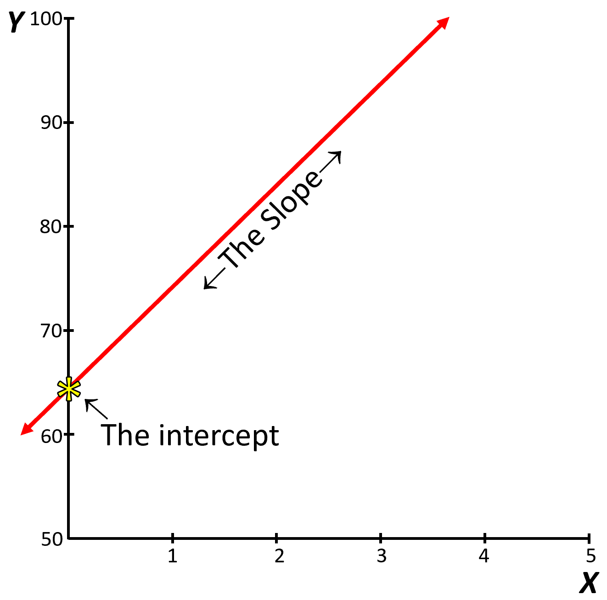
```


The intercept is basically the position in the Y-axis where the regression line crosses, or the value of Y when X=0.


The slope is the inclination of that line, or the change in Y divided by X. It also indicates the mount by which Y changes for unit of change in X; more on this later.

With the slope and the intercept you can draw any line you like.


```{block2, type='rmdimportant'}
At times, you will see the intercept being referred with the lowercase letter $a$ or $b$ or $b1$, whereas the slope is at times named with the lowercase $m$ or $b2$ (those are not tokens).
```

Let's check what the intercept and the slope do to a line.

For plotting a line in R, we use the *abline* function, which we used before for drawing horizontal or vertical lines. You can also use that R-function to draw lines with specific slopes and intercepts. Let's try.

Lets plot three lines with different slopes, but the same intercept. 

```{r, message=FALSE,warning=FALSE}
#play around with the lines of code below to see how they work

#First lets create an empty plot and make the x and y axis nicer.
plot(0, 0,xlab="X",ylab="Y",  xlim=c(-4,4),ylim=c(-4,4.5),col="grey")
  abline(h=0,lwd=2, col="grey",lty=1) 
  abline(v=0,lwd=2, col="grey",lty=1) 
  
# lets draw a first line with an intercept of 1, and a slope of 0.5. 
# In abline, the first number will be the intercept and the second will be the slope.
  
Intercept=1  #lets create a variable for the intercept, which i choose to call intercept and make that variable = 1
Slope=0.5    #lets create a variable for the slope, which i choose to call slope and make that variable = 0.5

abline(Intercept, Slope, col="orange") #lets plot the line, with my slope and intercept and make it orange to differentiate it

# now, draw another line keeping the intercept the same and increase the slope to 1.5
Slope=1.5
abline(Intercept, Slope, col="blue") #lets make it blue to differentiate it

# try keeping the intercept the same and increase the slope to 2.5
Slope=2.5
abline(Intercept, Slope, col="green") #lets make it green to differentiate it

#We can verify the intercept, by plotting the point in Y, where the line intercept.
points(0,Intercept, pch="*",cex=3, col="red") #remember the intercept is when x=0.
```


Lets now change the intercept, but keep the slope the same


```{r, message=FALSE,warning=FALSE}
#play around with the parameters in the code below to see how they work

#plot first
plot(0, 0,xlab="X",ylab="Y",  xlim=c(-4,4),ylim=c(-4,4.5),col="grey")
  abline(h=0,lwd=2, col="grey",lty=1) 
  abline(v=0,lwd=2, col="grey",lty=1) 
  
# now try a combination of difference intercepts but the same slope.
  
Intercept=1  
Slope=0.5   

abline(Intercept, Slope, col="orange") #lets plot the line, and make it orange to differentiate it

# keep the slope the same and increase the Intercept to 2
Intercept=2
abline(Intercept, Slope, col="blue") #lets make it blue to differentiate it

# keep the slope the same and increase the Intercept to 3
Intercept=3
abline(Intercept, Slope, col="green") #lets make it green to differentiate it

```


### How to interpret the slope {-}

The slope should be interpreted as the amount of change in Y for a single unit of change in X.

Let's say, you are told that a given relationship between total rainfall (in litters) and the amount of time (in hours) is 500. From that slope alone, we can tell now that for each extra hour, there will be 500 litters of water falling.

```{block2, type='rmdimportant'}
The units of the slope are the units of the variable in Y divided by the units of the varaibles in X. Say the units of Y are in litters and the units of X are in hours, so the slope will be in litters/hours.
```

To contextualize the slope graphically, you can take any point along the trendline, and move horizontally one unit; the difference between the Y-point at the first X and the Y-point at X+1, is your slope...Lets check.


```{r, message=FALSE,warning=FALSE}
#plot first
plot(0, 0,xlab="X",ylab="Y",  xlim=c(0,10),ylim=c(0,5000),col="grey")
  abline(h=0,lwd=2, col="grey",lty=1) 
  abline(v=0,lwd=2, col="grey",lty=1) 

#lets draw a trend line with a slope of 500, that intercepts the origin.
Intercept=0  
Slope=500  

abline(Intercept, Slope, col="orange") #lets plot the trend line, and make it orange to differentiate it


#lets move one unit along X, starting at zero
segments (0,0,1,0, col="red",lwd=3) #lets make that segment red

#from that point, X+1, lets move up 500 units, if the calculation is correct, then that segment of 500 units in Y should finish at the interception with the trend line...lets see

segments (1,0,1,500, col="blue",lwd=3) #here I draw a segment starting a x=1, y=0...until x=1, y=500
```

```{block2, type='rmdimportant'}
The slope represents the inclination of the regression line and reflects the amount of change in Y for a single unit of change in X.
```

### How to interpret the intercept {-}

The intercept is the expected value of Y when X=0.

Say that among children there is a relationship between age (in years) and size (in centimeters), and the Y-intercept is 35cm. What does that tell you?. 

So since the Y-intercept is the value at which X=0, then a Y-intercept of 35cm means the size of a child when he is zero years of age. Basically, children on average are born at 35cm of size.


```{block2, type='rmdimportant'}
The intercept represents the value of Y, when X= 0. The units of the intercept are the same units of the varaible in Y.
```

## Purpuse of the regression line {-}
As indicated earlier, a common name for the intercept is the lowercase letter $b$ and a common name for the slope is the lowercase letter $m$, in the regression model they come together as:

\begin{equation}
Y = mX + b
\end{equation}

The beauty of the regression model above is that by knowing $m$, and $b$, you can predict any value of Y, if you know X.

Say there is a relationship between years of higher education and salary, which is well defined with a regression equation with an intercept of $25,000 and a slope of $10,000 dollars/year. Given the units given, you should predict that salary is in the Y-axis and years of education in the X-axis. I can turn that into the equation, like:

\begin{equation}
Salary = 10,000 * \text{(Years Of Education)} + 25,000
\end{equation}

I can also display, that line in an XY plot, using the abline function:

```{r, message=FALSE,warning=FALSE}
#plot first
plot(0, 0,xlab="Years of education",ylab="Salary (in US dollars)",  xlim=c(0,10),ylim=c(0,150000),col="grey")
  abline(h=0,lwd=2, col="grey",lty=1) 
  abline(v=0,lwd=2, col="grey",lty=1) 

#lets draw a trend line with the given parameters
Intercept=25000  
Slope=10000  

abline(Intercept, Slope, col="orange") #lets plot the trend line, and make it orange to differentiate it
```

You can also ask questions, like what will be an average salary for a person that studies 4 years of higher education?..You simply replace the $x$ variable in the equation with the number 4 and do the mathematical calculation to get the average expected salary.

\begin{equation}
Salary = 10,000 * 4 + 25,000
\end{equation}

So the expected salary of a person that studies four years of higher education is $65.000.

<iframe src="https://cmora.h5p.com/content/1291859705227891048/embed" aria-label="18. Intercept" width="1088" height="637" frameborder="0" allowfullscreen="allowfullscreen" allow="autoplay *; geolocation *; microphone *; camera *; midi *; encrypted-media *"></iframe><script src="https://cmora.h5p.com/js/h5p-resizer.js" charset="UTF-8"></script>

Ok, at this moment you know the basics of a linear regression model. In a nutshell, a linear regression model is a mathematical equation that includes a slope and an intercept which allows you to draw a line, from which you can also predict any value of Y given values of X.

## The least-squares line {-}
By now, you know the formulation (i.e., $Y= mX + b$) and the general purpose (i.e., to predict Y, given values of X) of a linear regression model. The next task in this chapter is to figure out how to get the best line that can be drawn through two variables that we want to relate.

Obviously, you can draw an infinite number of straight lines trhough a set of datapoints; then a key question is which line best describe the data?. That is the goal of the linear regression model: to draw a **best-fit line** through the datapoints. 

The best fitting line will be a line that minimizes the distance from each point to that line. In mathematical terms, that line is called the **least-squares regression line**. In a moment, you will see how that name (least-squares regression line) speaks by itself; I hope in a moment you will see how the term is self-explanatory. 

### Understanding the least-squares line {-}
Let's use an analogy, and imagine the best fitting line as a knife that cut a cake.

Take the figure below as an example. That blue line would be the knife and the red dotted lines the pieces of cake for each person. Will this be a good cut? Will that be the best-fitting line?


```{r, echo=FALSE, message=FALSE,warning=FALSE}

Slope=-.4
intercept=-2.5
#now let's do the plot
plot(X, Y,xlab="X",ylab="Y", col="blue",pch="*", cex=2, xlim=c(-4,4),ylim=c(-4,4.5),xaxt = 'n',yaxt = 'n', ann=FALSE)

abline(intercept, Slope ,col="blue",lwd=1)

Names=c("Laura", "Peter", "Tom", "Chip","John")
text(X,Y,labels=Names,pos=2, col="orange")


Predicted=intercept+Slope*X
segments(X,Y, X, Predicted, col="red", lty=2,lwd=1)


```

Not quite s. I can imagine Laura not being happy about getting a smaller piece of cake. She may complain but there are four guys that will not support her, as they are likely very happy getting bigger shares of that cake. So in this case, this line is not the best describing the data.

What about the line below?. Will that be a good-fitting line to the data?

```{r, echo=FALSE, message=FALSE,warning=FALSE}

Slope=0.1
intercept=0
#now let's do the plot
plot(X, Y,xlab="X",ylab="Y", col="blue",pch="*", cex=2, xlim=c(-4,4),ylim=c(-4,4.5),xaxt = 'n',yaxt = 'n', ann=FALSE)

abline(intercept, Slope ,col="blue",lwd=1)

Names=c("Laura", "Peter", "Tom", "Chip","John")
text(X,Y,labels=Names,pos=2, col="orange")


Predicted=intercept+Slope*X
segments(X,Y, X, Predicted, col="red", lty=2,lwd=1)

```

Well, may be...you may think the complains by Laura and Peter getting smaller pieces could be balanced out by the extra happiness of Chip and John getting larger shares of the cake.

However, there are some justified complains that can be avoided if we better cut that cake; a cut in which we can reduce the complains by every body. That can only be done drawing a line that minimizes the distance from each point to the line, and that is the so-called "least-square regression line".


Like in the image below:
```{r, echo=FALSE, message=FALSE,warning=FALSE}
LM=lm(Y ~ X)

plot(X, Y,xlab="X",ylab="Y", col="blue",pch="*", cex=2, xlim=c(-4,4),ylim=c(-4,4.5),xaxt = 'n',yaxt = 'n', ann=FALSE)

abline(LM$coefficients[1], LM$coefficients[2] ,col="blue",lwd=1)

Names=c("Laura", "Peter", "Tom", "Chip","John")
text(X,Y,labels=Names,pos=2, col="orange")


Predicted=LM$coefficients[1]  +  LM$coefficients[2]*X
segments(X,Y, X, Predicted, col="red", lty=2,lwd=1)


```

### Deciphering the least-squares line {-}

But of all lines that we can draw through a set of data points, how can we know what is the best-fit line?, the one in which everybody is happy using the cake analogy?. There are actually different ways to get to that line...let's start by using brutal force, which may actually help us understand the idea behind the "least-squares".

We know for a fact that the 'best-fitting line' has to pass by the XY coordinates defined by the mean of all values in X and the mean value of all values in Y. At that inflection point, all data in X and all data in Y are evenly separated, so the best fitting-line has to pass by that given point.

Let's plot the mean value of X and the mean value of Y (Dashed grey-lines in the image below) and at the interception of those lines let's we plot the mean of X and the mean of Y (red dot in image below).


```{r, echo=FALSE,message=FALSE,warning=FALSE}
#lets use the same data we have been using so far for time studying and grades
plot(X, Y,xlab="X",ylab="Y", col="blue",pch="*", cex=2, xlim=c(-4,4),ylim=c(-4,4.5),xaxt = 'n',yaxt = 'n', ann=FALSE)


      abline(h=MeanY,lwd=2, col="grey",lty=2)  #Ymean
      legend(2.8,MeanY,"Y-mean",box.col = "lightblue", bg = "lightblue",xjust=0, adj = 0.2)

      abline(v=MeanX,lwd=2, col="grey",lty=2)  #Xmean
      legend(-1.5,4.8,"X-mean",box.col = "lightblue", bg = "lightblue",xjust=0, adj = 0.2)


text(X,Y,labels=Names,pos=2, col="orange")

points(MeanX,MeanY, col="red",pch=16, cex=2)

```

Next, we draw a very inclined line passing trough that inflection point defined by the coordinates Mean-X and Mean-Y. Like in the image below.


Next, we measure the distance from each point to that line (red-dashed lines), which I indicate with the red numbers in the image below.

(Remember, the best line will be one with the smallest distance between each point and the given line)

```{r, echo=FALSE,message=FALSE,warning=FALSE}
Slope=1.9

LM=lm(Y ~ X)

plot(X, Y,xlab="X",ylab="Y", col="blue",pch="*", cex=2, xlim=c(-4,4),ylim=c(-4,4.5),xaxt = 'n',yaxt = 'n', ann=FALSE)

      abline(h=MeanY,lwd=2, col="grey",lty=2)  #Ymean
      abline(v=MeanX,lwd=2, col="grey",lty=2)  #Xmean
      
      
abline(LM$coefficients[1], Slope ,col="blue",lwd=1)

Names=c("Laura", "Peter", "Tom", "Chip","John")
text(X,Y,labels=Names,pos=2, col="orange")


Predicted=LM$coefficients[1]  +  Slope*X
segments(X,Y, X, Predicted, col="red", lty=2,lwd=1)


Residuals=round (Y-Predicted,3)

text(X,(Y-Residuals/2),labels=Residuals,pos=4, col="red",cex=.8)

```

That difference between each point and the best-fitting line (red-dashed lines and red-numbers) are called **residuals**. It may also be named **residual errors**. 

Why call the residual also an error?. well, in the case of the linear regression, we want a model that best describes the data. Unfortunately, the best-line does not pass by every single one of the points, so that difference between the each point and the line is the error in the model.

Next, we add up all residual errors. Remember, the best fitting line will be that one with the least residual error:

$(`r Residuals[1]`)$ +  $(`r Residuals[2]`)$ +  $(`r Residuals[3]`)$ +  $(`r Residuals[4]`)$ +  $(`r Residuals[5]`)$  = $`r round(sum(Residuals),4)`$

Hmm, that does no make sense, the sum is `r round(sum(Residuals),4)`; yet we know that for Laura alone, the residual error is $(`r Residuals[1]`)$.


So how can you add up positive and negative errors, so they do not cancel each other out?. You should know....

I hope you say by "squaring" pr elevating the given number to the power of 2. If you recall from the last chapter, the approach of squaring any value allows to convert all values positive or negative to non-negative values...lets try.


$(`r Residuals[1]`)^2$ +  $(`r Residuals[2]`)^2$ +  $(`r Residuals[3]`)^2$ +  $(`r Residuals[4]`)^2$ +  $(`r Residuals[5]`)^2$ =$`r round(sum(Residuals^2),4)`$

Ok, that is more like it. That value that we just calculated is call the **Sum of Square Errors** or SSE. The best fitting line, will be that one in which SSE is the smallest. There why the approach to finding out the best finding line is called the "least squares".

Lets finish the exercise by brutal force, drawing lines with different inclinations and estimating their SSE. Like the figure below.


```{r, out.width = "100%", echo= FALSE, fig.align = 'center',fig.cap = 'Finiding the line with the least-squares error'}
knitr::include_graphics("images/test.GIF")
```


We can compare the sum of squares errors, SSE, of each line to find out the one with the least, like this:


```{r, echo=FALSE,message=FALSE,warning=FALSE,results='hide'}
 library(RColorBrewer)
ColSca <- rev(brewer.pal(9, 'YlOrRd'))   #From discrete colors  brewer.pal(9,"YlOrRd")
ColSca <- colorRampPalette(ColSca)  #to continuous

#ColSca = colorRampPalette(heat.colors(10))

Data=read.csv("D:/GEO380/Datasets/RSS.csv")
colnames(Data)=c("X","Line", "SSE")
Data$colors= ColSca(100)[cut(Data$SSE, breaks = seq(0.9, 27.5, len = 100))] 


plot(Data$SSE~Data$Line, xlab="Line number", ylab="SSE",ylim=c(0,12))

Winner=Data[which.min(Data$SSE),]
points(Winner$Line,Winner$SSE, pch="*",cex=4, col="red")

```

And it seems we have a winner, our line number `r Winner$Line` was the one with the lowest sum of squares, which I separate below:


```{r, echo=FALSE, message=FALSE,warning=FALSE}
library(TeachingDemos)

LM=lm(Y ~ X)
predicted <- predict(LM) 
residuals <- round(residuals(LM),1)

#now let's do the plot
plot(X, Y,xlab="X",ylab="Y", col="blue",pch="*", cex=2, xlim=c(-4,4),ylim=c(-4,4.5),xaxt = 'n',yaxt = 'n', ann=FALSE)
abline(LM$coefficients[1], LM$coefficients[2] ,col="blue",lwd=1)
      abline(h=MeanY,lwd=2, col="grey",lty=2)  #Ymean
      abline(v=MeanX,lwd=2, col="grey",lty=2)  #Xmean
segments(X,Y, X, predicted, col="orange", lty=1,lwd=2)

shadowtext(X,(Y-residuals/2),labels=residuals,pos=4, col="red")
text(X,Y,labels=Names,pos=2, col="orange")

```

Ok, I hope is clear then what it is the least squares approach to find the best fitting line. Next, we will learn how to estimate the parameters for the intercept, $b$, and the slope, $m$, that define the line in the linear regression model, the smart and easy way.

## Estimating the least-squares line {-}
The ultimate goal of a linear regression model is to identify the parameters for the intercept, $b$, and the slope, $m$, of the line that minimize<span style="color: blue;">s</span> the sum of square errors also called least-square errors.

```{block2, type='rmdnote'}
The linear regression line is expresed as $Y = mX + b$
```

### Refreshing the Slope {-}
Before we get into the mathematical equation to describe the slope of the linear regression model, lets review your 4th grade geometry about how to calculate the slope between two points.

If you recall Ms. Smith, your Match teacher in 4th grade, she told you that the slope between two points can be calculated as:

\begin{equation}
Slope = m = \frac{\Delta y}{\Delta x}= \frac{y_{2}-y_{1}}{x_{2}-x_{1}}
\end{equation}

Basically, the change in Y divided by the change in X. Put another way, if I change X by 1 unit, how much will Y change?

Lets check the math, using a line for which we know the slope, using the R-function *abline*, as we did earlier.


```{r, message=FALSE,warning=FALSE}
Slope= 2  #lets set a line with a slope of 2
Intercept=1 # We do not need the intercept but lets use a value of 1 as an example

plot(0,0,xlab="X",ylab="Y", col="blue",pch=".", cex=2, xlim=c(-0,4),ylim=c(0,8), yaxs="i", xaxs="i") #lets create an empty plot

#Next we draw the line with the known slope:
abline(Intercept, Slope ,col="blue",lwd=1) 

#Now place two points along that line...say a point at the coordinates (1,3) and another point at the coordinates (3,8).
#If you recall, the coordinates of a point are x and y given between parenthesis.

# draw Point 1 in the plot and put a label to it.
points(1,3,pch=21, col="black",bg="yellow",cex=2,lwd=.1) #First point
text(1,3, labels="(1,3)",pos=2) #lets create a label

# do the same for Point 2
points(3,7,pch=21, col="black",bg="yellow",cex=2,lwd=.1) #second point
text(3,7, labels="(3,7)",pos=2) #lets create a label  

#lets draw a segment for the change X: is x0=1, and x1=3, then the difference is 2.
segments(x0=1,y0=3,x=3,y=3, col="red", lty=2,cex=2) #lets draw the segment for the difference in x between the two points, and make it red
text(2,3, labels="2",col="red",pos=1) #lets create a label for that segment

#lets draw the difference in Y, which basically y0=3, and y=7, so the difference, delta, is 4.
segments(x0=3,y0=3,x=3,y=7, col="blue", lty=2,cex=2) #lets draw the segment for the difference in y between the two points
text(3,5, labels="4",col="blue",pos=4) #lets create a label  
```

Continuing with the example above, the change in Y, also called $\Delta y$, was 4. The change in X, also called $\Delta x$, was 2. So, the slope can be calculated as:

\begin{equation}
m = \frac{\Delta y}{\Delta x}= \frac{4}{2}=2
\end{equation}


That is exactly, the slope we set in abline, which serve the purpose to illustrate that the slope of a line is simply the change in Y divided by the change in X.

With that in mind lets now calculate the slope of the regression line

## The slope {-}
Why not to use Ms. Smith way to calculate the slope for the regression model?. Well, we use the same principle, difference in Y divided difference in X, but we cannot use the same formula  because in the case of a regression model we have more than two points.


There are numerous ways to calculate the slope, $m$, of a linear regression model. However, the simplest is:

\begin{equation}
Slope = m = \frac{\sum(x-\bar{x})*(y-\bar{y})}{\sum(x-\bar{x})^2}
\end{equation}

We have seen those terms before. The numerator was included in the covariance (i.e., how two variables trend together) and the denominator was included in the variance (i.e., how disperse are the data in one variable).

If you think about it...that equation speaks by itself. 

As we mentioned earlier, the slope of any line can be described as the change in Y divided by the change in X. 

From Chapter 5, the Section on Dispersion, you may recall that the best indicator of the variability in a variable was the variance, which has as term $\sum(x-\bar{x})^2$. From chapter 6, you may recall that the best indicator of the tendency between two variables was the covariance $\sum(x-\bar{x})*(y-\bar{y})$.

As such, we if want the slope among a set of points that follows their central tendency, then the change in X will be $\sum(x-\bar{x})^2$, and the change in Y will be how Y varies with X, which mathematically is $\sum(x-\bar{x})*(y-\bar{y})$.

You can phrase the equation for the slope in the regression line in a different way, if X changes by the variance of X, then Y will change by the covariance of Y and X.


Ok, now that the equation for the slope is clear, lets calculate it.

Let's use the data we have been using on the time studying and grades,

```{r, echo= FALSE, message=FALSE,warning=FALSE}
Names=c("Peter","Laura", "John", "Chip", "Tom")
Hours_Studying=c(0.5, 1.8, 2.4, 3.8, 4.5)
Grade=c(55, 64, 75, 82,95)
XDif=Hours_Studying-mean(Hours_Studying)
YDif=Grade-mean(Grade) 

Data=data.frame(Names=Names,Hours_Studying=Hours_Studying,Grade=Grade,XDif=XDif,YDif=YDif)

colnames(Data) <- c("Names", "Hours Studying", "Grade","$$(x-\\bar{x})$$",   "$$(y-\\bar{y})$$")


knitr::kable(
  Data, longtable = TRUE, booktabs = TRUE,
  caption = 'Grades and time studying Stats', align = "rcccc"
)
```

<span style="color: white;">a</span>
<span style="color: white;">a</span>

So, all we have to do is to replace the differences in X and the difference in Y in the slope formula:


\begin{equation}
slope = m = \frac{(`r XDif[1]`*`r YDif[1]`) + (`r XDif[2]`*`r YDif[2]`) + (`r XDif[3]`*`r YDif[3]`) + (`r XDif[4]`*`r YDif[4]`) +(`r XDif[5]`*`r YDif[5]`)}   { (`r XDif[1]`)^2 + (`r XDif[2]`)^2 + (`r XDif[3]`)^2 + (`r XDif[4]`)^2 +(`r XDif[5]`)^2}
\end{equation}


\begin{equation}
slope = m = 9.6 
\end{equation}


So the slope, m, is equal to `r round(sum(XDif*YDif)/sum(XDif^2),2)`. The units will be the units in Y (i.e., grade), divided by the units of x (i.e., hours studying). So if the unit of change in X in one hour then the unit of change in Y will be `r round(sum(XDif*YDif)/sum(XDif^2),2)` points higher in grade. 

Put another way, for each extra hour that you study a week, you can expect a `r round(sum(XDif*YDif)/sum(XDif^2),2)` points higher in your grade, neat or what?.

I should mention that there as several other ways to calculate the slope of the linear regression model, but I find them a bit more complicated and difficult understand. I prefer to use the simple formula above, but be aware there are a few other ways to get to the slope of the least-squares line.

## The intercept {-}

There are numerous combulated equations to calculate the intercept of the linear regression model. Here I want us to use a procedure that you probably learned in 6th grade. 

If you look at the linear regression model equation,

\begin{equation}
Y = mX + b
\end{equation}

You could isolate the intercept, $b$, as:

\begin{equation}
b = Y - mX
\end{equation}

If you recall, the line of the least-squares regression line has to pass by the coordinates defined by the mean value of X and the mean value of X. So to estimate the intercept all you have to do is to replace the $X$ and $Y$ parameters of the linear regression equation by the mean of X, $\bar{x}$, and the mean of Y, $\bar{y}$. Like this:

\begin{equation}
b = \bar{y} - m\bar{x}
\end{equation}

Because you also know the slope from the prior section. Then you have all parameters of the equation above to stimate the intercept.

Let's estimate the intercept for the relationship between time studying and grades. From that data, the mean of X, $\bar{x}$, was `r mean (Hours_Studying)`, and the mean of Y, $\bar{y}$, was `r mean (Grade)`. So, the intercept for that linear regression is:


\begin{equation}
Intercept = b =`r mean (Grade)` - `r mean (Hours_Studying)`*`r round(sum(XDif*YDif)/sum(XDif^2),3)`

\end{equation}

\begin{equation}
Intercept = b =`r  round(mean (Grade) - mean (Hours_Studying) * sum(XDif*YDif)/sum(XDif^2),3)`

\end{equation}

So the Y-Intercept of the least-square line for the relationship between grades and time studying is
`r  round(mean (Grade) - mean (Hours_Studying) * sum(XDif*YDif)/sum(XDif^2),2)`. You can interpret that value as the grade that you can expect in my class if you do not study a single hour of the week. Hmm, not good.


## Linear regression in R {-}
By now you know the equation of the linear regression model, the idea behind the least-squares approach, and how to calculate and interpret the different elements of the equation.

R can calculate all those equations automatically for you using the *lm* function, which stands for *linear model*. The cool think is that you can now interpret the results from that function. Lets try using the data on grades and time studying.


```{r, results='hide', message=FALSE,warning=FALSE}
#lets start by bringing back the data 
Hours_Studying=c(0.5, 1.8, 2.4, 3.8, 4.5)
Grade=c(55, 64, 75, 82,95)

# the function lm, requires you to simply set the model as y ~ x. In our case, grades are the dependent variable, so it goes on the Y-axis, and time studying is the independent variable, so it goes in the x-axis.
lm (Grade~Hours_Studying)

```

The results of the linear model, *lm*, in R are pretty straightforward, check the image below.
```{r, out.width = "90%", echo= FALSE, fig.align = 'center',fig.cap = 'Linear regression output in R'}
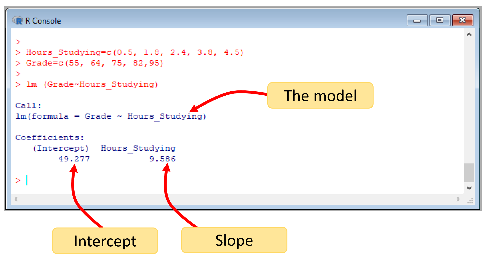
```


## The coeficient of determination {-}
There is one final cool thing about the linear regression model: it allows you to quantify a neat parameter called the coefficient of determination, $r^2$.

That parameter is useful for two main reasons:

1. It tells you how good is the relationship between the two variables, although you sort of know this from the correlation coefficient, $r$, that you estimated earlier.

2. It tells you the percent of variance of Y that is explained by X.

Say you found a relationship between plant size and nutrient input with an $r^2$ of 85%. This tells you that 85% of the variability you have among your plants can be explained by the input of nutrients. 

In other words, if the relationship was positive, then plants that grew a lot had lots of nutrients, while plants that did not grow well was because they did not have nutrients. So given the high $r^2$, it will probably be good idea to add nutrients to the plants.

Say that in the opposite you found an $r^2$ of 5%. Then only 5% of the variability in plant size can be explained by nutrient input. In this case, it may be wasteful to add nutrients to the plants, since they affect so little how plants will grow. This may be the case if you have some good soil, so, no need for nutrients.

In this example about nutrients and plants, you can see how $r^2$ let you make inferences about the strength of the relationships. 

One bad thing about $r^2$, as oppose to the correlation coefficient, $r$, is that you cannot know the direction of the relation (i.e., whether it is positive or negative). So you may still have to relay on the correlation coefficient, $r$, to know in which direction are the two variables related.

Before we get into the mathematics of the $r^2$, check out this brief explanation:

<iframe width="560" height="315" src="https://www.youtube.com/embed/wHvxTZWV-sE" frameborder="0" allow="accelerometer; autoplay; clipboard-write; encrypted-media; gyroscope; picture-in-picture" allowfullscreen></iframe>


The coefficient of determination, $r^2$, is mathematically calculated as:


\begin{equation}
\text{Coefficient of Determination} = r^2 = \frac{SSmean - SSfit}{SSmean}
\end{equation}


Let's break that equation into its pieces to see what is doing. 

$SSmean$, stands for Sum of Squares of the Mean. That is the same term we have used before $\sum(y - \bar y)^2$. Basically, how far from the mean is each point. If we were to divide that by the number of samples, you will get the variance that we studied earlier.

Just to refresh, you take the mean of all values in Y (horizontal line, in image below), for each point measure the distance to that mean (dotted lines), then you square each value and add them together. If you did not square them, when summing them, the result will be zero. 

```{r, out.width = "80%", echo= FALSE, fig.align = 'center',fig.cap = 'Sum of Squares from the Mean, SSmean'}

```

You need to think of the Sum of Squares of the Mean, $SSmean$, as the variability in Y.


$SSfit$, stands for Sum of Squares around the Fit. Let's see what this means.

Take the data on grades and time studying, relate grades against times studying, and find the best line (Orange line in figure below). Then for each point measure the distance from the point to the line, or so-call *residuals* (red-dotted lines). Take each residual, square it, and then add them together. What you get is the Sum of Squares around the Fit, $SSfit$.


```{r, out.width = "80%", echo= FALSE, fig.align = 'center',fig.cap = 'Sum of Squares around the Fit, SSfit'}
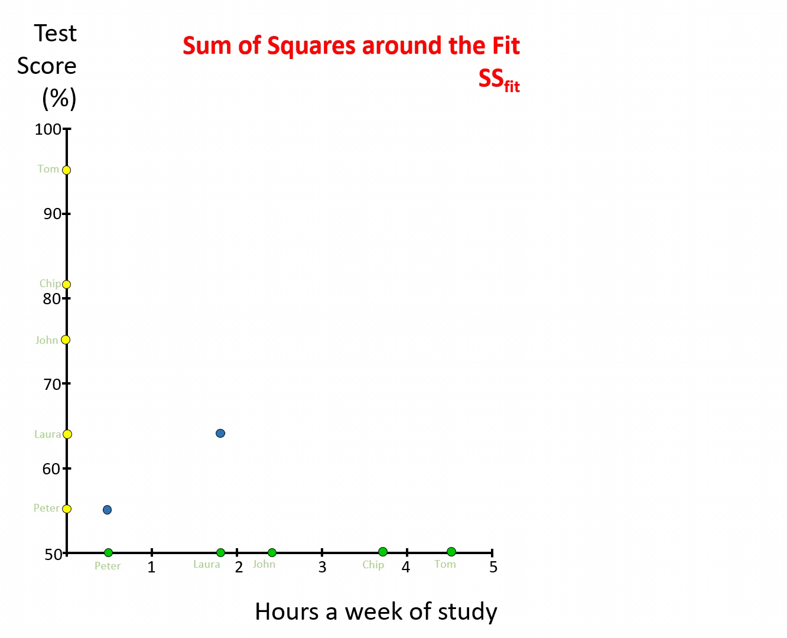
```

You need to think of the Sum of Squares around the Fit, $SSfit$, as the variability in Y that was not explained by X.

Remember, the regression line is the mathematical formulation of how Y relates to X, whatever is not accounted for by that line are the residuals, or the variation in Y, that remains to be accounted for.

So, it you look at the formulation for $r^2$, basically, you are trying to quantify the fraction of variability of Y that was accounted for by the relationship of Y to X. Easy right?

Let's calculate $r^2$,

```{r, message=FALSE,warning=FALSE}
#take the data on grades and time studying
X=c(0.5, 1.8, 2.4, 3.8, 4.5) #hours studying
Y=c(55, 64, 75, 82,95)       #grades

# lets estimate the regression line using lm, and lets put that model in a variable
LM = lm (Y~X)   #this is the linear model between Grades~Hours_Studying

#you can find out the residuals of that model using the R-Function residuals.
Residuals= residuals (LM)  #here we create a vector with the residuals from our model

#Estimate SSfit
SSFit= sum (Residuals^2)  # here you are squaring each residual, then adding them

#Lets now estimate SSMean
DeltaY=Y-mean(Y)  # here you take each value in Y and subtract it to the mean of Y
SSMean= sum(DeltaY^2) #here you square each score in the line above, sum them together

#we have all we need for the calculation of the R2.

R2=(SSMean-SSFit)/SSMean
R2
```


So, the $r^2$ of the relationship between grades and time studying is `r round(R2,2)`. That is the fraction of the variability in grades that is explained by the amount of time students study. You can also report the $r^2$ as a percentage by multiplying the fraction by 100.

In R, the $r^2$ is outputted as part of the *lm* function in combination with the function *summary*, like this:

```{r,  results='hide', message=FALSE,warning=FALSE}
summary (LM)   #summary results of the lm we created in the code above.  
```

The image below indicates the different outputs, we have studied so far:
```{r, out.width = "80%", echo= FALSE, fig.align = 'center',fig.cap = 'lm outputs'}
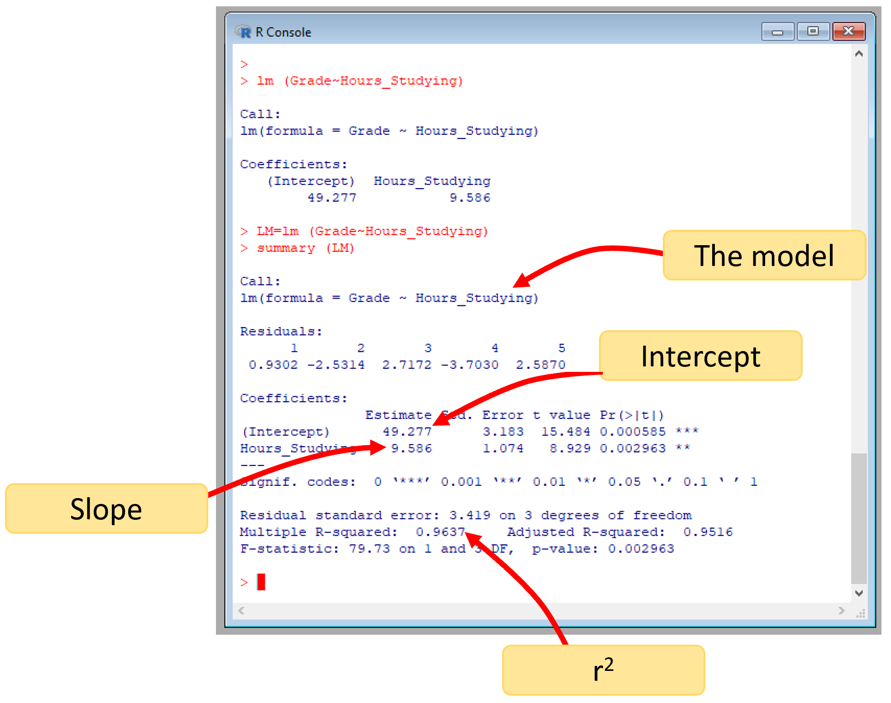
```

## Predict: Interpolation, Extrapolation {-}
Ok, now we know how to build a linear regression model of the form:

\begin{equation}
Y = mX + b
\end{equation}

Isn't it beauty?


That equation describes, to the best possible, how Y relates to X. With the extra support of the Coefficient of Determination, $r^2$, you can also know how strong the relationship is. 

And it just keep giving. With that relationship, you can now predict any value of Y, at any given value of X. All you have is to replace the X parameter in the equation above, for the value you like, run the calculation to get the expected value of Y.

```{r, out.width = "60%", echo= FALSE, fig.align = 'center',fig.cap = 'Predictions with linear models'}
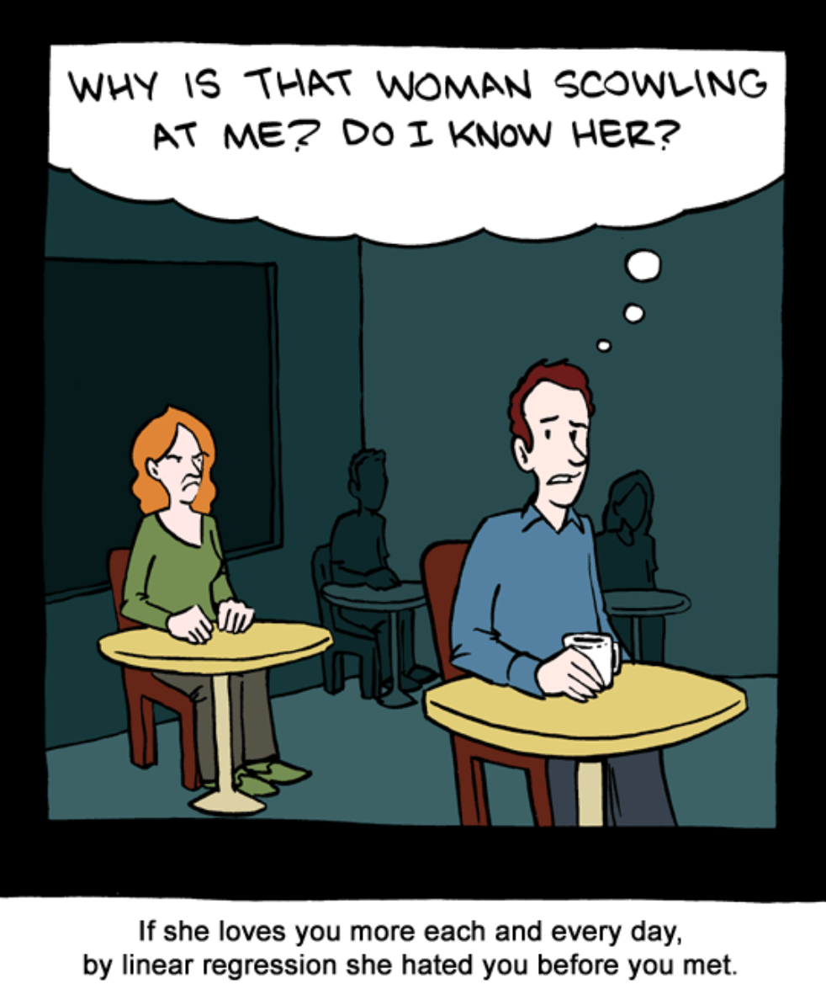
```

Let's try. From the relationship between grades and time studying, we already know that the intercept, $b$, was
`r  round(mean (Grade) - mean (Hours_Studying) * sum(XDif*YDif)/sum(XDif^2),2)`, and that the slope, $m$, was `r round(sum(XDif*YDif)/sum(XDif^2),2)`. So, the linear model can be formulated as:


\begin{equation}
Y = `r round(sum(XDif*YDif)/sum(XDif^2),2)`X + `r  round(mean (Grade) - mean (Hours_Studying) * sum(XDif*YDif)/sum(XDif^2),2)`
\end{equation}

So, given that model, what would be the expected grade of a person studying 4 hours a week?. Simple, replace X for 4, run calculation and done,


\begin{equation}
Y = `r round(sum(XDif*YDif)/sum(XDif^2),2)`* 4 + `r  round(mean (Grade) - mean (Hours_Studying) * sum(XDif*YDif)/sum(XDif^2),2)`
\end{equation}

\begin{equation}
Y = `r round(sum(XDif*YDif)/sum(XDif^2),2)*4 +   round(mean (Grade) - mean (Hours_Studying) * sum(XDif*YDif)/sum(XDif^2),2)`
\end{equation}

For a person that studies four hours a week the expected grade will be `r round(sum(XDif*YDif)/sum(XDif^2),2)*4 +   round(mean (Grade) - mean (Hours_Studying) * sum(XDif*YDif)/sum(XDif^2),2)`.


### Interpolation and Extrapolation {-}
Predictions based on a linear model can be separated between those that are within the data you have, in which case the prediction is called an "interpolation". If the prediction is beyond the values of X that you have, then the prediction is call and extrapolation. 

```{r, out.width = "60%", echo= FALSE, fig.align = 'center',fig.cap = 'Interpolation and Extrapolation'}
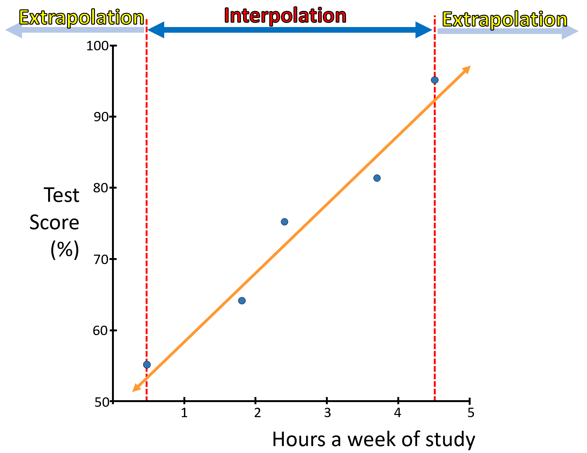
```

Needless to say, that when you extrapolate, there is always a risk that the forecast is wrong. The model you created only modeled the relationship between Y and X, for the data you have. Pass that set of data, the relationship may be different, so It is always important to be careful with extrapolations.


```{block2, type='rmdnote'}
Predicting Y values for X values that are between observed X values in the data set is called interpolation.

Predicting Y values for X values that are beyond observed X values in the data set is called extrapolation or forecasts. 
```

```{block2, type='rmdcaution'}
Becuase extrapolation predict values beyond what is known, uncertainty is much higher and at times forecasts can be unrealistic.
```

In R, you can predict any value from a linear model, using the *predict* function, let's try.

```{r, message=FALSE,warning=FALSE}
#take the data on grades and time studying
X=c(0.5, 1.8, 2.4, 3.8, 4.5) #hours studying
Y=c(55, 64, 75, 82,95)       #grades

# lets estimate the regression line using lm, and lets put that model in a variable
LM = lm (Y~X)   #this is the linear model between Grades~Hours_Studying

# lets now predict, the expected grades for three students that studied 1 hour, 3 hours and 10 hours
PredictGradres=data.frame(X = c(1,3,100)) #here I create a data.frame with the times studied by the three students. You need to create a column, with the same name, as the model, so lm can know which one is  the X-variable

predict(LM, PredictGradres)


```

From the predictions above, you can see how the model wrongly predicts that a person that studies 100 hours a week, will get a 1000.7 grade in the class. Obviously, the most you can get is 100%. This helps to illustrate the caution needed when extrapolating a linear model beyond the limits of the data.


```{block2, type='rmdnote'}
Two statisticians were traveling in an airplane from LA to New York.

About an hour into the flight, the pilot announced that they had lost an engine. "Don’t worry", says the pilot, "there are three left; but, instead of 5 hours it would take 7 hours to get to New York". 


A little later, the pilot announced that a second engine failed. "Don’t worry", says the pilot, "there are two left; but, instead of 5 hours it would take 10 hours to get to New York". 


Somewhat later, the pilot came on the intercom again and announced that a third engine had died. "Never fear", he announced, "the plane can fly on a single engine. However, it would now take 18 hours to get to NewYork", the pilot added.

At this point, one statistician turned to the other and said, "Gee, I hope we don't lose that last engine, or we'll be up here forever!"
```


## Outliers {-}
One of the critical issues with regression models, is that they can be influenced by extreme points. Those extreme points that clearly do not follow the main pattern are called **outliers**. 

Sometimes, those outliers could be measurement errors, but at times could also indicate the influence of variables that you did not measure. It is always good to visualize the data in an scatterplot to see if such cases examples of outliers exist on your data. 

Outliers can also be tested mathematically, by re-running the linear model without them, and check for the effect of removing them on the linear model.

There are several approaches to test if such an effect of removing the outlier is significant or not in the linear model, which we will not cover here. But you need to know.


```{r, out.width = "50%", echo= FALSE, fig.align = 'center',fig.cap = 'The outlier'}
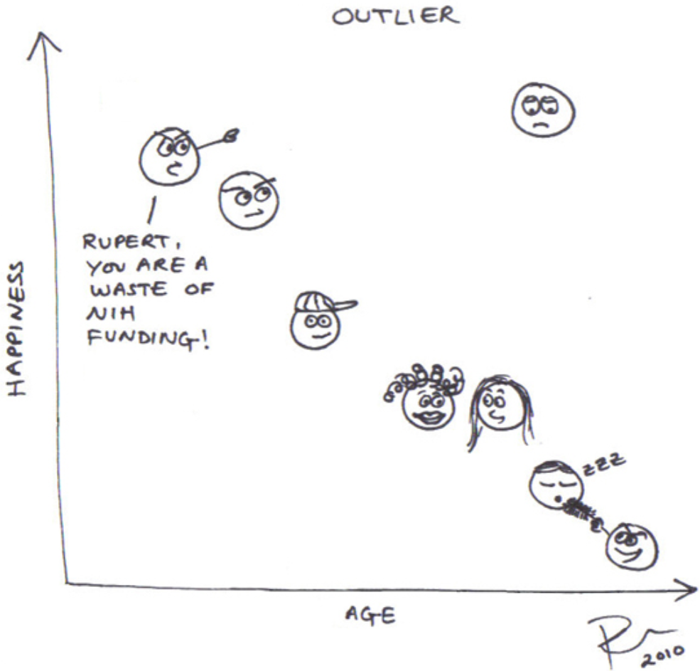
```


## The significance {-}

Several times in this book, we have mentioned how there is always a chance that any result can arise by chance alone. 
The linear regression model is not different. There may still be a chance that you find an $r^2$ similar to the one you found if you did not use any independent variable at all. 

To rule out that possibility, we use what is called an F-test. We will review the F-statistics in more detail later in the Chapter about hypothesis testing. 

Basically, some people have taken the time to run millions of simulations of "fake" "random" datasets, created linear models with them with varying sample sizes and number of parameters, and estimated the fitness of those models. Then, they put the results of those "random" models in **F-tables**, which you can find at the end of most books on stats.  

The beauty of those tables is that you can compare your model, given the number of samples and the number of variables, to find out the fraction of models similar to yours that could have happened  by chance.

To compare your model to theirs, you need:

1. the F-value from your model, which we will get into in a sec.
2. the number of variables in your model (for the purpose of comparison to the their tables, we will call this value $v1$)
3. A parameter, we will call $v2$, which is the number of datapoints in the model minus the number of predictors in the model plus one. 

$v1$ and $v2$ are just parameters needed to compare to random models of similar parameters.

If your model is similar to theirs, then, your results could have emerged by simple chance. If your results were different, then the relationship you found is legit. We will work more on this later on.

Ok, but we need to estimate the F-Value of our model. There is an specific equation to calculate the F-value or F-statistics of a linear regression model. However, it can also be predicted using the $r^2$, which we will use here for simplicity, using the following equation:

\begin{equation}
F_{statistics} = \frac{r^2}{1-r^2} *\frac{v2}{v1}
\end{equation}

Where $r^2$, is the coefficient of determination; $v1$ is number of predictors in the model;  $v2$ is the number of datapoints minus the number of predictors in the model plus one. 

If you think about that formula above, you are estimating an standard metric of the variance explained, $r^2$, to the variance not explained, $1-r^2$, for a model of certain characteristics of sample size and variables used. 

Because the most variance you can explain in any case is always just 100%, this metric could be assumed standard among any model random or not. And that is how then, we can compare our results on legit data to fake data, and see if any result of ours is different from random.

With all parameters at hand for our model, we need to look into an *F-table* to estimate the *critical F-value*. A *critical F-value* is the expected F-value at which certain fraction of random models occur. Let's take a moment to understand this.

Image a statistician runs one million regressions with random data using certain number of samples and independent variables and for each model he estimates the F-value above. He then creates a frequency distribution of the number of models at each F-value, like the figure below.

```{r, out.width = "80%", echo= FALSE, fig.align = 'center',fig.cap = 'F-distribution'}
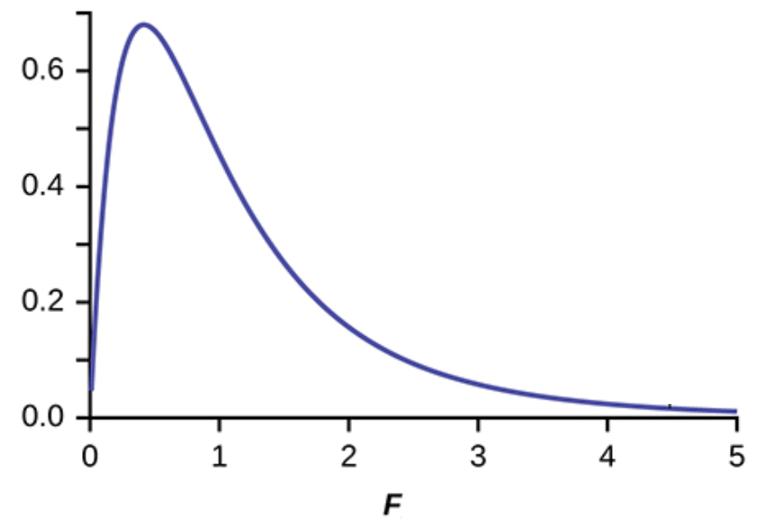
```

From that distribution, you can now find out the F-value at which say 90% of the random models occur; that value is the *critical F-value*, like in the image below.

If say our model has an F-value larger than that critical F-value then we are 90% sure our model cannot have emerge by chance.

Alternatively, you could say our model is significant at p>0.1, which is the complement of 90% or 0.9 if you look at it as fractions. That p-value is also called the *critical p-value* or at times also named alpha, $\alpha$.


```{r, out.width = "80%", echo= FALSE, fig.align = 'center',fig.cap = 'Critical f-Value at 90% or p=0.1'}
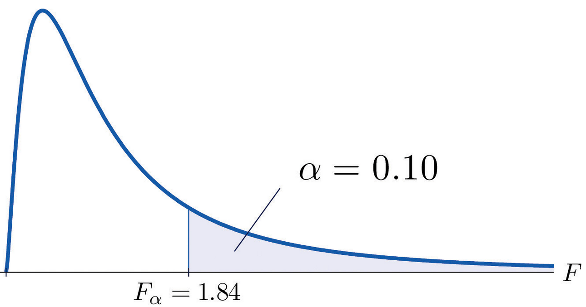
```

Lets estimate the F-value for our regression model between grades and time studying, for which we know the $r^2$ was $`r round (R2,2)`$. $v1$, the number of predictors in the model would be 1, as we only have one independent variable (i.e., time studying) and, $v2$ is 3; If you recall $v2$ is the number of datapoints (five student) minus the number of predictors (one in our case) plus one. So

\begin{equation}
F_{statistics} = \frac{`r round (R2,2)`}{1-`r round (R2,2)`} *\frac{3}{1}
\end{equation}

\begin{equation}
F_{statistics} = `r (R2/(1-R2)) *((3/1))`
\end{equation}

So the F-value for our model was $`r round((R2/(1-R2)) *((3/1)),2)`$. Now we need to find out the *critical F-value*, and lets take a $\alpha =0.05$. For this we use an F-table, like the one below, which you can find on most books on stats.

Because $v1$ = 1 in our case, you have to select the first column, then scroll down until $v2$ in the gray column is equal to 3, at the interception is the **F-critical**. Or the F-value at which 95% of the random models occurred. There are similar tables like this for each $\alpha$.

So for a model like ours, 95% of the random models should have an critical F-value smaller than 10.13. However, our model had an F-value = `r (R2/(1-R2)) *((3/1))`. So our model is very different from the random expectation, or also-called significantly different at p>0.05.


```{r, out.width = "80%", echo= FALSE, fig.align = 'center',fig.cap = 'lm outputs'}
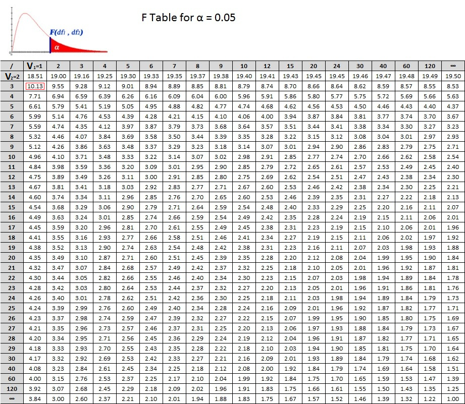
```


In R, the F-value is produced automatically with the $lm$ function and the $summary$ function. The outputs from the linear model, lm, also include the exact probability at which our model could be random, see image below.

```{r,  results='hide', message=FALSE,warning=FALSE}
summary (LM)   #Here LM is the linear model, lm, we create in the code just above.  
```


```{r, out.width = "80%", echo= FALSE, fig.align = 'center',fig.cap = 'lm outputs'}
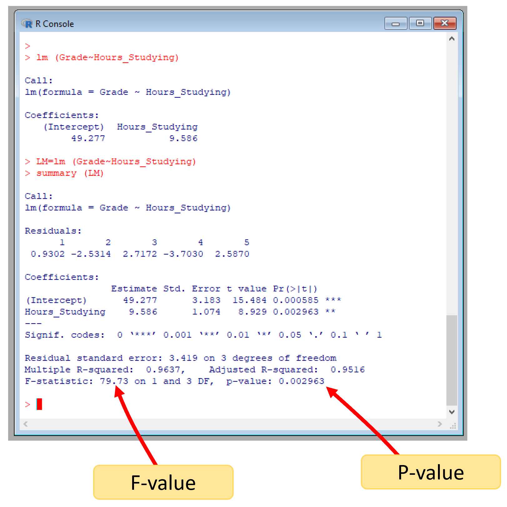
```

In conclusion, there is a significantly strong relations ($r^2 = 0.96$) at p<0.05 between studying for my class and getting a nice grade. There you go, keep studying.

## Multiple regression {-}
Up to now, we have used the linear regression model to predict Y in terms of only one variable, X. However, as you may have noted in the examples above, it is rare for a model with a single independent variable to predict fully the dependent variable...those residuals that are left tell you there is something else that may influence the dependent variable. 

Linear regression further allows you to check for the effect of additional variables, using the same principle.

Think about it this way...you run a linear regression model with one independent variable and some residuals are left.

Take those residuals as independent variable in a second linear model, relate those residuals to another variable, and see how much the unexplained variation by the first independent variable is explained by the second independent variable. 

You can keep going at it, until you could potentially find all the set of variables that explain your response variable.

The example above is an oversimplification of how multiple regression works, as there are some collinearities among independent variables that you have to handle. But for now I just want you to know that linear regression allows you to test additional variables by trying to explain the unexplained variation in Y with additional variables. The so-call **multiple regression** analysis.

Let's take the data we have been using, and say, we also got data on the amount of debt of each student...this variable may indicate the level of stress of the student, a likelihood that they have a job that prevents them of working fully and well, etc...how does this second variable influences the grades of students in my class?. 

Let's check..

```{r, results='hide', message=FALSE,warning=FALSE}
#lets start by bringing back the data on time studying and grades
Names=c("Peter","Laura", "John", "Chip", "Tom")
Hours_Studying=c(0.5, 1.8, 2.4, 3.8, 4.5)
Grade=c(55, 64, 75, 82,95)

#here is the data for the second independent variable for the same students
Debt=c(80, 60, 55, 15, 5) #debt of students in thousands of dollars

# we use the same lm function we used before and add debt as independent variable, like this:
MultipleRegression=lm (Grade ~ Hours_Studying + Debt)

#next we check the results
summary(MultipleRegression)
```


```{r, out.width = "80%", echo= FALSE, fig.align = 'center',fig.cap = 'R multiple regression results'}
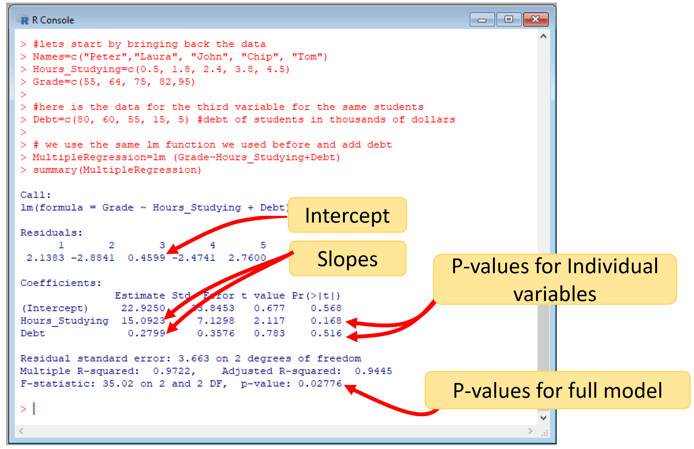
```

The outputs are the same as we sow before. You have a unique intercept, but now you have a slope for each variable. You also need to pay attention to a second result, which is the p-values for the individual variables, which I indicate in the image above. Plus, the p-value for the full model. 

In this case, while the full model was significant, the individual variables were not.

In this specific case, this is happening because our sample size is too small, which bring me to the caution that you need to have when running multiple regression analysis: adding more variables, while it will increase the predictive power of the model, also will increase your chances that the results may happen by chance.

## Non-linear regression {-}
There will be numerous instances in which a variable Y does not relate linearly to a variable X. Think the growth of people, for instance.

Early in life a person will grow fast, but over time this growth will reduce, eventually leveling off. These types of relationships are not well described with linear models; and there is where non-linear models come in.

In R, non-linear regression models are handled with an specific function call $nlm$, but you can also linearize the variable and use the linear model you used before.

Take the example below, showing the relationship between age and height of a random person. Let's start by fitting a linear model to it.


```{r, message=FALSE,warning=FALSE}
#let's create a variable for height (dependent variable) and other for age (independent variable)
Age=c(2,4,6,8,10,12,14,16,18,20,22,24,26,28,30)
Height=c(50, 65,85, 95, 110, 120,130,140,145, 152, 158, 169, 170, 171, 171.2)

  
LM=lm(Height~Age) #here is the linear model

plot(Height~Age)
abline(coef = coef(LM))
summary(LM)
```

The $R^2$ is pretty good, $r^2$=`r summary(LM)$r.squared`.

You can try a non-linear model, by transforming the data...there are numerous types of transformations possible, and many will give you different types of fit using linear models. Here is where an approach called model selection comes in, which is to find which of all models to fit to the data is the best. That is quite an endeavor that we will not cover in this basic stats class, but you should know that selecting among different types of models is non-trivial.

For for the sake of seeing how a non-linear model is done, let's try a logarithmic transformation of the data used above for height and age.

```{r, message=FALSE,warning=FALSE}
Age=c(2,4,6,8,10,12,14,16,18,20,22,24,26,28,30)
Height=c(50, 65,85, 95, 110, 120,130,140,145, 152, 158, 169, 170, 171, 171.2)

#to log transform simply use the log function:
LogHeight=log(Height) #log transforming the variable Y
LogAge=log(Age)       #log transforming the variable X

LogLM=lm(LogHeight~LogAge) #now we re-run the model, but with the transformed variables

plot(LogHeight~LogAge, ylab=("Log height (cm)"), xlab=("Log age (years)"))
abline(coef = coef(LogLM))
summary(LogLM)
```
You can now see how  this non-linear modeling of the variables gives you an even better $r^2$=`r summary(LogLM)$r.squared`.

There are numerous complexities to the use of non-linear models, that will not be addressed here...the main goal at this introductory level is to know that regression modeling can be done in non-linear relationships.

## Exercises {-}

Some of these questions may take a while to load depending on your internet connection.

<iframe src="https://cmora.h5p.com/content/1291859705693074788/embed" aria-label="20. lm" width="1088" height="637" frameborder="0" allowfullscreen="allowfullscreen" allow="autoplay *; geolocation *; microphone *; camera *; midi *; encrypted-media *"></iframe><script src="https://cmora.h5p.com/js/h5p-resizer.js" charset="UTF-8"></script>


<iframe src="https://cmora.h5p.com/content/1291859707299942068/embed" aria-label="19. Name the components of the regression plot" width="1088" height="637" frameborder="0" allowfullscreen="allowfullscreen" allow="autoplay *; geolocation *; microphone *; camera *; midi *; encrypted-media *"></iframe><script src="https://cmora.h5p.com/js/h5p-resizer.js" charset="UTF-8"></script>

<iframe src="https://cmora.h5p.com/content/1291859715838304678/embed" aria-label="22. Summary results" width="1088" height="637" frameborder="0" allowfullscreen="allowfullscreen" allow="autoplay *; geolocation *; microphone *; camera *; midi *; encrypted-media *"></iframe><script src="https://cmora.h5p.com/js/h5p-resizer.js" charset="UTF-8"></script>


<iframe src="https://cmora.h5p.com/content/1291859706725823038/embed" aria-label="23. Pair element of the linear model output in R" width="1088" height="637" frameborder="0" allowfullscreen="allowfullscreen" allow="autoplay *; geolocation *; microphone *; camera *; midi *; encrypted-media *"></iframe><script src="https://cmora.h5p.com/js/h5p-resizer.js" charset="UTF-8"></script>

<iframe src="https://cmora.h5p.com/content/1291859703464652448/embed" aria-label="24. About the slope of a linear model, lm, in R" width="1088" height="637" frameborder="0" allowfullscreen="allowfullscreen" allow="autoplay *; geolocation *; microphone *; camera *; midi *; encrypted-media *"></iframe><script src="https://cmora.h5p.com/js/h5p-resizer.js" charset="UTF-8"></script>

<iframe src="https://cmora.h5p.com/content/1291859702978794408/embed" aria-label="25. About the intercept of a linear model, lm, in R" width="1088" height="637" frameborder="0" allowfullscreen="allowfullscreen" allow="autoplay *; geolocation *; microphone *; camera *; midi *; encrypted-media *"></iframe><script src="https://cmora.h5p.com/js/h5p-resizer.js" charset="UTF-8"></script>

<iframe src="https://cmora.h5p.com/content/1291859702736339918/embed" aria-label="26. About the significance of a linear model, lm, in R" width="1088" height="637" frameborder="0" allowfullscreen="allowfullscreen" allow="autoplay *; geolocation *; microphone *; camera *; midi *; encrypted-media *"></iframe><script src="https://cmora.h5p.com/js/h5p-resizer.js" charset="UTF-8"></script>

<iframe src="https://cmora.h5p.com/content/1291859702493362058/embed" aria-label="27. About the coeficient of determination of a linear model, lm, in R" width="1088" height="637" frameborder="0" allowfullscreen="allowfullscreen" allow="autoplay *; geolocation *; microphone *; camera *; midi *; encrypted-media *"></iframe><script src="https://cmora.h5p.com/js/h5p-resizer.js" charset="UTF-8"></script>

## Homework {-}

A biologist has been monitoring the population of wolfs and caribou for several years in Denali National Park, Alaska.

Let x  represents the caribou population (in hundreds) and y the wolf population in the park.

x = 30 34 27 25 17 23 20
y = 66 79 70 60 48 55 60


(a) Make a scatter plot of the data, adjust aesthetics so the figure follows publication guidelines.

(b) What is the equation that defines the linear relationship between wolfs and caribou.

(c) What is the wolf population when there are not caribou.

(d) What is the increase wolf population for each hundred caribou.

(e) What will be the expected wolf population, at say 1000 caribou?. any caution on this prediction? 

(f) Is that a strong relationship?. what evidence can you provide?

(g) Was it significant, what evidence can you provide?. also what does is mean significant?


Place the figure and your responses in a Word document and email it as a homework. Send a nice looking document.
