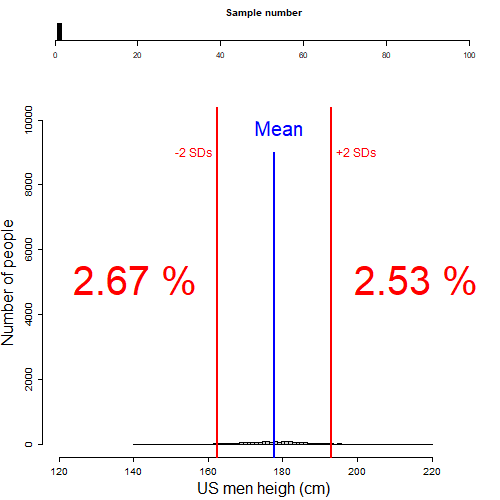
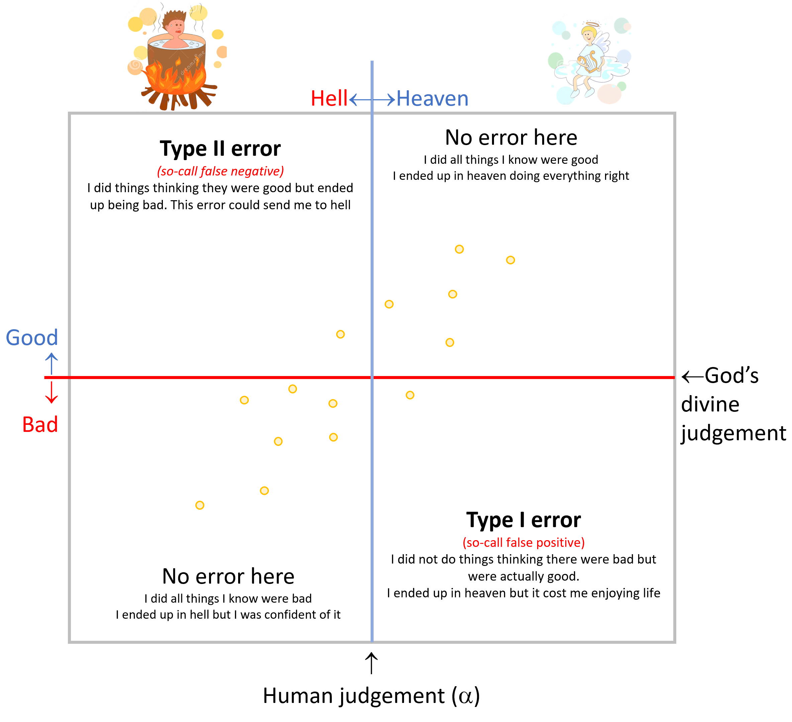
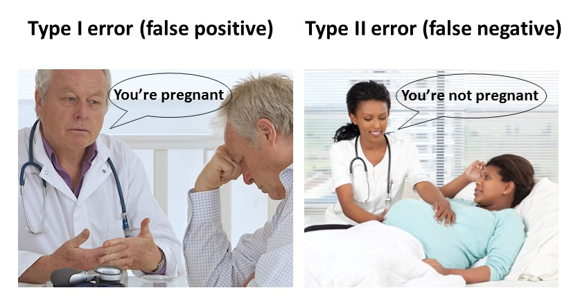
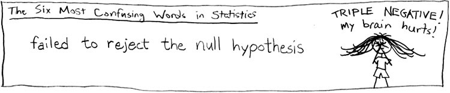
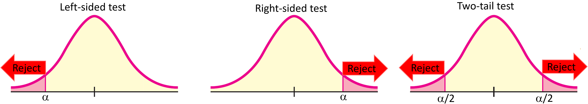
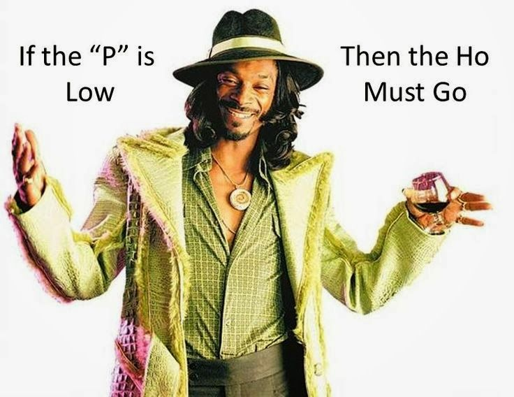

# Hypothesis testing {}

In the prior chapters, we have been dealing with three of the core goals of statistics: visualization of data (i.e., scatterplots, histograms, etc.), description of the data (i.e., mean, mode, SD, etc), and relationships among variables (e.g., correlation, regression). In this chapter, we will deal with a fourth main goal of statistics: to tell if something (one thing) or somethings (many things) are different.


There is an amazing level of complexity to that single question, of whether a thing or set of things are different. In this chapter, I want to break that complexity into its peaces, so you can better comprehend the results of any test aimed at testing for significant differences.

```{r, out.width = "90%", echo= FALSE, fig.align = 'center',fig.cap = 'Rejecting the extremes or special'}

```

**Expectation for this chapter**

At the end of this chapter, it is expected that you:

1. Can states a null hypothesis and alternative hypothesis.

2. Can interpret the different types of errors when making a conclusion on a hypothesis.

3. Can interpret the critical p-values, significance level.

4. Can interpret p-values.


Alright, let's get to it.


## Significance level {-}

When the question is formulated of whether something is different; inherently, you are making a decision with a chance that we may be wrong. Put another way, we imply that there is a threshold  beyond which we may be wrong. In statistics that threshold is called **significance level**, or alpha, $\alpha$.

Take my rabbit population below, and say I found a rabbit in the street and that all I have to compare is body size? Could this one rabbit be one of my rabbits? 

Tricky right?. Nine out of my ten rabbits are smaller. So is this one guy different as to be not one of mine?

Well, it depends on the chance I want to give myself of being wrong.


```{r, out.width = "80%", echo= FALSE, fig.align = 'center',fig.cap = 'Is it mine?'}
knitr::include_graphics("images/IsDifferent.png")
```

If I assume a threshold of say 20% chance of me being wrong. Then this rabbit would not be mine... 80% of my rabbits are smaller than 6.1 not included. The rabbit I found was 6.8, so at a 20% chance, this rabbit is too big to be from my rabbit population. 

What if I set the threshold of me being wrong at a 10% chance? In this case I am considering that the rabbit I found has to be smaller than the 10% largest rabbits in my population, for it to be mine.

In my rabbit population 10% of the rabbits are larger than 7, the rabbit I found was 6.8 so in this case this rabbit belongs to my population at a 10% chance that I may be wrong.


This examples serves the purpose to illustrate that in hypothesis testing there is always a chance of you being wrong and that such a chance is proportional to how different the thing you have is compared to the population you are comparing to.


```{block2, type='rmdimportant'}
The threshold beyond which we reject a null hyphothesis is called the **level of significance** or alpha, $\alpha$.
```

## Deciphering $\alpha$ {-}
Early on, we studied how a population can be characterized based on the mean value of its individuals and the variability of those individuals, the so-call standard deviation. With those two parameters alone you can know how the entire population looks like. 

Lets look at an example. In the USA, the average men is 177.8cm in height with an standard deviation of 7.62cm. Lets plot this population. 


```{r, message=FALSE,warning=FALSE}
Mean_Height=177.8   # height of average male in the USA
SD_Heigh=7.62       # Standard deviation of male population in the USA

MenUSPop<- rnorm(164000000,Mean_Height,SD_Heigh) #we select from a population with that mean and SD, 164 million values, the total number of men in the US

breaks = seq(100, 240, length.out = 80) #I create a set of bins for the x-axis of the distribution

#next I plot the data for the size of the entire population of men in the USA
 hist(MenUSPop, main=NA,xlim=c(100, 240),ylim=c(0, 20000000),breaks = breaks, xlab = "US men heigth (cm)",ylab = "Number of people")
```

As you can see from the figure above some men are tall, others shorter, but on average the US men population is 177.8 cm tall.

When we refer to a significance level, $\alpha$, we are referring to an specific fraction of the population that is on the tails of that distribution. Basically, those individuals that are different or special.

As mentioned earlier, in biology and most sciences, we generally accept an $\alpha$ smaller than 0.05. Basically, we assume something is different/special, if it is larger or smaller than the top or bottom 5% of all individual in that population.

```{r, out.width = "80%", echo= FALSE, fig.align = 'center',fig.cap = 'How p<0.05 feels like'}

```

If you may recall from Chapter 5, we mentioned that 95% of the individuals on any normally distributed population are within two-standard deviations from the mean. With that said, and following on the example above about men heights', any individual that is taller or shorter than two standard deviation below or above the mean, is different at a 5% level of confidence.

In the figure below, I illustrate random samples of males taken from the US men height population. If I were to count the fraction of people two standard deviations below or above the mean (percentage red numbers shown in the figure), you would see that on any sample there are cumulatively almost always 5%, or about 2.5% on each tail of the distribution. 


```{r, out.width = "80%", echo= FALSE, fig.align = 'center',fig.cap = 'Critical f-Value at 90% or p=0.1'}

```

Of course, you could use different levels of confidence, $\alpha$, when testing if something is  significantly different. But in all cases, $\alpha$ will be the threshold beyond which you conclude that something is  significantly different. 


## Error types {-}
Hypothesis testing deals primarily with those things we could never know for sure; there is always a chance that we are wrong when making a conclusion. That chance of being wrong can be separated into two different types of errors called **Type I** and **Type II** errors. 

I found a couple neat examples online you should check for further clarification on the Type-I and Type-II errors [here](http://experimentaltheology.blogspot.com/2010/09/theology-of-type-1-type-2-errors.html) and [here](https://www.analyticsvidhya.com/blog/2020/06/statistics-analytics-hypothesis-testing-z-test-t-test/)

Lets try the one about going to hell or to heaven depending on your threshold of what qualifies as a good or a bad thing...the example goes like this:

```{r, out.width = "90%", echo= FALSE, fig.align = 'center',fig.cap = 'Errors that send you to hell'}

```

There is a God, we have never met in person, that holds the **ultimate threshold** of the actions that qualify to go to heaven or not. Because we do not know the guy, and we do not have fully clear guidelines, there may be an speculation on that threshold. The point here is that there is an **ultimate threshold**, the **ultimate truth**, which we do not know for certain.

On the other side of this problem is our judgment of what God would mean such threshold is. The ten commitments were a nice start, but what about when you are mean to your teacher?. The Bible says do not do to others what you do not want others to do to you. Would being mean to another person take points out my score to go to heaven?. If I were you I would play it save and be nice to everyone, including your teacher, but we are uncertain if being mean reduces the score of the going-to-heaven ticket.

The point above is that there is an ultimate threshold that defines the truth, a threshold that we do not know for certain, but that we can approximate. This approximation threshold it what we called $\alpha$ earlier: the chance we are giving ourselves to be wrong in our decisions. 

When our human $\alpha$ threshold matches the divine threshold, then we got lucky, and we were right every time we did something in life. No errors here. I did all right things knowingly  knowing I will end up in heaven or I did all wrong things knowingly knowing I would end up in hell.


However, if my threshold was too low and I did a lot of mean things, that turned out to be bad and reduced my going-to-heaven-score, then my threshold did have an error that let me to conclude that doing certain things were ok, when in truth they were not. If you think about this type of error, you accepted the hypothesis that certain things were ok, but turned out to be they were not fine. This is what is call a **false negative**, or a **Type II** error.

Say that in the opposite my threshold to define what was right or not was too high...this may not necessary ensure me a ticket to heaven. While I am minimizing my Type II error, such a very high threshold means that I am probably not doing things that could be ok,  things that may have help other people or the planet. So a high threshold may defeat the purpose of why God send me here, and we may be penalized for that. A very high threshold will lead to what is call a **false positive** or a **Type I error**. Rejecting things that could be ok. Over preaching and not doing could may well be a type I error.


```{r, out.width = "80%", echo= FALSE, fig.align = 'center',fig.cap = 'Type I and Type II errors'}

```

```{block2, type='rmdimportant'}
Type I error is to reject the null hypothesis when it is, in fact, true.
Type II error is to accept the null hypothesis when it is, in fact, false.
```


## Stating hyphotheses and tails {-}

The statistical approach to hypothesis testing is to reduce all likely options to a binary choice between the **null hypothesis** or the **alternative hypothesis**.

The **null hypothesis** is denoted with the letters $Ho$. The **alternative hypothesis** is denoted with the letters $H1$. 

The **null hypothesis** is always making reference to how things should commonly be, it can also make references to the option of no-difference or that something is equal to a given value. The **alternative hypothesis**  is all what the **null hypothesis** is not. 

In statistics, you can only accept or reject the null hypothesis. This is why, when you reject the null hypothesis, you do not necessary accept the alternative hypothesis. 

There are several ways to state hypotheses. Let's try a few examples to clarify:

Say a burger company claims that their Combo #1 has 1,800 calories, with a variability (Standard deviation, SD) of 50 calories. To test if this is true you can set your hypotheses different ways, like:

Null hypothesis,         Ho:  Combo1 = 1,800 calories.

Alternative hypothesis,  H1:  Combo1 $\neq$ 1,800 calories.

In this form, I am asking if the burger is equal to 1,800 calories. In this case, the alternative has to be that the burger is different than 1,800cal. To be different, a burger could be much smaller than 1,800cal but it can also be much larger than 1,800 calories.

If I take several of their burgers, and measure their caloric content, I can reject the null hypothesis if the sample I took had much higher number of calories, but also if the sample have many fewer calories than the significance level, $\alpha$, I chosen. This is what is call a **two-tail** hypothesis. Lets visualize this in R,


```{r, message=FALSE,warning=FALSE}
mean=1800 # this is the mean number of calories in their burger. We can think of this as the population mean
sd=50     #this is the variability in calories

# create a normal distribution of burgers with the given mean and SD
x <- seq(-4,4,length=100)*sd + mean  # This w
y <- dnorm(x,mean,sd)

plot(x, y, type="l", xlab="Calories per burger", ylab= "Fraction of burgers") # this is how the calories of the population of burgers should look like

PositiveAlpha =mean+sd # lets create an alpha of plus and minus one SD...do not overthink this for now.
NegativeAlpha =mean-sd

#plot the critical thresholds set by alpha
abline(v=PositiveAlpha, lwd=2, col="blue", lty=2) 
abline(v=NegativeAlpha, lwd=2, col="red", lty=2) 

#Lets plot the critical areas
polygon(c(x[x>=PositiveAlpha], PositiveAlpha), c(y[x>=PositiveAlpha], y[x==max(x)]), col="blue") #right hand tail
polygon(c(x[x<=NegativeAlpha], NegativeAlpha), c(y[x<=NegativeAlpha], y[x==max(x)]), col="red") #right hand tail

```

In the example above, I would reject the null hypothesis, if the sample I took, was larger or smaller than the significance level, $\alpha$, I set. Basically, if my sample is on the red or blue area above, I can claim that my sample was significantly different than what the company claims.


The hypotheses could also be set like this:

Null hypothesis,         Ho:  Combo1 <= 1,800 calories.

Alternative hypothesis,  H1:  Combo1 > 1,800 calories.

In the example above, I am being more specific, testing the null hypothesis that the average burger has less than 1,800 caloriess; the alternative hypothesis has ti be that the burger has more than 1,800 calories.

If I take several of their burgers, and measure their caloric content, I can reject the null hypothesis only if the sample I took had much higher number of calories than the significance level, $\alpha$, I chosen. This is what is call a **right-tail** test. Lets visualize this in R,


```{r,  message=FALSE,warning=FALSE}
mean=1800 # this is the mean number of calories in their burger. We can think of this as the population mean
sd=50     #this is the variability in calories

# create a normal distribution of burgers with the given mean and SD
x <- seq(-4,4,length=100)*sd + mean  
y <- dnorm(x,mean,sd)

plot(x, y, type="l", xlab="Calories per burger", ylab= "Fraction of burgers") # this is how the calories of the population of burgers should look like

PositiveAlpha =mean+sd # lets create an alpha of plus  one SD...do not overthink this for now.

#plot the critical thresholds set by alpha
abline(v=PositiveAlpha, lwd=2, col="blue", lty=2) 

#Lets plot the one critical area
polygon(c(x[x>=PositiveAlpha], PositiveAlpha), c(y[x>=PositiveAlpha], y[x==max(x)]), col="blue") #right hand tail
```

In this case, I will reject the null hypothesis if the sample I took has more calories than the significance level I chosen; if my sample fall anywhere in the blue area.


The hypotheses could also be set like this:

Null hypothesis,         Ho:  Combo1 >= 1,800 calories.

Alternative hypothesis,  H1:  Combo1 < 1,800 calories.

In the example above, I am testing if the burgers have more calories than what the company claims. The alternative hypothesis, then has to be that the burgers have less than 1,800 calories.

If I take several of their burgers, and measure their caloric content, I can reject the null hypothesis only if the sample I took had much fewer number of calories than the significance level, $\alpha$, I chosen. This is what is call a **left-tail** test. Lets visualize this in R,


```{r, message=FALSE,warning=FALSE}
mean=1800 # this is the mean number of calories in their burger. We can think of this as the population mean
sd=50     #this is the variability in calories

# create a normal distribution of burgers with the given mean and SD
x <- seq(-4,4,length=100)*sd + mean  # This w
y <- dnorm(x,mean,sd)

plot(x, y, type="l", xlab="Calories per burger", ylab= "Fraction of burgers") # this is how the calories of the population of burgers should look like


NegativeAlpha =mean-sd


#Lets plot the one critical area
polygon(c(x[x<=NegativeAlpha], NegativeAlpha), c(y[x<=NegativeAlpha], y[x==max(x)]), col="red") #right hand tail

#plot the critical thresholds set by alpha
abline(v=NegativeAlpha, lwd=2, col="orange", lty=2) 
```

In this case, I will reject the null hypothesis if the sample I took has less calories than the significance level I chosen; if my sample fall anywhere in the red area.


## Accepting or rejecting the null hypothesis {-}
In a nutshell, the idea of testing a hypothesis is to see if a given individual or sample is different compared to a population at a certain level of significance, $\alpha$. The given value for the individual or sample is called the p-value, basically an standardized metric of how far from the mean your individual or sample is.

```{r, out.width = "70%", echo= FALSE, fig.align = 'center',fig.cap = 'The P-value'}

```

In a two tail test, the null hypothesis is rejected if the p-value is larger or smaller than the significance level. On the contrary, if your p-value is within the range outlined by your level of confidence, then you conclude that you failed to reject the null-hypothesis. Please remember that in statistics you only "fail to reject" or reject the null hypothesis but you never prove the alternative hypothesis when you reject the null hypothesis. 


```{r, out.width = "80%", echo= FALSE, fig.align = 'center',fig.cap = 'Painfull rejection narrative'}

```

In a right tail test, the null hypothesis is rejected if the p-value is larger than the significance level.

```{r, out.width = "80%", echo= FALSE, fig.align = 'center',fig.cap = 'Types of tests'}

```


In a left tail test, the null hypothesis is rejected if the p-value is smaller than the significance level.


```{r, out.width = "80%", echo= FALSE, fig.align = 'center',fig.cap = 'If the P is low, the Ho must go'}

```


## Testing a hypothesis by brutal force {-}
In the following chapters, we will introduce standardized ways to test hypotheses; I want to finish this chapter by illustrating the ultimate idea behind testing a hypothesis by running a brief simulation. This simulation will aim to show the general approach of hypothesis testing.


Lets say that you work for the FDA, and you have been commissioned to provide evidence for a lawsuit case involving the calories in MacDonals burgers (this is a fictitious example). The pending lawsuit refers to a person who suffered a heart attack after its cholesterol levels increased considerably. Prior to the heart attack, his doctor recommended that he kept a daily diet of no more than 2000 calories a day, so he satisfied his weakness for burgers eating a new type of MacDonals burger that claimed to have less than 1,500 calories (Standard deviation, SD= 100). 

x = 1350, 1600, 1510, 1850, 1750, 1756, 1400, 1500, 1350, 1400

Let x be the calorimetric value of a random sample of ten burger you took. So the question is, do the claims by this individual hold any right?

Let's start by stating the hypotheses:


Null hypothesis,         Ho:  burger <= 1,500 calories.

Alternative hypothesis,  H1:  burger > 1,500 calories.

In this case, I specifically want to know is these burgers have less than 1500 calories as claimed by the company.

We want to test this hypothesis at a $\alpha$, level of confidence, of 5%.

Alright, lets start our simulation.


```{r,  message=FALSE,warning=FALSE}
#Lets put the data of the sample of ten burgers in a vector
x = c(1350, 1600, 1510, 1850, 1750, 1756, 1400, 1500, 1350, 1400)

MeanCal= mean (x) #lets calculate the mean of the sample, or so call p-value. 

plot(1, type="n", xlab="Calories per burger", ylab="Percent of burgers", xlim=c(1000, 2000), ylim=c(0, 10)) # lets create an empty plot


#plot the p-value
abline(v=MeanCal, lwd=2, col="blue", lty=2) 

#lets name the mean sample value
text(MeanCal,10,labels="p-value",pos=4, col="blue")
```

Next, we take one random sample of ten values from a normal population with a mean of 1500 and an standard deviation, SD, of 50. In R, you can take any number of individuals from any normally distributed population using the function $rnorm$.


```{r, message=FALSE,warning=FALSE}
MeanPopulation=1500
SDPopulation=50
RandomSample1<- rnorm(10,MeanPopulation,SDPopulation) 

RandomSample1

```
Our actual sample of 10 burgers had an average calorimetric content of $`r MeanCal`$ while the expected value of this one random sample was  $`r round(mean (RandomSample1),2)`$.

Hmm, from that one comparison it seems the one guy may be right; these burgers have more calories than what they claim. But we only have one random sample. To be robust, we probably should take 10000 random samples and from all of those see if the top 5% of the random samples, our critical threshold, is larger or smaller than our observed value/p-value.

To run such a simulation, we can use the *for* loop function in R. Lets try. Let me explain that function with the example.


```{r, message=FALSE,warning=FALSE}

population= c()  #we create an empty vector where we will store the random averages of our 1000 random samples of ten burgers
for (sampleI in 1:10000) { # here I set a variable called sampleI that will loop from 1 to 1000
  
RandomSampleI<- rnorm(10,MeanPopulation,SDPopulation) #take 10 values randomly

#next calculate the average calories in the random sample
meanRandomSampleI= mean (RandomSampleI)

#lets place the value for that sample in the vector
population=c(population, meanRandomSampleI ) #basically I am appending the mean of every sample in every loop to the vector
}
# the code between {} will run for 1000 times. to test lest count the number of entries in the vector

length(population)
```
Ok, we just created a population of 10000 random samples from a normal population with a mean of 1500 and an standard deviation, SD, of 50. Let's do a histogram of that database

```{r, message=FALSE,warning=FALSE}
breaks = seq(1300, 1600, length.out = 100) #lets create a set of bins

hist(population,main=NA,xlim=c(1400, 1600),ylim=c(0, 1000),breaks = breaks, xlab = "Caloric content of burgers",ylab = "Number of ramdon samples")
```
Looking good....lets draw a line for the 5% level of confidence for the expected distribution of calories in a burger given the claims of MacDonalds. We will use the R function $quantile$, which we used earlier, to find out the value located at the 95% percentile.

```{r, message=FALSE,warning=FALSE}

FivePercent=quantile(population,0.95,type=1) #quantile finds the value in the population of calories located at the top 5% percentile
FivePercent
```

Now we can compare the average calorimetric content in our actual sample of 10 burgers (p-value) to the  value located at the 5% mark (i.e., the level of confidence).

```{r, message=FALSE,warning=FALSE}
hist(population,main=NA,xlim=c(1400, 1600),ylim=c(0, 1000),breaks = breaks, xlab = "Caloric content of burgers",ylab = "Number of ramdon samples")

#plot critical value or confidence level
abline(v=FivePercent, lwd=2, col="red", lty=2) 
#lets name the critical value
text(FivePercent,1000,labels="Critical p-value",pos=2, col="red")


#plot the p-value
abline(v=MeanCal, lwd=2, col="blue", lty=2) 

#lets name the mean sample value
text(MeanCal,1000,labels="p-value",pos=4, col="blue")


```

The amount of calories in our sample of ten burgers (Blue line in figure above) was much larger than the critical value at 5% chance (red line), We then reject the null hypothesis that these burgers have less than 1,500 calories, and would have to embrace the alternative hypothesis that the burgers have more than 1500 calories. You can surmise in your report to the judge that the one guy lawsuiting MacDonalds was deceived. A case of false advertisement.

## Exercises {-}
Some of these questions may take a while to load depending on your internet connection.

<iframe src="https://www.impactsofclimatechange.info/H5P/wp-admin/admin-ajax.php?action=h5p_embed&id=28" width="958" height="344" frameborder="0" allowfullscreen="allowfullscreen"></iframe><script src="https://www.impactsofclimatechange.info/H5P/wp-content/plugins/h5p/h5p-php-library/js/h5p-resizer.js" charset="UTF-8"></script>


<iframe src="https://www.impactsofclimatechange.info/H5P/wp-admin/admin-ajax.php?action=h5p_embed&id=29" width="958" height="572" frameborder="0" allowfullscreen="allowfullscreen"></iframe><script src="https://www.impactsofclimatechange.info/H5P/wp-content/plugins/h5p/h5p-php-library/js/h5p-resizer.js" charset="UTF-8"></script>


<iframe src="https://www.impactsofclimatechange.info/H5P/wp-admin/admin-ajax.php?action=h5p_embed&id=30" width="958" height="530" frameborder="0" allowfullscreen="allowfullscreen"></iframe><script src="https://www.impactsofclimatechange.info/H5P/wp-content/plugins/h5p/h5p-php-library/js/h5p-resizer.js" charset="UTF-8"></script>

<iframe src="https://www.impactsofclimatechange.info/H5P/wp-admin/admin-ajax.php?action=h5p_embed&id=36" width="958" height="531" frameborder="0" allowfullscreen="allowfullscreen"></iframe><script src="https://www.impactsofclimatechange.info/H5P/wp-content/plugins/h5p/h5p-php-library/js/h5p-resizer.js" charset="UTF-8"></script>

<iframe src="https://www.impactsofclimatechange.info/H5P/wp-admin/admin-ajax.php?action=h5p_embed&id=31" width="958" height="311" frameborder="0" allowfullscreen="allowfullscreen"></iframe><script src="https://www.impactsofclimatechange.info/H5P/wp-content/plugins/h5p/h5p-php-library/js/h5p-resizer.js" charset="UTF-8"></script>


<iframe src="https://www.impactsofclimatechange.info/H5P/wp-admin/admin-ajax.php?action=h5p_embed&id=32" width="958" height="311" frameborder="0" allowfullscreen="allowfullscreen"></iframe><script src="https://www.impactsofclimatechange.info/H5P/wp-content/plugins/h5p/h5p-php-library/js/h5p-resizer.js" charset="UTF-8"></script>


<iframe src="https://www.impactsofclimatechange.info/H5P/wp-admin/admin-ajax.php?action=h5p_embed&id=33" width="958" height="311" frameborder="0" allowfullscreen="allowfullscreen"></iframe><script src="https://www.impactsofclimatechange.info/H5P/wp-content/plugins/h5p/h5p-php-library/js/h5p-resizer.js" charset="UTF-8"></script>


<iframe src="https://www.impactsofclimatechange.info/H5P/wp-admin/admin-ajax.php?action=h5p_embed&id=34" width="958" height="311" frameborder="0" allowfullscreen="allowfullscreen"></iframe><script src="https://www.impactsofclimatechange.info/H5P/wp-content/plugins/h5p/h5p-php-library/js/h5p-resizer.js" charset="UTF-8"></script>


<iframe src="https://www.impactsofclimatechange.info/H5P/wp-admin/admin-ajax.php?action=h5p_embed&id=35" width="958" height="312" frameborder="0" allowfullscreen="allowfullscreen"></iframe><script src="https://www.impactsofclimatechange.info/H5P/wp-content/plugins/h5p/h5p-php-library/js/h5p-resizer.js" charset="UTF-8"></script>


## Homework {-}

The annual migration of a bird through a watershed in Florida has remained stable for several years at an average of 1,2 million birds and a Standard deviation of 100,000 birds. Due to coastal development, in the last year the number of birds was 700,000. Was this number significantly less than the historical background at a 5% level of confidence?

In this exercise, please:

1. Write down the null and the alternative hypothesis.

2. Please run an R-simulation to test this hypothesis.

3. Create a frequency distribution plot indicating the expected distribution of the birds and mark with a line the observed value for the last year. Also mark on the figure the 5% boundary of the distribution.

In a Word document write down your answers, the figure and the code.


