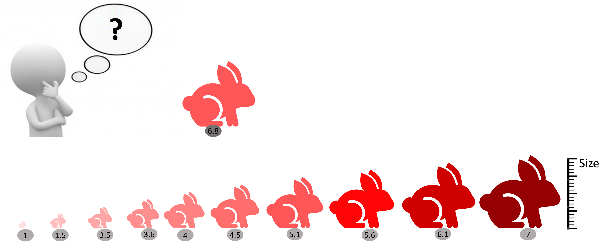
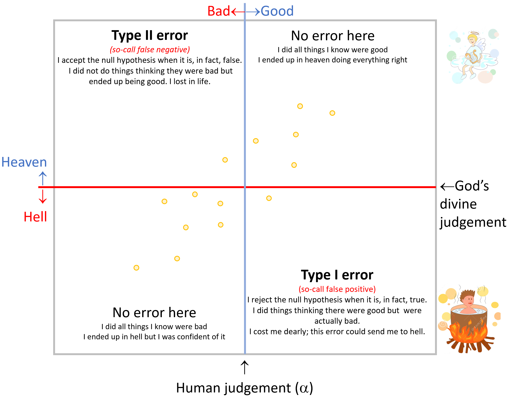

# Hypothesis testing {}

Chapter not ready for review

In the prior chapters, we have been dealing with three of the core goals of statistics: visualization of data (i.e., scatterplots, histograms, etc.), description of the data (i.e., mean, mode, SD, etc), and relationships among variables (e.g., correlation, regression). In this chapter, we will deal with a fourth main goal of statistics: to tell if something (one thing) or somethings (many things) are different.


There is an amazing level of complexity to that single question, of whether a thing or set of things are different. In this chapter, I want to break that complexity into its peaces, so you can better comprehend the results of any test aimed at testing for significant differences.

```{r, out.width = "90%", echo= FALSE, fig.align = 'center',fig.cap = 'Rejecting the extremes or special'}
knitr::include_graphics("images/NastyReject.png")
```

**Expectation for this chapter**

At the end of this chapter, it is expected that you:

1. Can state a null hypothesis and alternative hypothesis.

2. Can interpret the level of significance and the critical values,

3. Can interpret p-value.

4. Can interpret the different types of errors when making a conclusion on a hypothesis.


Alright, let's get to it.


## Background info {-}
If  the question is asked if something is different, how do we know that a thing is different? It is rare the case when two things are identical, so is everything different?. In statistic, we commonly use the term **significantly different**  to indicate more precisely the level at which something is different. We will get to this in a moment.

When the question is formulated of whether something is significantly different; inherently we assume a couple things:

1. There is a reference point to which we are comparing to. That reference is most commonly, almost always, a metric we obtained from the population. So it is compared to the data from the population that will know  if something is different. 


```{block2, type='rmdnote'}
A population is a whole, it’s every member of a group. A sample is a fraction of the population.
```


```{r, out.width = "70%", echo= FALSE, fig.align = 'center',fig.cap = 'Population, sample, individual'}
knitr::include_graphics("images/Population.png")
```


2. The second thing implied is that there is a threshold beyond which we will assume something is different. Who determines the level at which something is different?. That will be the so-call **level of significance**, which at times will appear named as alpha, $\alpha$.

As mentioned earlier, in biology and most sciences, we generally accept an $\alpha$ smaller than 0.05. Basically, we assume something is **significantly different**, if it is larger or smaller than the top or bottom 5% of all individuals in that population.

```{r, out.width = "80%", echo= FALSE, fig.align = 'center',fig.cap = 'How p<0.05 feels like'}
knitr::include_graphics("images/P05feelslike.png")
```

Of course, you can use different levels of significance, and it all cases it means the same: the threshold beyond which you assume something is different.

The particular value in a distribution where the given $\alpha$ occurs is call the **critical value**. Say you want to test a hypothesis that a given rabbit is significantly larger than the common rabbit and you want to test this hypothesis with a level of significance of 0.1. In this case, you need to know the size at which 10% of the common rabbit occurs.

In the example below, 10% of the rabbits are larger than 7in. In this case, the critical value for a level of significance of 0.1 is 7in. 

It is called critical value, because that is the cut off that will determine if your sample is significantly different or not. 

In the example below, the rabbit I want to compare is 6.8in tall, so at a $significance level$=0.01, this rabbit is not significantly large. 


```{r, out.width = "80%", echo= FALSE, fig.align = 'center',fig.cap = 'Critical value'}

```

By the way, 1 - $\alpha$ is what is call **level of confidence**. Think about it, if I conclude that something is significantly different at $\alpha$=0.05, then my confidence has to be the complement of that, which will be 0.95 or 95%.

```{block2, type='rmdimportant'}
The threshold beyond which we reject a null hyphothesis is called the **level of significance** or alpha, $\alpha$. The value in a population at which $alpha$ falls is called the **critical value**. The complement to the level of significance, 1- $\alpha$, is call the **level of confidence **.
```

Let's put together the data on the population and the level of significance for you to better know how then we make a call on whether something is different.


### p-value and alpha {-}

Early on, we studied how a population can be characterized based on the mean value of its individuals and the variability of those individuals, the so-call standard deviation. With those two parameters alone you can know how the entire population looks like. 

Lets look at an example. In the USA, the average men is 177.8cm in height with an standard deviation of 7.62cm. Lets plot this population. 


```{r, message=FALSE,warning=FALSE}
Mean_Height=177.8   # height of average male in the USA
SD_Heigh=7.62       # Standard deviation of male population in the USA

MenUSPop<- rnorm(164000000,Mean_Height,SD_Heigh) #we select from a population with that mean and SD, the 164 million men in the use. This will be the entire population....this line may take a while, dependenting how good your computer is...you are taking over 160 million values...you can click scape if it take to long and use rather take a still large sample of 1.6 million men, for contnuing with the execersize.

breaks = seq(100, 240, length.out = 80) #I create a set of bins for the x-axis of the distribution

#next I plot the data for the size of the entire population of men in the USA
 hist(MenUSPop, main=NA,xlim=c(100, 240),ylim=c(0, 20000000),breaks = breaks, xlab = "US men heigth (cm)",ylab = "Number of people")
 
 
#plot the mean height of men
abline(v=Mean_Height, lwd=2, col="blue", lty=2) 

#lets add a label to mean label
text(Mean_Height,20000000,labels="Mean",pos=4, col="blue") 
 
```

From the figure above, you can see that while most men are on average 177.8 cm tall, some men can get very tall and others are very short. And just so you know, on the distribution above, the tallest men was $`r round(max(MenUSPop),2) `$ cm while the shortest was $`r round(min(MenUSPop),2) `$ cm.

One cool property of the population data, specially data that are normally distributed, is that you can tell relatively well the fraction of individuals away from the mean by knowing the standard deviation.

If you recall Chapter 5, we mentioned that 95% of the individuals on any normally distributed population are within two-standard deviations from the mean. Lets check that out.

In the figure below, I illustrate random samples of males taken from the US men height population. If I were to count the fraction of men two standard deviations below or above the mean height (percentage red numbers shown in the figure) on each sample, you would see that on any sample there are cumulatively almost always 5%, or about 2.5% on each tail of the distribution. Cool ah?


```{r, out.width = "80%", echo= FALSE, fig.align = 'center',fig.cap = 'Frcation of population beyond 2SD'}
knitr::include_graphics("images/AnimatedDistribution.gif")
```

And it gets even better, you can know very precisely, then the fraction of individuals in a population that are above or below a given standard deviation. 

Let's say I found a men that is 193.04cm tall. What fraction of men can be taller than him?

In this case, this guy is 2SD (Standard deviations) above the mean. The average height was $`r Mean_Height `$ and one standard deviation, SD, was $`r SD_Heigh`$. So, $`r Mean_Height `$ + (2 *$`r SD_Heigh`)$ = $`r round(Mean_Height  + (2*SD_Heigh),2)`$.

So you know that below the mean there are 50% of men, and two standard deviations above the mean are 47.5%. So 97.5% of the men are shorter than that guy. This guys is as tall as the tallest 2.5% of the men in th USA. If we assume a **level of significance** of 5%, then you can claim this one guy is significantly tall.

```{r, out.width = "50%", echo= FALSE, fig.align = 'center',fig.cap = 'How do you like me?'}

```

This mathematic property of a normal population also works in reverse. Let's say I found a men that is $`r round(Mean_Height  - (2*SD_Heigh),2)`$cm tall?. What fraction can be shorter than him?


In this case, this guy is 2SD (Standard deviations) below the mean. The average height was $`r Mean_Height `$ and one standard deviation, SD, was $`r SD_Heigh`$. So $`r Mean_Height `$ - (2 *$`r SD_Heigh`) = $`r round(Mean_Height  - (2*SD_Heigh),2)`$.

We know that above the mean there are 50% of men, and two standard deviations below the mean are 47.5%. So 97.5% of the men are taller than that guy. This guys is as short as the shortest 2.5% of the men in th USA. If we assume a level of significance of 5%, then you can claim this one guy is significantly short.

In statistics, the fraction of individuals, members, data points, etc. that are above or below the given sample value in a population is called the p-value.

So in the example above, our conclusion that this one guy was significantly shorter has a p-value = 0.025 or 2.5%.

If we assume a level of significance, $\alpha$, of 0.05, then we are assuming that something is significantly smaller or taller, if it is as short or as tall to the shortest or tallest 5% of the population. 

In R, we can find out the critical value in a distribution of data at any given significance level using the $qnorm$ function, which we used earlier. Worth nothing that this function assumes that the population is normally distributed. 


In the example just above, the short guy was $`r round(Mean_Height  - (2*SD_Heigh),2)`$cm tall, which was as short as the shortest 2.5% of the population. So this person is significantly small at an $\alpha$ of 0.05.  In fact, we can be more confident than that as our conclusion has a p-value of 0.025; We know that over 97.5% of the US population is taller than him.

Multiple academic discussions have taken place around the need to report the **level of significance** when the **p-value** is more accurate. At least now you know what they both mean.

From the example above, we can see that the overall approach to test if something is significantly different is relatively straightforward.

All you need to know is how many standard deviations from the mean a given individual or sample is. From this you can know the fraction of individuals that are above or below that given number (the p-value). You can then compare that p-value to the level of significance, $\alpha$, you want to use. If the p-value is smaller than the level of significance then you conclude that the one thing is significantly different at the given $\alpha$.


```{block2, type='rmdimportant'}
P-VALUE is the fraction of individuals in a population as extreme as or more extreme than an observed individual.
It is also refered as a probability. 
```


Lets finish this section by looking at the fraction of individuals in a population at increasing larger standard deviation.

```{r, out.width = "80%", echo= FALSE, fig.align = 'center',fig.cap = 'Significance level'}
knitr::include_graphics("images/CummulativeNormalDistribution.gif")
```

## Approach to testing a hyphothesis {-}
In the prior section, you sow how to test if something is significantly different or not. While overtime you can get to it right away, you should know that there is a ritual/approach to how to test a hypothesis. It goes like this:

1. State the null and alternative hypothesis.

2. Chose the level of significance.

3. Find the critical values.

4. Compare the sample value to the critical value.

5. Draw a conclusion.


## Stating hyphotheses and tails {-}

The statistical approach to hypothesis testing is to reduce all likely options to a binary choice between the **null hypothesis** or the **alternative hypothesis**.

The **null hypothesis** is denoted with the letters $Ho$. The **alternative hypothesis** is denoted with the letters $H1$. 

The **null hypothesis** is always making reference to how things should commonly be, it can also make references to the option of no-difference or that something is equal to a given value. The **alternative hypothesis**  is all what the **null hypothesis** is not. 

In statistics, you can only **reject the null hypothesis** or **fail to reject the null hypothesis** (this is synonym for accept the null hypothesis, but this term is not accepted because we are never certain). Along the same lines, when you reject the null hypothesis, we you do not accept the alternative hypothesis. 

```{r, out.width = "80%", echo= FALSE, fig.align = 'center',fig.cap = 'Painfull rejection narrative'}

```

There are several ways to state hypotheses. Let's try a few examples to clarify:

Say a burger company claims that their Combo #1 has 1,800 calories, with a variability (Standard deviation, SD) of 50 calories. To test if this is true you can set your hypotheses different ways, like:

Null hypothesis,         Ho:  Combo1 = 1,800 calories.

Alternative hypothesis,  H1:  Combo1 $\neq$ 1,800 calories.

In this form, I am asking if the burger is equal to 1,800 calories. In this case, the alternative has to be that the burger is different than 1,800cal. To be different, a burger could be much smaller than 1,800cal but it can also be much larger than 1,800 calories.

If I take several of their burgers, and measure their caloric content, I can reject the null hypothesis if the sample I took had much higher or lower number of calories that the **critical value** at which the **significance level**, $\alpha$, I chosen falls. 

This is what is call a **two-tail** test. Basically, you have to divide the level of significance in two as you will be testing if the sample is much smaller or much larger. If my sample falls in the red areas, in the image below, then I reject the null hypothesis, as it means that my one sample is much larger than the upper 97.5% or much lower 2.5%, or an $\alpha$=0.05. Let's visualize this in R,


```{r, message=FALSE,warning=FALSE}
mean=1800 # this is the mean number of calories in their burger. We can think of this as the population mean
sd=50     #this is the variability in calories

# create a normal distribution of burgers with the given mean and SD
x <- seq(-4,4,length=100)*sd + mean  # This w
y <- dnorm(x,mean,sd)

plot(x, y, type="l", xlab="Calories per burger", ylab= "Fraction of burgers",ylim=c(0,0.009),main="Ho: Combo1 = 1,800 calories") # this is how the calories of the population of burgers should look like

#because this is a two tail distribution, I mean something will be different if it is much larger or much smaller, then you have to look for the critical value at alpha divided by 2. 

LowerCriticalVal=qnorm(0.025,mean,sd) # we need to find the critical value at 2.5% and the upper 97.5%...that is a significance level of 5%
UpperCriticalVal=qnorm(0.975,mean,sd) # upper critical value, or value above which 97.5% of the population occurs.
  
#plot the critical thresholds set by alpha
abline(v=UpperCriticalVal, lwd=2, col="red", lty=2) 
abline(v=LowerCriticalVal, lwd=2, col="red", lty=2) 

#Lets plot the critical areas
polygon(c(x[x>=UpperCriticalVal], UpperCriticalVal), c(y[x>=UpperCriticalVal], y[x==max(x)]), col="red") #right hand tail
polygon(c(x[x<=LowerCriticalVal], LowerCriticalVal), c(y[x<=LowerCriticalVal], y[x==max(x)]), col="red") #right hand tail


#let's make this fancier and put arrows to indicate rejection areas. We will use the package shape for this
#install.packages("shape")
library(shape)
Arrows(LowerCriticalVal,0.006,LowerCriticalVal-50,0.006,lwd=2, arr.type="triangle")
text(LowerCriticalVal,0.0065,"Reject",pos=2)

#we can do add the same arrow for the upper tail of rejection zone
Arrows(UpperCriticalVal,0.006,UpperCriticalVal+50,0.006,lwd=2, arr.type="triangle")
text(UpperCriticalVal,0.0065,"Reject",pos=4)

#while we are at it, lets indicate the zone of the level of confidence
Arrows(LowerCriticalVal,0.0085,UpperCriticalVal,0.0085,lwd=2, arr.type="curved",code=3)
text(mean,0.0085,"Level of confidence ",pos=3)

#finally, let's add a label to indicate the types of hyphotesis this test will help anwser


```


The hypotheses could also be set like this:

Null hypothesis,         Ho:  Combo1 <= 1,800 calories.

Alternative hypothesis,  H1:  Combo1 > 1,800 calories.

In the example above, I am being more specific, testing the null hypothesis that the average burger has less than 1,800 caloriess; the alternative hypothesis has ti be that the burger has more than 1,800 calories.

If I take several of their burgers, and measure their caloric content, I can reject the null hypothesis only if the sample I took had much higher number of calories than the **critical value** at which the **significance level**, $\alpha$, I chosen falls. This is what is call a **right-tail** test. Lets visualize this in R,


```{r,  message=FALSE,warning=FALSE}
mean=1800 # this is the mean number of calories in their burger. We can think of this as the population mean
sd=50     #this is the variability in calories

# create a normal distribution of burgers with the given mean and SD
x <- seq(-4,4,length=100)*sd + mean  
y <- dnorm(x,mean,sd)

plot(x, y, type="l", xlab="Calories per burger", ylab= "Fraction of burgers",main="Ho: Combo1 <= 1,800 calories") # this is how the calories of the population of burgers should look like

UpperCriticalVal=qnorm(0.95,mean,sd) #in this case I am looking for the upper 5% of the individuals..or the threshold at which 95% of the population occurs

#plot the critical thresholds set by alpha
abline(v=UpperCriticalVal, lwd=2, col="red", lty=2) 

#Lets plot the one critical area
polygon(c(x[x>=UpperCriticalVal], UpperCriticalVal), c(y[x>=UpperCriticalVal], y[x==max(x)]), col="red") #right hand tail
```


The hypotheses could also be set like this:

Null hypothesis,         Ho:  Combo1 >= 1,800 calories.

Alternative hypothesis,  H1:  Combo1 < 1,800 calories.

In the example above, I am testing if the burgers have more calories than what the company claims. The alternative hypothesis, then has to be that the burgers have less than 1,800 calories.

If I take several of their burgers, and measure their caloric content, I can reject the null hypothesis only if the sample I took had much fewer number of calories than the **critical value** at which the significance level I chosen falls. This is what is call a **left-tail** test. Lets visualize this in R,


```{r, message=FALSE,warning=FALSE}
mean=1800 # this is the mean number of calories in their burger. We can think of this as the population mean
sd=50     #this is the variability in calories

# create a normal distribution of burgers with the given mean and SD
x <- seq(-4,4,length=100)*sd + mean  # This w
y <- dnorm(x,mean,sd)

plot(x, y, type="l", xlab="Calories per burger", ylab= "Fraction of burgers",main="Ho: Combo1 >= 1,800 calories") # this is how the calories of the population of burgers should look like


UpperCriticalVal=qnorm(0.05,mean,sd) #in this case I am looking for the lower 5% of the individuals..or the threshold at which 5% of the population occurs


#Lets plot the one critical area
polygon(c(x[x<=UpperCriticalVal], UpperCriticalVal), c(y[x<=UpperCriticalVal], y[x==max(x)]), col="red") #right hand tail

#plot the critical thresholds set by alpha
abline(v=UpperCriticalVal, lwd=2, col="red", lty=2) 
```


## Accepting or rejecting the null hypothesis {-}
In a nutshell, the idea of testing a hypothesis is to see if a given individual or sample is larger or smaller than the population cutoff set by the level of significance, $\alpha$.


In a two tail test, the null hypothesis is rejected if the sample value is larger or smaller than the critical value. On the contrary, if your sample value is within the range outlined by your critical value, then you conclude that you failed to reject the null-hypothesis. Please remember that in statistics you only "fail to reject" or "reject" the null hypothesis but you never prove the alternative hypothesis when you reject the null hypothesis. 


In a right tail test, the null hypothesis is rejected if the sample value is larger than the critical value.

```{r, out.width = "80%", echo= FALSE, fig.align = 'center',fig.cap = 'Types of tests'}
knitr::include_graphics("images/TestTypes.png")
```


In a left tail test, the null hypothesis is rejected if the sample value is smaller than the critical value.

Hypotheses can also be tested by simply comparing your chosen level of significance, $\alpha$, to your p-value. Every time your p-value is smaller than the $\alpha$ you reject the null hypothesis.  

```{r, out.width = "80%", echo= FALSE, fig.align = 'center',fig.cap = 'If the P is low, the Ho must go'}
knitr::include_graphics("images/PHO.jpg")
```

Think about this for a moment. 

Let's say I am testing if the heart rate of a person is significantly larger that the average population using a **level of significance** at 0.05. 

In this case, I am assuming a heart rate will be significantly larger for any heart rate faster than the top 5% of all hearth rates in the human population. 

Let's say I measured the hearth rate of a person and estimated that it has a p-value of 0.02. 

This means that the heart rate of this one person is as fast as the top 2% fastest hearth rates in the population. 

In this case, the p-value is smaller than $\alpha$, so I reject the null hypothesis, and conclude that indeed the hearth rate of the given individual is significantly larger than expected from the average human population. 


```{r, out.width = "70%", echo= FALSE, fig.align = 'center',fig.cap = 'The P-value'}
knitr::include_graphics("images/P05.png")
```

## Testing a hypothesis by brutal force {-}
In the following chapters, we will introduce standardized ways to test hypotheses comparing sample values to critical values; I want to finish this chapter by illustrating the ultimate idea behind testing a hypothesis by running a brief simulation. This simulation will aim to show the general approach of hypothesis testing.


Lets say that you work for the FDA, and you have been commissioned to provide evidence for a lawsuit case involving the calories in MacDonals burgers (this is a fictitious example). 

The pending lawsuit refers to a person who suffered a heart attack after his cholesterol levels increased considerably. Prior to the heart attack, the doctor of this person recommended him that he kept a daily diet of no more than 2000 calories a day, so he satisfied his weakness for burgers eating a new type of MacDonals burger that claimed to have less than 1,500 calories (Standard deviation, SD= 50). 

Let say that you collected a random sample of ten burgers and found that they have on average 1600 calories. So the question is, do the claim by this individual hold any right?

Let's start by stating the hypotheses:


Null hypothesis,         Ho:  burger <= 1,500 calories.

Alternative hypothesis,  H1:  burger > 1,500 calories.

In this case, I specifically want to know if these burgers have less than 1500 calories as claimed by the company.

We want to test this hypothesis at an $\alpha$, level of significance, of 0.05 or 5%.

Alright, lets start our simulation.


```{r,  message=FALSE,warning=FALSE}
MeanCal = 1600 #calories in the sample of burgers

plot(1, type="n", xlab="Total calories in MacDonal's bugers", ylab="Percent of burgers", xlim=c(1000, 2000), ylim=c(0, 10)) # lets create an empty plot

#plot the sample value
abline(v=MeanCal, lwd=2, col="blue", lty=2) 

#lets name the mean sample value
text(MeanCal,10,labels="Sample value",pos=4, col="blue")
```

Next, you can plot the **critical value** for an alpha of 0.05 in a population with a mean of 1500 and an standard deviation of 50. 

In this case, the critical value at $\alpha$=0.05, is simply the cutoff at which 95% of the calories in the MacDonals burgers occurs. If we are assuming the population data is normal and has a mean of 1500 and a Standard deviation, SD, of 50, we can find out that critical value using the $qnorm$ function in R.


```{r,  message=FALSE,warning=FALSE}
CriticalVal=qnorm(0.95,1500,50) # here we want to know the cutoff at which 95% of the observations occur in a population with a mean of 1500 and an SD of 50

plot(1, type="n", xlab="Total calories in MacDonal's bugers", ylab="Percent of burgers", xlim=c(1000, 2000), ylim=c(0, 10)) # lets create an empty plot


#plot the sample value
  abline(v=MeanCal, lwd=2, col="blue", lty=2) 
  #lets name the mean sample value
  text(MeanCal,10,labels="Sample value",pos=4, col="blue")

#plot the critical value
  abline(v=CriticalVal, lwd=2, col="red", lty=2) 
  #lets name the mean sample value
  text(CriticalVal,10,labels="Statistical critical value",pos=2, col="red")

```

For the comparison between the critical value and the sample value, we can already observe that the sample burgers in reality have more calories than claimed by MacDonals at a significance level, $\alpha$, of 0.05.

Lets try the same test but building an actual population of expected burgers. For this, we take one random sample from a normal population with a mean of 1500 and an standard deviation, SD, of 50. In R, you can take any number of individuals randomly from any normally distributed population using the function $rnorm$.


```{r, message=FALSE,warning=FALSE}
MeanPopulation=1500
SDPopulation=50
RandomSample1<- rnorm(1,MeanPopulation,SDPopulation) 

RandomSample1

```
Our actual sample of 10 burgers had an average calorimetric content of $`r MeanCal`$ while the expected value of this one random sample was  $`r round(mean (RandomSample1),2)`$.

Hmm, ok, but we only have one random sample. To be robust, we probably should take 100,000 random samples and from all of those see if the top 5% of the random samples, our critical threshold, is larger or smaller than our observed sample value.

To run such a simulation, we can use the *for* loop function in R. Lets try. Let me explain that function with the example.


```{r, message=FALSE,warning=FALSE}

population= c()  #we create an empty vector where we will store the random averages of our 1000 random samples of ten burgers
for (sampleI in 1:100000) { # here I set a variable called sampleI that will loop from 1 to 1000
  
meanRandomSampleI<- rnorm(1,MeanPopulation,SDPopulation) #take a random value

#lets place the value for that sample in the vector
population=c(population, meanRandomSampleI ) #basically I am appending the value of every sample in every loop to the vector
}
# the code between {} will run for 100,000 times. to test lest count the number of entries in the vector

length(population)
```
Ok, we just created a population of 100,000 random samples from a normal population with a mean of 1500 and an standard deviation, SD, of 50. Let's do a histogram of that database

```{r, message=FALSE,warning=FALSE}
breaks = seq(1200, 1800, length.out = 100) #lets create a set of bins

hist(population,main=NA,xlim=c(1200, 1800),ylim=c(0, 5000),breaks = breaks, xlab = "Total calories in MacDonal's bugers",ylab = "Number of ramdon samples")
```

Looking good....lets draw a line for the 5% level of significance for the expected distribution. We will use the R function $quantile$, which we used earlier, to find out the value located at the 95% percentile, which will outline the position to the right where 5% of the cases occur. Let's call this the modeled critical value, to differentiate it from the  statistical critical value we calculated earlier.

```{r, message=FALSE,warning=FALSE}

ModelledCriticalValue=quantile(population,0.95,type=1) #quantile finds the value in the population of calories located at the top 5% percentile
ModelledCriticalValue
```

Now we can compare the average calorimetric content in our actual sample of 10 burgers (sample value) to the  value located at the 5% mark (i.e., the level of significance).

```{r, message=FALSE,warning=FALSE}
hist(population,main=NA,xlim=c(1200, 1800),ylim=c(0, 6000),breaks = breaks, xlab = "Caloric content of burgers",ylab = "Number of ramdon samples")


#plot the sample value
    abline(v=MeanCal, lwd=2, col="blue", lty=2) 
    #lets use a label for it
    text(MeanCal,6000,labels="Sample value",pos=4, col="blue")


#plot the 5% modeled critical value 
abline(v=ModelledCriticalValue, lwd=4, col="orange", lty=2) 
#lets name the critical value
text(ModelledCriticalValue,6000,labels="Modeled critical value",pos=2, col="orange")


#plot the 5% statistical critical value
  abline(v=CriticalVal, lwd=2, col="red", lty=2) 
  #lets name the mean sample value
  text(CriticalVal,5500,labels="Statistical critical value",pos=2, col="red")

```

Pretty neat, ah?. the modeled and statistical critical value were identical. And they both were below the sample value. In short, the sample of ten burgers (Blue line in figure above) was much larger than the critical value at 5% (red lines), we then reject the null hypothesis that these burgers have less than 1,500 calories, and would have to embrace the alternative hypothesis that the burgers have more than 1500 calories. You can surmise in your report to the judge that the one guy lawsuiting MacDonalds was deceived. A case of false advertisement.


## Error types {-}

You probably noted the level of caution used while testing hypotheses. That is because we work on probabilities, so we are never certain. In hypothesis testing we deal primarily with those things we could never know for sure; there is always a chance that we are wrong when making a conclusion. That chance of being wrong can be separated into two different types of errors called **Type I** and **Type II** errors. 

I found a couple neat examples online you should check for further clarification on the Type-I and Type-II errors [here](http://experimentaltheology.blogspot.com/2010/09/theology-of-type-1-type-2-errors.html) and [here](https://www.analyticsvidhya.com/blog/2020/06/statistics-analytics-hypothesis-testing-z-test-t-test/)

Lets try the one example about going to hell or to heaven depending on your threshold of what qualifies as a good or a bad thing...the example goes like this:

```{r, out.width = "90%", echo= FALSE, fig.align = 'center',fig.cap = 'Errors that send you to hell'}

```

There is a God, we have never met in person, that holds the **ultimate threshold** of the actions that qualify to go to heaven or not. Because we do not know the guy, and we do not have fully clear guidelines, there may be an speculation on that threshold. The point here is that there is an **ultimate threshold**, the **ultimate truth**, which we do not know for certain.

On the other side of this problem is our judgment of what God would mean such threshold is. The ten commitments were a nice start, but what about when you are mean to your teacher?. The Bible says do not do to others what you do not want others to do to you. Would being mean to another person take points out my score to go to heaven?. If I were you I would play it save and be nice to everyone, including your teacher, but we are uncertain if being mean reduces the score of the going-to-heaven ticket.

The point above is that there is an ultimate threshold that defines the truth, a threshold that we do not know for certain, but that we can approximate. This approximation threshold it what we called $\alpha$ earlier: the chance we are giving ourselves to be wrong in our decisions. 

When our human $\alpha$ threshold matches the divine threshold, then we got lucky, and we were right every time we did something in life. No errors here. I did all right things knowingly  knowing I will end up in heaven or I did all wrong things knowingly knowing I would end up in hell.


However, if my threshold was too low and I did a lot of mean things, that turned out to be bad and reduced my going-to-heaven-score, then my threshold did have an error that let me to conclude that doing certain things were ok, when in truth they were not. If you think about this type of error, you accepted the hypothesis that certain things were ok, but turned out to be they were not fine. This is what is call a **false negative**, or a **Type II** error.

Say that in the opposite my threshold to define what was right or not was too high...this may not necessary ensure me a ticket to heaven. While I am minimizing my Type II error, such a very high threshold means that I am probably not doing things that could be ok,  things that may have help other people or the planet. So a high threshold may defeat the purpose of why God send me here, and we may be penalized for that. A very high threshold will lead to what is call a **false positive** or a **Type I error**. Rejecting things that turned aout be ok.


```{r, out.width = "80%", echo= FALSE, fig.align = 'center',fig.cap = 'Type I and Type II errors'}
knitr::include_graphics("images/TypesOfError.png")
```

```{block2, type='rmdimportant'}
A false positive, also call Type I error, is to reject the null hypothesis when it is, in fact, true.

A false negative, also call Type II error, is to accept the null hypothesis when it is, in fact, false.
```


## Exercises {-}
Some of these questions may take a while to load depending on your internet connection.

<iframe src="https://www.impactsofclimatechange.info/H5P/wp-admin/admin-ajax.php?action=h5p_embed&id=28" width="958" height="344" frameborder="0" allowfullscreen="allowfullscreen"></iframe><script src="https://www.impactsofclimatechange.info/H5P/wp-content/plugins/h5p/h5p-php-library/js/h5p-resizer.js" charset="UTF-8"></script>


<iframe src="https://www.impactsofclimatechange.info/H5P/wp-admin/admin-ajax.php?action=h5p_embed&id=29" width="958" height="572" frameborder="0" allowfullscreen="allowfullscreen"></iframe><script src="https://www.impactsofclimatechange.info/H5P/wp-content/plugins/h5p/h5p-php-library/js/h5p-resizer.js" charset="UTF-8"></script>


<iframe src="https://www.impactsofclimatechange.info/H5P/wp-admin/admin-ajax.php?action=h5p_embed&id=30" width="958" height="530" frameborder="0" allowfullscreen="allowfullscreen"></iframe><script src="https://www.impactsofclimatechange.info/H5P/wp-content/plugins/h5p/h5p-php-library/js/h5p-resizer.js" charset="UTF-8"></script>

<iframe src="https://www.impactsofclimatechange.info/H5P/wp-admin/admin-ajax.php?action=h5p_embed&id=36" width="958" height="531" frameborder="0" allowfullscreen="allowfullscreen"></iframe><script src="https://www.impactsofclimatechange.info/H5P/wp-content/plugins/h5p/h5p-php-library/js/h5p-resizer.js" charset="UTF-8"></script>

<iframe src="https://www.impactsofclimatechange.info/H5P/wp-admin/admin-ajax.php?action=h5p_embed&id=31" width="958" height="311" frameborder="0" allowfullscreen="allowfullscreen"></iframe><script src="https://www.impactsofclimatechange.info/H5P/wp-content/plugins/h5p/h5p-php-library/js/h5p-resizer.js" charset="UTF-8"></script>


<iframe src="https://www.impactsofclimatechange.info/H5P/wp-admin/admin-ajax.php?action=h5p_embed&id=32" width="958" height="311" frameborder="0" allowfullscreen="allowfullscreen"></iframe><script src="https://www.impactsofclimatechange.info/H5P/wp-content/plugins/h5p/h5p-php-library/js/h5p-resizer.js" charset="UTF-8"></script>


<iframe src="https://www.impactsofclimatechange.info/H5P/wp-admin/admin-ajax.php?action=h5p_embed&id=33" width="958" height="311" frameborder="0" allowfullscreen="allowfullscreen"></iframe><script src="https://www.impactsofclimatechange.info/H5P/wp-content/plugins/h5p/h5p-php-library/js/h5p-resizer.js" charset="UTF-8"></script>


<iframe src="https://www.impactsofclimatechange.info/H5P/wp-admin/admin-ajax.php?action=h5p_embed&id=34" width="958" height="311" frameborder="0" allowfullscreen="allowfullscreen"></iframe><script src="https://www.impactsofclimatechange.info/H5P/wp-content/plugins/h5p/h5p-php-library/js/h5p-resizer.js" charset="UTF-8"></script>


<iframe src="https://www.impactsofclimatechange.info/H5P/wp-admin/admin-ajax.php?action=h5p_embed&id=35" width="958" height="312" frameborder="0" allowfullscreen="allowfullscreen"></iframe><script src="https://www.impactsofclimatechange.info/H5P/wp-content/plugins/h5p/h5p-php-library/js/h5p-resizer.js" charset="UTF-8"></script>


## Homework {-}

The annual migration of a bird through a watershed in Florida has remained stable for several years at an average of 1,2 million birds and a standard deviation of 100,000 birds. In the last year, the number of birds was 700,000. There have been numerous concern that a development project may be damaging the habitats of the bird. As a first order of inquiry, we need to know if this year's numbers are significantly lower than in prior years. Please test this hypothesis at a 5% level of confidence?


In this exercise, please:

1. Write down the null and the alternative hypothesis.

2. Please run an R-simulation to test this hypothesis.

3. Create a frequency distribution plot indicating the expected distribution of the birds and mark with a line the observed value for the last year. Also mark on the figure the 5% boundary of the expected distribution.

In a Word document write down your answers, the figure and the code.
