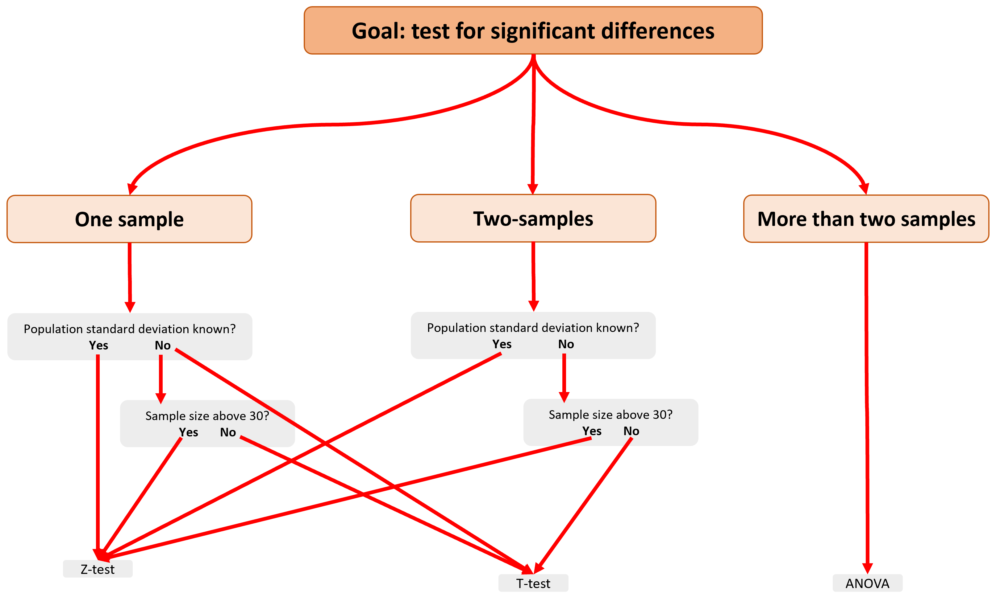

# Standard hyphostesis tests {}
In the prior chapter, we learned that the basic principle of hypothesis testing was to find out if a given value (from a sample) was on the extremes of a population. The threshold for what we mean by extreme is determined by the $\alpha$ value. We can test a hypothesis by brutal force running a simulation, but we can also run a set of available tests that will tell you the position of your sample in relation to the population.

There are a diversity of statistical tests available for testing hypotheses, but here we will deal only with those tests intended to test if one thing, two things or more than two things are different.

By the way,  the suitability of available tests depends on whether your data are normally distributed or not (please recall from chapter 3 that normally distributed data looks like a bell-shape curve). Tests for normally distributed data are call **parametric tests**. In cases, where your data are not normal (e.g., it is biased, or homogeneous) requires a different set of tests called non-parametric tests. We will not cover non-parametric here but you need to be aware of this distinction. 


**Expectation for this chapter**

At the end of this chapter, it is expected that you can identify the case you want to test (i.e., one, two or more sample tests), and select the proper statistical method to test for significant differences for each case. 

## Alternative types of tests {-}
When comparing samples, in broad terms, there are three likely options:

### One sample test  {-}
This type of case relates to situations in which you have a sample parameter and you want to compare it a population. 

Say you are disappointed by how much smaller the candy bars in a store look like. Say you take a few samples of candy bars and found they are on average 180g. The label says they are on average 200g +/-10g. This would be a case of a *one-sample test*. Basically, you have one sample and you want to find out if it is different to the expected value from a population.

Let's visualize this:

```{r, message=FALSE,warning=FALSE}
SampleWeight=180  # this is the average weight of the samples you took
PopulationWeight=200   # Average weight reported in the lable of the candy bar
SD=10       # reported Standard deviation for the candy bars

SimulatedPopulation<- rnorm(10000,PopulationWeight,SD) #lets simulate a population of 10000 candy bars with .

breaks = seq(150, 250, length.out = 80) #I create a set of bins for the x-axis of the distribution, this will determine how many bis you have

#next I plot the data
 hist(SimulatedPopulation, main=NA,xlim=c(150, 250),ylim=c(0, 800),breaks = breaks, xlab = "Candy bar weight (g)",ylab = "Number of candies")
 
 
#plot the mean height of men
abline(v=SampleWeight, lwd=2, col="red", lty=2) 

#lets add a label to mean label
text(SampleWeight,2000,labels="Sample",pos=4, col="blue") 
 
```

### Two sample test  {-}
These are cases when you want to compare samples from two different populations. 

Say you have noted that when you fuel-up your at a gas station A, you can take on average one more trip to work than when you fuelup your car at gas station B. You can suspect one of the gas stations is adding more gas or actually giving less gas than it is suppose to. You can report this to the consumer group, and a likely test will be to take say samples of one gallon from both gas stations and measure the actual volume they dispense. Say a sample of 50 trials yeilds valumes of 1.1 gal +/-.05gal in Gas station A and 1.01 gal +/-.02gal in Gas station B.

This is a case of a two-sample test. In this case, you can treat both samples as independent, and assume they come from independent populations that are the same.

Lets visualize this:

```{r, message=FALSE,warning=FALSE}
MeanGasA=1.1  # average gas volume for a suspected 1 gallon dispensing at gas station A
SDGasA=0.05   # SD for sample from gas station A

MeanGasB=1.01  # average gas volume for a suspected 1 gallon dispensing at gas station B
SDGasB=0.02   # SD for sample from gas station B


SimulatedGasA<- rnorm(10000,MeanGasA,SDGasA) #lets simulate a population for gas station A.
SimulatedGasB<- rnorm(10000,MeanGasB,SDGasB) #lets simulate a population for gas station A.


breaks = seq(0.7, 1.4, length.out = 100) #I create a set of bins for the x-axis of the distribution, this will determine how many bis you have

#next I plot the data. because we want to plot two distributions on top of each other. we need to create each distribution independently and then add them to a  single plot

#histogram for gass station A.
GasA= hist(SimulatedGasA, xlim=c(0.7, 1.4),ylim=c(0, 500),breaks = breaks,  plot = FALSE)

#histogram for gass station B.
GasB= hist(SimulatedGasB, xlim=c(0.7, 1.4),ylim=c(0, 500),breaks = breaks,  plot = FALSE)

#because you are plotting two distributions, it will be nice to use different colors. and because they likelu overlap, you should use semitransparent colors
LightBlue <- rgb(173,216,230,max = 255, alpha = 5, names = "lt.blue") #the fucntion rgb lets your select one color, and the alpha gives you how tranparent
DarkRed <- rgb(255,192,203, max = 255, alpha = 95, names = "lt.pink")


#lets plot the first distribution
plot(GasA, main=NA,xlim=c(0.7, 1.4),ylim=c(0, 1500),breaks = breaks, xlab = "Dispensed gas volume for a reported 1 gallon (in gallons)",ylab = "Number of trials" ,col=LightBlue)

plot(GasB, add=T ,col=DarkRed)  #note how for the parameter col, you indicate the color you create as a variable above
 
``` 

### More than two sample test  {-}

These are cases when you want to compare samples from more than two different populations. 

Say you have have visited three countries and notice that men were very different in height. You are use to the men in the USA, which we already established have an average height of 177.8cm +/-SD 7.62 cm. In France, they were 172.8cm +/-SD 5.62 cm and in North Korea they were 155.5 cm +/- 8.5cm. 


This is a case of a three samples, and you what to test if they are different.

Lets visualize this:

```{r, message=FALSE,warning=FALSE}
USA_Height=177.8   # height of average male in the USA
USA_SD=7.62       # Standard deviation of male population in the USA

France_Height=172.8   # France data
France_SD=5.62       # SD for france

NKorea_Height=155.5   # North Korea data
NKorea_SD=8.5       # SD for North Korea


SimulatedUSA<- rnorm(10000,USA_Height,USA_SD) #lets simulate a population for USA
SimulatedFrance<- rnorm(10000,France_Height,France_SD) #lets simulate a population for USA
SimulatedNKorea<- rnorm(10000,NKorea_Height,NKorea_SD) #lets simulate a population for USA


breaks = seq(120, 220, length.out = 100) #bins for the distribution

#histogram for USA
USA= hist(SimulatedUSA, xlim=c(120,220),ylim=c(0, 500),breaks = breaks,  plot = FALSE)

#histogram for FCrance
France= hist(SimulatedFrance, xlim=c(120,220),ylim=c(0, 500),breaks = breaks,  plot = FALSE)

#histogram for USA
NKorea= hist(SimulatedNKorea, xlim=c(120,220),ylim=c(0, 500),breaks = breaks,  plot = FALSE)


#because you are plotting three distributions, it will be nice to use different colors. and because they likely overlap, you should use semitransparent colors
LightBlue <- rgb(173,216,230,max = 255, alpha = 100, names = "lt.blue") #the fucntion rgb lets your select one color, and the alpha gives you how tranparent
DarkRed <- rgb(255,192,203, max = 255, alpha = 95)

MiddleOrange <- rgb(255,69,0, max = 255, alpha = 95)

#lets plot the first distribution
plot(USA, main=NA,xlim=c(120, 220),ylim=c(0, 800),breaks = breaks, xlab = "Men size (cm)",ylab = "Number of people" ,col=LightBlue)

plot(France, add=T ,col=DarkRed)  #note how for the parameter col, you indicate the color you create as a variable above

plot(NKorea, add=T ,col=MiddleOrange)  #note how for the parameter col, you indicate the color you create as a variable above

 
``` 

##selecting the right test {-}
At this moment you should be able to identify cases involving comparisons between one, two or more samples. When you are interested for testing for significant differences int he cases above you have an option between tests called Z-test, T-test and the ANOVA or so-called analysis if variances. 

Which test you should use is based primarily on the number of samples to use, whether you know the variance of your population and whether the sample size is larger than 30 individuals or not. You need to use the following chart to select the proper test. Pleas remember that these are parametric tests, meaning they are only useful for cases in which data are normally distributed.


```{r, out.width = "70%", echo= FALSE, fig.align = 'center',fig.cap = 'Selecting statistical test'}

```

Also take a moment to review how hypotheses are stated, as that will be important in a moment to select the right type of test.

<iframe width="560" height="315" src="https://www.youtube.com/embed/8NKaocZectc" title="YouTube video player" frameborder="0" allow="accelerometer; autoplay; clipboard-write; encrypted-media; gyroscope; picture-in-picture" allowfullscreen></iframe>


## Homework {-}

Create a publication quality plot for each of these case examples. For each plot, indicate inside the plot if that is a case of one, two or more samples:


1. Chevrolet and Honda are strongly competing to produce hybrid cars as an option to electrical cars. The Honda model drives 50mpg (miles per gallon) +/-5mpg and the Chevrolet model drives 55mpg (miles per gallon) +/-7mpg.

2. Students at a school got on average GPA of 3.8, and are being considered for an award if they are among the best at the national level, in which the average GPA was 3.5 +/-0.12.

3. China is currently looking to optimize food production within its borders and run an experiment on biomass production for wheat, rice and corn. The annual yields were 55500 tns +/-500tns for wheat, 45500 tns +/-200tns for rice, and 35500 tns +/-255tns for corn.
