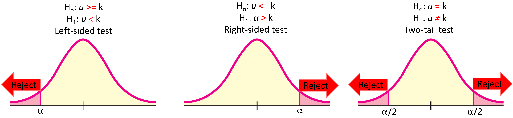
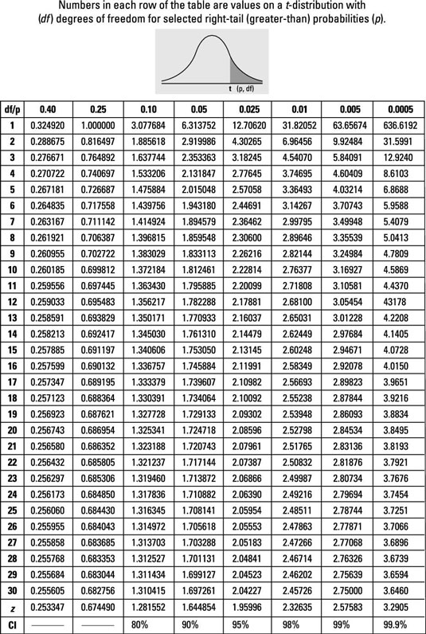

# One sample tests {}
One sample tests are for cases in which you have one sample, and what to determine if it belongs to a certain population. Like: 

is it the gas in Hawaii significantly more expensive than the rest of the USA?. 

is a 10 year old girl taller than expected?

These types of questions can be answered with either the Z-test or the T-Test, which we will introduce in this chapter. Both of these tests are suited for one-sample test, but the Z-test is used for cases in which you know the population SD and your sample size is larger than 30 individuals.  If on the contrary, you do not know your population SD or your sample size is smaller than 30, then you used the T-Test.

```{r, out.width = "70%", echo= FALSE, fig.align = 'center',fig.cap = 'Z-score fucntion'}
knitr::include_graphics("images/SelectingOnSampleTest.png")
```

At the end of this chapter, you are expected to:


1. Run a one sample Z-test and interpret its results from R.

2. Run a one sample T-test and interprets its results from R.


## The one-sample Z-test {-}
As mentioned earlier, the Z-test is used in cases when you want to run a one-sample test, you know the population standard deviation and your sample size is larger than 30 individuals.


The principle of the Z-score is very straightforward. Basically, this score allows you to know how many Standard deviations from the mean a given sample is.


As it has been indicated several times in this book, it is relatively easy to know the proportion of individuals in a population at certain standard deviations from the mean. 

As an example, plus or minus two standard deviations from the mean includes about 95% of the individuals in that population (assuming the population is normally distributed).

Given this principle then you can easily know the fraction of individuals at certain standard deviations from the mean.

The z-cores is basically an index that allows you to convert/standardize any value to a given number of standard deviations.

```{r, out.width = "70%", echo= FALSE, fig.align = 'center',fig.cap = 'Z-test fucntion'}
knitr::include_graphics("images/Z-score.png")
```
Lets try an example.

Say you want to know if females in a team run particularly faster the 100m race.

You measured the times of 31 girls and they were 9.7, 9.7, 8.9, 9.2, 9.4, 9.1, 9.5, 9.6, 8.9, 9.1, 9.5, 9.2, 9.5, 9.4, 9.6, 9.2, 9.9, 10, 9.3, 9.6, 9.1, 9.5, 9.2, 9.5, 9.4, 9.6, 9.2, 9.9, 10, 9.3, 9.6. 

In turn, the historical times running that race are 9.5sec +/-0.2sec.

From the example, it looks like we have one sample that we want to compare to a population. We have the standard deviation, SD, of the population and our sample size is larger than 30, so the best test here is a Z-test.

As it is customary, we start by stating the hypothesis:

H0: Time girls = 9.5 sec      The null hypothesis is how things are suppose to be...that means, the historical time of 9.5sec
H1: Time girls < 9.5 sec      The alternative hypothesis is what we are interested on, or claiming...that the team is faster than 9.5sec

Let's calculate the z-score:

```{r, message=FALSE,warning=FALSE}

Sample=c(9.7, 9.7, 8.9, 9.2, 9.4, 9.1, 9.5, 9.6, 8.9, 9.1, 9.5, 9.2, 9.5, 9.4, 9.6, 9.2, 9.9, 10, 9.3, 9.6, 9.1, 9.5, 9.2, 9.5, 9.4, 9.6, 9.2, 9.9, 10, 9.3, 9.6) #lets put the values in a vector

SampleMean=mean(Sample) #mean time racing for the girls sampled
SampleSize= length(Sample)  # this is the sample size or number of girls measured

PopulationMean= 9.5 #this is the population mean...or the historical time it has taken people to run 100m
PopulationSD=0.2 #this is the population standard deviation


#let's now estimate the z-score using the equation above.

ZTest=(SampleMean-PopulationMean)/(PopulationSD/sqrt(SampleSize))
ZTest
 
``` 

Now you need to recall chapter 8 to find out if this is a left-, right- or two tail test.

```{r, out.width = "80%", echo= FALSE, fig.align = 'center',fig.cap = 'Types of tests'}

```

Because, our alternative hypothesis is stating that the sample is smaller than, then we have to use a left-sided test. And with that you should look for the p-value in a Z-table for the left-sided test, like this one below (These tables are in the back of each stats book and online). The Z-table would give you the p-value for a given Z-value...in other words, what fraction of the population is beyond the given z-score.

```{r, out.width = "80%", echo= FALSE, fig.align = 'center',fig.cap = 'Left-sided Z-table'}
knitr::include_graphics("images/NegativeZtable.jpg")
```

To find out the p-value for a given Z-score in the left-sided Z-table, scroll down the first column looking for the first decimal point in your calculated z-score. In our case that will be -1.9. 

Once on that row, go back to the first row, and move horizontally until the column with the second decimal point in your calculated Z-score, which in our case is 0.

Basically, you are looking for the value at the interception between  the first decimal point in your calculated z-score indicated in the first column, and the second decimal of your z-score indicated in the first row of the Z-table.

In our case, the p-value for a Z-score of -1.90 is 0.0287.

What that tells you is that the girls in that team are as fast as the top 2.87% of all runners. If you use a **significance level**, $\alpha$, of 0.05. Thus, you reject the null hypothesis that the 100m run time of this team is 9.5sec or higher and conclude that these girls indeed run faster than the historical average.


We can run such a test in R, using the package BSDA, and its function z.test. Lets try it.

```{r, message=FALSE,warning=FALSE,results='hide'}
# install.packages("BSDA")   #first install the library, if you have not this library installed....simply remove the # sign and run this line
library ("BSDA")           #load the library
Sample=c(9.7, 9.7, 8.9, 9.2, 9.4, 9.1, 9.5, 9.6, 8.9, 9.1, 9.5, 9.2, 9.5, 9.4, 9.6, 9.2, 9.9, 10, 9.3, 9.6) #lets put the values in a vector
PopulationMean= 9.5 #this is the population mean...or the historical time it has taken people to run 100m
PopulationSD=0.2 #this is the population standard deviation

z.test(x=Sample, alternative = "less", mu = PopulationMean, sigma.x = PopulationSD, conf.level = 0.95)

#the parameters needed to run a Z-test are self-explanatory. x is the array with your sample data. alternative is the type of test to run, in this case we want to check is the sample is less than the population mean. mu is the population mean, and sigma.x is the standard deviation of the population. This function ask for the confidence level, which as we indicated before is the complement to the level of significance we use, in our case our significance level is 0.05, so the confidence level will be 0.95

``` 
The results will look like the image below, which are nearly identical to our hand calculation. a

```{r, out.width = "80%", echo= FALSE, fig.align = 'center',fig.cap = 'R-results for a one-sample z-test'}
knitr::include_graphics("images/ZoneSampleTestResultsR.png")
```

## The one-sample T-test {-}
We perform a *one-Sample t-test* when we want to compare a sample mean with the population mean and we do not know the population standard deviation or our sample size is small, n < 30. The difference from the Z Test is that we do not have the information on Population Variance here. We use the sample standard deviation instead of population standard deviation in this case.

```{r, out.width = "80%", echo= FALSE, fig.align = 'center',fig.cap = 'R-results for a one-sample z-test'}

```

Lets try an example.

Let’s say we want to determine if on average girls score more than 600 points in a given exam. We do not have the information related to variance (or standard deviation) for girls’ scores, so we take randomly the scores of 10 girls. We choose our ⍺ value (significance level) to be 0.05.

The scores for the ten girl were 587, 602, 627, 610, 619, 622, 605, 608, 596, 592.

Lets' set the hypothesis

H0: $\mu$ =< 600     the true or expected value
H1: $\mu$ >  600     the question of interest, which in this case is to know if these scored higher

In this case, we have a one-sample comparison, we do not know the population variance, and our sample size is only 10 individuals, so a T-test is best suited here.

Let's do one by hand,

```{r, message=FALSE,warning=FALSE,results='hide'}
Sample=c(587, 602, 627, 610, 619, 622, 605, 608, 596, 592) #lets put the values in a vector

SampleMean=mean(Sample) #mean score of the girls sampled
SampleSD=sd(Sample) #this is the sample standard deviation
SampleSize= length(Sample)  # this is the sample size 

PopulationMean= 600 #this is the true, expected value, think of it as the population mean...

#let's now estimate the T-score using the equation above.

TTest=(SampleMean-PopulationMean)/(SampleSD/sqrt(SampleSize))
TTest
 
``` 

So our estimated T-value is 1.64.

Now, we need to find out the critical t-value at the 0.05 significance level. For this, we need to estimate something call **Degrees of freedom**, which in this case is simply our sample size minus one. In our case, the degrees of freedom, then , are 9.

With the information of the ⍺ value (i.e., 0.05 in our case) and the degrees of freedom, **DF** (i.e, 9 in our case), we can look for the critical T-value in a table, like the one below.

Basically, scroll down the first column looking for 9 DF, then move horizontally to the column displaying the 0.05 level of significance, in our case that is 1.8331.


```{r, out.width = "100%", echo= FALSE, fig.align = 'center',fig.cap = 'R-results for a one-sample z-test'}

```
Our critical t-value for 9DF and $\alpha$=0.05 is 1.8331. This means 5% of the given population are above a T-value of 1.8331. In our case, the calculated t-value was 1.64, which is smaller than the critical value, so we *fail to reject the null hypothesis* and don’t have enough evidence to support the hypothesis that on average, girls score more than 600 in the exam.

There is only one T-table for cases of left-, right-, or two-tail test. When in need of a left-side score, simply remove the sign and look for the critical t-value in the table above. This is because the T-distribution is symmetric from the mean: it is the same right or left. 

When in need of a two-tail test, divide the p-value by 2. Say, you are using a p-value of 0.05 testing an alternative hypothesis of something being different, then you will be running a two-tail test, meaning you will be looking to see if your sample value is on either tail of the population distribution. In this case you need to divide the p-value of interest by two to account for the fact that you are checking the two-tails of the distribution.


We can run  a T-test in R, using the package BSDA, and its function tsum.test. Lets try it.

```{r, message=FALSE,warning=FALSE,results='hide'}
library ("BSDA")           #load the library
Sample=c(587, 602, 627, 610, 619, 622, 605, 608, 596, 592) #lets put the values in a vector

SampleMean=mean(Sample) #this is the sample mean
SampleSD= sd(Sample)    #this is the sample standard deviation
SampleSize=length(Sample)  #sample size

PopulationMean= 600 #this is the population mean...or the expected score, which is assumed to be 600 points

tsum.test(mean.x=SampleMean, s.x = SampleSD, n.x = SampleSize, alternative = "greater", mu = PopulationMean, conf.level = 0.95)


#the parameters needed to run a T-test are self-explanatory. mean.x is the mean of your sample data. alternative is the type of test to run, in this case we want to check is the sample is greater than the population mean. mu is the population mean, and s.x is the standard deviation of the sample. This function ask for the confidence level, which as we indicated before is the complement to the level of significance to use, in our case our significance level is 0.05, so the confidence level will be 0.95

``` 

The results will look like the image below, which are nearly identical to our hand calculation.

```{r, out.width = "80%", echo= FALSE, fig.align = 'center',fig.cap = 'R-results for a one-sample z-test'}
knitr::include_graphics("images/ToneSampleTestResultsR.png")
```


## Homework {-}

For each of the problems below do:

1. State the null and alternative hypothesis.
3. Indicate the type of test to use.
4. Run the given test in R.
5. Report your results on top of a publication quality plot.
6. Describe your conclusion.

**Problem 1:**
Public safety standards indicate that CO2 emissions of gasoline cars should be 8.89kilogram +/-.2 kg for each gallon of gasoline used.A car company is being sued by costumers who claim these cars produce much more carbon emissions. A sample of 500 cars of this given company were used to measure carbon emissions and the results indicated that on average the cars produced 9.2 CO2kg/gallon of gas. Do the data support the claim of these costumers?


**Problem 2:**
An energy drink company recently purchased a bottling machine for their 250ml trade-mark product. Before releasing any product, the factory manager wants to confirm the right volume of liquid is being dispensed by this machine. He measured the volume of liquid in several samples, which were 245.5, 249.2, 251.2, 251.1, 252. Given these data, what will be your recommendation about starting to pack the product?

