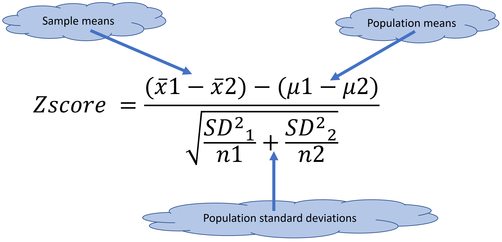

# Two sample tests {}
Two sample tests are for cases in which you want to compare two independent samples. Like:

Are the students in school A yielding better math scores than students in School B?.

Are apples heavier than oranges?.

The premise is that the more similar the two samples, the less likely they are to be significantly different.

```{r, out.width = "70%", echo= FALSE, fig.align = 'center',fig.cap = 'Two populations with different means, n=5'}
knitr::include_graphics("images/OverlapAndPvalue.gif")
```


These types of questions can be answered with either the Z-test or the T-Test, which we will introduce in this chapter. Both of these tests are suited for two-sample tests, but the Z-test is preferred to the t-test for large samples (n > 30) or when the population variance is known.

```{r, out.width = "70%", echo= FALSE, fig.align = 'center',fig.cap = 'Z-test or T-test?'}
knitr::include_graphics("images/SelectingOnSampleTest.png")
```

At the end of this chapter, you are expected to:

1. Run a two sample Z-test and interpret its results from R.

2. Run a two sample T-test and interprets its results from R.


## The two-sample Z-test by hand {-}

The two-sample Z-test is used to compare the means of two different samples, when you know the population standard deviation and your sample size is larger than 30 individuals.


```{r, out.width = "70%", echo= FALSE, fig.align = 'center',fig.cap = 'Z-test fucntion for two samples'}

```


Lets try an example.

A researcher wants to determine if a given drug is any different than a placebo at affecting physical endurance (i.e, the time it takes to do 20 push-ups).

Nine hundred subjects are given the drug prior to testing, whereas 1000 other subjects receive a placebo.

For the drug group, it took 9.78sec on average (S.D. = 4.05) to do 20 push-ups, whereas the placebo group took 15.10sec on average (S.D. = 4.28).

Does this drug has any effect on physical performance? Let's test this hypothesis at an $\alpha$ of 0.05,or 5%.

Lets start by visualizing these data:

```{r, message=FALSE,warning=FALSE}
Drug_Mean=9.78   
Drug_SDSD=4.05

Placebo_Mean=15.10
Placebo_SD=4.28

SimulatedDrug<- rnorm(10000,Drug_Mean,Drug_SDSD)
SimulatedPlacebo<- rnorm(10000,Placebo_Mean,Placebo_SD)

breaks = seq(-20,40, length.out = 50) #bins for the distribution

#histogram for drug
Drug= hist(SimulatedDrug, xlim=c(-20,40),ylim=c(0, 500),breaks = breaks,  plot = FALSE)

#histogram for Placebo
Placebo= hist(SimulatedPlacebo, xlim=c(-20,40),ylim=c(0, 500),breaks = breaks,  plot = FALSE)


#because you are plotting two distributions, it will be nice to use different colors. and because they likely overlap, you should use semitransparent colors
LightBlue <- rgb(173,216,230,max = 255, alpha = 100) #the function rgb lets your select one color, and the alpha gives you how transparent
DarkRed <- rgb(255,192,203, max = 255, alpha = 95)


#lets plot the first distribution
plot(Drug, main=NA,xlim=c(-20,40),ylim=c(0, 1500),breaks = breaks, xlab = "Time to do 20 push-up (Seconds)",ylab = "Number of people" ,col=LightBlue)

#now add the second distribution to the first plot, using the parameter add=TRUE, or add=T, theya re both the same
plot(Placebo, add=T ,col=DarkRed)  #note how for the parameter col, you indicate the color you create as a variable above
``` 

Lets state the hypotheses:

H0: Drug performance time = placebo  time           The null hypothesis is that the two groups take the same time.

H1: Drug performance time $\neq$ placebo  time      The alternative hypothesis is that they are different.

If you read carefully the question, you will see that the motivation of the researcher was to see if the drug was "any different". I did that on purpose, so you can state the alternative hypothesis accordingly.

Perhaps a better statement could be that the drug is better, in which case the null hypothesis would be greater than, in which case we would need a right-hand test, as oppose to a two-tail test when we asked is they are different. When it comes to statistics, and most things in life, you always do what is written, as that is your supporting evidence.


So what test do we use?. Well, the sample size is larger than 30, so a Z-test seems appropriated.

Lets calculate the Z-score for comparing two samples

```{r, message=FALSE,warning=FALSE}
Drug_Mean=9.78   
Drug_SDSD=4.05
Drug_n =900   #sample size for the drug treatment

Placebo_Mean=15.10
Placebo_SD=4.28
Placebo_n=1000 #sample size for the placebo treatment

 
Z_Score_Numerator= (Drug_Mean-Placebo_Mean) -0  #because we assume that the two treatments have the same effect, we then have to assume that the difference between the population means is zero.

Z_Score_denominator= sqrt(((Drug_SDSD^2)/Drug_n)+((Placebo_SD^2)/Placebo_n))
                          
Z_score=Z_Score_Numerator/Z_Score_denominator
Z_score
``` 

By now, we know well that two standard deviations from the mean include 95% of the observations in a normally distributed population. A value that is -27.82 standard deviations away from the mean does not even appear in traditional z-tables, so we can certainly reject the null  hypothesis and conclude that this drug is indeed different than a placebo.

## The two-sample Z-test in R {-}
We can run such a test in R, using the package BSDA, and its function z.test. Lets try it.

```{r, message=FALSE,warning=FALSE,results='hide'}
# install.packages("BSDA")   #first install the library, if you have not this library installed....simply remove the # sign and run this line
library ("BSDA")           #load the library

Drug_Mean=9.78   
Drug_SDSD=4.05
Drug_n =900   #sample size for the drug treatment

Placebo_Mean=15.10
Placebo_SD=4.28
Placebo_n=1000 #sample size for the placebo treatment

zsum.test(mean.x=Drug_Mean, sigma.x = Drug_SDSD, n.x = Drug_n,
          mean.y = Placebo_Mean, sigma.y = Placebo_SD, n.y = Placebo_n, 
          alternative = "two.sided", mu = 0,conf.level = 0.95)


#the parameters needed to run a Z-test are self-explanatory, similar to the one-sample test. x would indicate the data for the drug and y the data for the placebo. In this case, we are testing a two-tail hypothesis.

``` 

```{r, out.width = "70%", echo= FALSE, fig.align = 'center',fig.cap = 'Z-test results for two samples from R'}

```


## The two-sample T-test by hand {-}
We perform a Two-Sample t-test when we want to compare the mean of two samples, and our sample sizes are smaller than 30.

```{r, out.width = "70%", echo= FALSE, fig.align = 'center',fig.cap = 'T-test fucntion for two samples'}

```


Lets try an example.

Historically, males have scored 15 points more than girls in a  given exam. No standard deviations exists. To test if this is true today, a researcher performed such a test in 10 males and 10 females and found that males scored 630.1 on average (+/- 13.42SD) and females 606.8 (+/- 13.14 SD). He wants to test the significance of this conclusion with a $\alpha$ value (significance level) of 0.05.

Let's start by stating the hypotheses:

H0: Men scores -(minus) Female scores <= 15,   The null hypothesis is the complement of the alternative hypothesis, so set that one first

H1: Men scores-Female scores > 15              The question of interest is that males get 15 points more than females. So the difference between male and female scores is larger than 15 points.

What test to use?. Well the sample size is smaller than 30, so we need to use a T-Test.

And before we do any calculations, lets start by visualizing these data:


```{r, message=FALSE,warning=FALSE}
Males_Mean=630.1  
Males_SDSD=13.42

Females_Mean=606.8
Females_SD=13.14

SimulatedMales<- rnorm(10000,Males_Mean,Males_SDSD)
SimulatedFemales<- rnorm(10000,Females_Mean,Females_SD)

breaks = seq(500,700, length.out = 50) #bins for the distribution

#histogram for drug
Males= hist(SimulatedMales,breaks = breaks,  plot = FALSE)

#histogram for Placebo
Females= hist(SimulatedFemales, breaks = breaks,  plot = FALSE)


#because you are plotting two distributions, it will be nice to use different colors. and because they likely overlap, you should use semitransparent colors
LightBlue <- rgb(173,216,230,max = 255, alpha = 100) #the function rgb lets your select one color, and the alpha gives you how tranparent
DarkRed <- rgb(255,192,203, max = 255, alpha = 95)


#lets plot the first distribution
plot(Males, main=NA,xlim=c(500,700),ylim=c(0, 1500),breaks = breaks, xlab = "Score test",ylab = "Number of people" ,col=LightBlue)

#now add the second distribution to the first plot, using the parameter add=TRUE, or add=T, they are both the same
plot(Females, add=T ,col=DarkRed)
``` 

Lets calculate the T-score for comparing two samples:

```{r, message=FALSE,warning=FALSE}
Males_Mean=630.1  
Males_SDSD=13.42

Females_Mean=606.8
Females_SD=13.14

SampleSize= 10  #we can use this variable for both males and females, since in both cases 10 people were analyzed

 
T_Score_Numerator= (Males_Mean-Females_Mean) -15  #because we assume that males score 15 point more, we need to assume that the difference between the population means is 15 points

T_Score_denominator= sqrt(((Males_SDSD^2)/SampleSize)+((Females_SD^2)/SampleSize))
                          
T_score=T_Score_Numerator/T_Score_denominator
T_score
``` 


Next, look for the t-critical value in the t-table for 18 degrees of freedom. In the case of a two sample t-test, degrees of freedoms are equal to the sample size one plus sample size two minus two) and a level of significance $\alpha$ of 0.05 (Here we are looking at one tail test, as the alternative hypothesis states that one mean is larger than the other).

```{r, out.width = "100%", echo= FALSE, fig.align = 'center',fig.cap = 'R-results for a one-sample z-test'}
knitr::include_graphics("images/TTable.jpg")
```

So the critical t-Score is 1.734.

Since our calculated t-value (i.e., 1.397465) was smaller than the critical t-value (1.734), we **fail to reject the null hypothesis**. Males doe not get 15 points higher than females in this exam as it has been historically.

## The two-sample T-test in R {-}

We can run a T-test in R, using the package BSDA, and its function tsum.test. Lets try it.

```{r, message=FALSE,warning=FALSE,results='hide'}
library ("BSDA")           #load the library
Males_Mean=630.1  
Males_SDSD=13.42

Females_Mean=606.8
Females_SD=13.14

SampleSize= 10

tsum.test(mean.x=Males_Mean, s.x = Males_SDSD, n.x = SampleSize,
          mean.y=Females_Mean, s.y = Females_SD, n.y = SampleSize,
          alternative = "greater", mu = 15, conf.level = 0.95)


#the parameters needed to run a T-test are self-explanatory. x parameters would be for males and y parameters for females, mu is the expected difference between the population means, which we know from the example is 15 score points

``` 
```{r, out.width = "100%", echo= FALSE, fig.align = 'center',fig.cap = 'R-results for a two-sample T-test'}
knitr::include_graphics("images/T Two SampleTestResultsR.png")
```


## Homework {-}

For each of the problems below do:

1. State the null and alternative hypothesis.
2. will this be a one tail or two-tail test?.
3. Indicate the type of test to use (Z-test or T-test).
4. Run the given test in R.
5. Report your results on top of a publication quality plot.
6. Describe your conclusion.

**Problem 1:**
Two competing headache remedies claim to give fast-acting relief. An experiment was performed to compare the mean lengths of time required for bodily absorption of brand A and brand B headache remedies. The lengths of time in minutes for the drugs to reach a specified level in the blood were recorded. Results were are follow:

Brand A: Mean time= 21.8 min; sd= 8.7 min; n=500.

Brand B: Mean time= 18.9 min; sd= 7.5 min; n=350.

Are the two drugs different?. Test this at a significance level of 0.05

**Problem 2:**
A consumer group is testing two camp stoves. To test the heating capacity of a stove, it measures the time required to bring 2 quarts of water from 50°F to boiling (at sea level). The following results are obtained:

Model 1: Mean time = 11.4 min; sd= 2.5 min; n= 10 stoves.

Model 2: Mean time = 9.9 min; s2=3.0 min; n=12 stoves.

Assume that the time required to bring water to a boil is normally distributed for each stove.  Is there any difference between the performances of these two models? Use a 5% level of significance.

