# Multiple sample test {}
This chapter describes the mathematical approach to check for differences among independent groups, or so-call ANOVA test (or Analysis of Variance). Although the name of the technique refers to variances, the main goal of ANOVA is to investigate differences among means.


There are numerous ways in which you can look for differences among groups, which will determine the type of ANOVA to use. Lets check some examples, to clarify the distinctions.

Say the International Olympic Association wants to endorse an energy drink for its athletes and two different companies send samples of their products.

A first order question could be if the drinks make any difference in the endurance of the athletes. And you can compare, say the times running 100m for groups of athletes given the two types of drinks and a control given water. In this case, you want to test, if at least one of the three groups is different, and in this case, you will use what is call a **one-way ANOVA**. You only have one factor, which is the drink type. 

```{r, out.width = "50%", echo= FALSE, fig.align = 'center',fig.cap = 'One-Way ANOVA'}
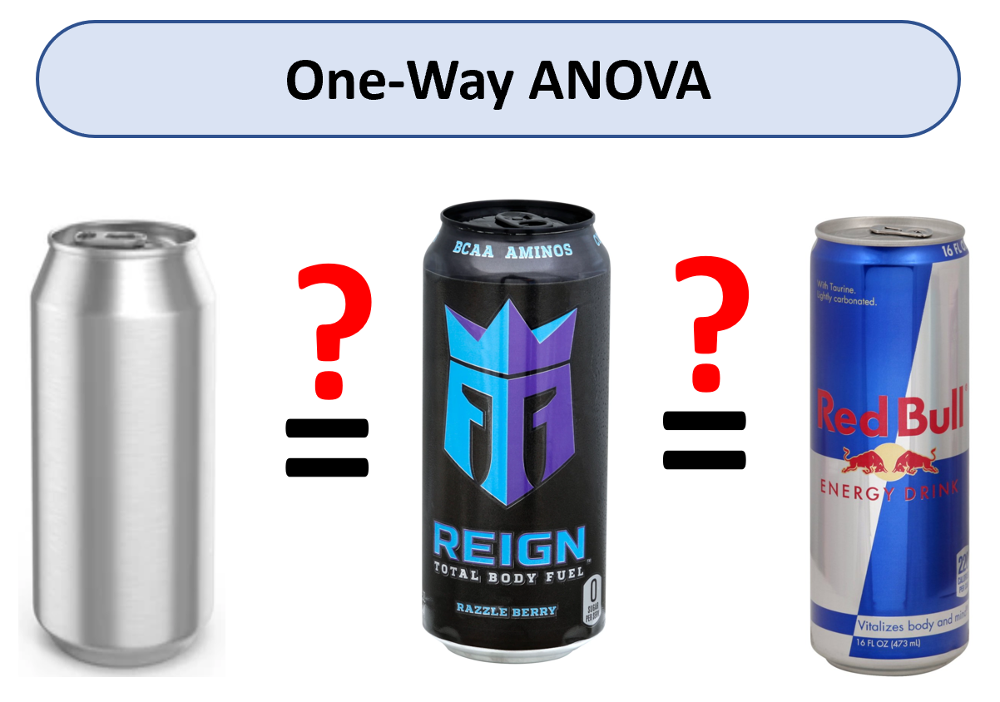
```


Say, however, that you are also interested in knowing if such an effect varies between men and females. In this case, you have two factors and you will need to know the effect of the drink and the effect of gender. For this type of cases, you will use what is called a two-way ANOVA.You have two factors (drink type and gender).

```{r, out.width = "70%", echo= FALSE, fig.align = 'center',fig.cap = 'Two-Way ANOVA'}
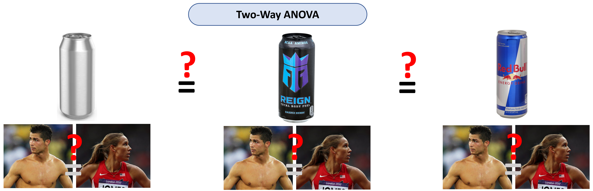
```

If now you want to check for the effect of the drinks among different types of sports, you will now have a third factor (sport type), and then you will use a three-way ANOVA, as you have three factors: drink type, gender, and sport type.


In this course, we will study only one-way  ANOVAS. You should also be aware that to run an ANOVA you need to test for different key assumptions, which we will study later in this chapter.

1. The data are normally distributed. As mentioned earlier, this assumption is key to all types of parametric tests. Basically, we need to know the data follows a bell shape, such that we can approximate the distribution of data.

2. The variances among the different groups have to be homogeneous, or so-call homogeneity of variance. As we will learn soon, ANOVA is based on the ratio of the variance between groups and the variance within groups. So if variances are non homogeneous among groups this could bias the ANOVA test.

3. The observations are independent.

4. No outliers are present.


At the end of this chapter, you are expected to:

1. Run an ANOVA in R, and interpret its results.

2. Run a post-hoc test, identify differences among specific pairs of groups.    

## ANOVA reasoning {-}
Before we get to deep into mathematical equations, we should learn the overall idea of testing for significant differences among groups.

When you are comparing different groups of observations, you can divide the variance in the data in three different ways: 

```{block2, type='rmdnote'}
If you recall from Chapter 5, the variance is simply the summation of the difference between each observation and the mean squared (Sum of Squares) divided by the number of observation minus one (Degrees of freedom). Basically, the variance is the Sum of Squares (SS) divided by the Degrees of freedom.
```

To better visualize the approach, we will keep the sum of squares and the degrees of freedom separated for each component.

1. **Total variance**: Let's calculate the Total Sum of Squares (SSt). Basically, forget that the observations belong to any group, and simply calculate the the difference from each observation to the **grand mean**, square each value and sum them all. We can also calculate the total degrees of freedom (DFt), which is simply the total number of observations minus one.

```{r, out.width = "70%", echo= FALSE, fig.align = 'center',fig.cap = 'Total Sum of Squares and degrees of freedom, DF'}
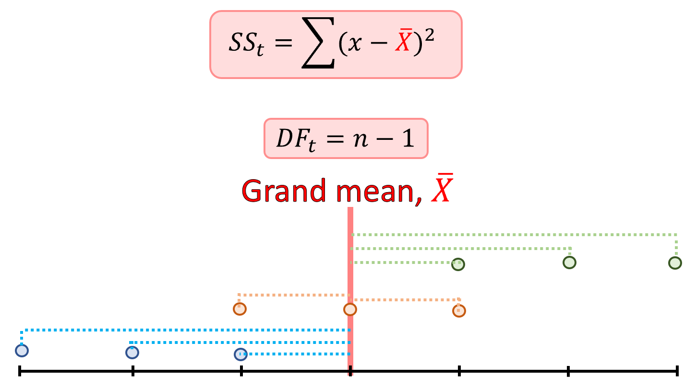
```

That total variance can be now divided in *between* and *among* groups:

```{r, out.width = "70%", echo= FALSE, fig.align = 'center',fig.cap = 'Between and within group variance'}
knitr::include_graphics("images/ANOVA.png")
```

2. **Between groups variance**: This is the fraction of the total variance that is due to variations between groups. The Sum of Square for between groups (SSb) is simply the difference between each group mean and the grand mean times squared and multiplied by the number of observations in each group. We can also calculate the between group degrees of freedom (DFb), which is simply the total number of groups minus one. If this case we are only obtaining information from the groups.

```{r, out.width = "70%", echo= FALSE, fig.align = 'center',fig.cap = 'Between group variance and degrees of freedom, DF'}
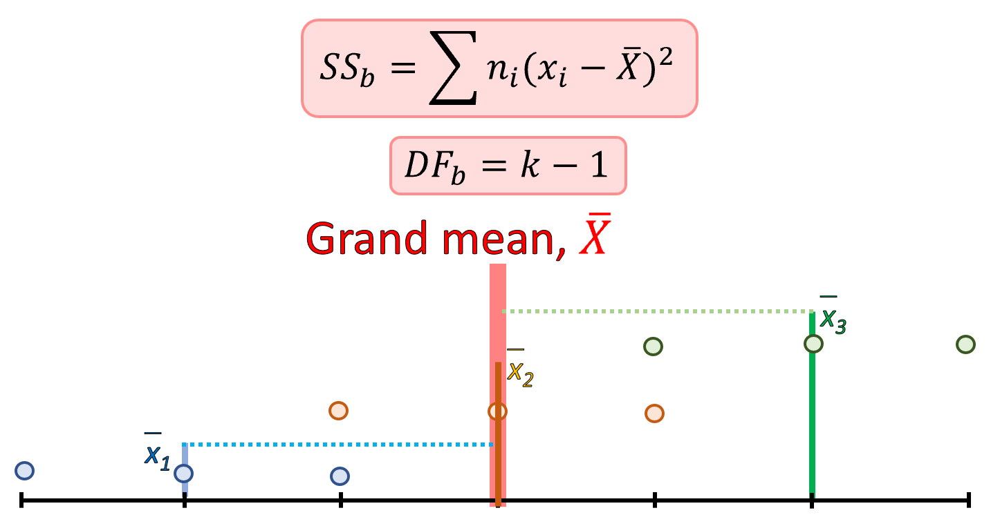
```


3. **Within groups variance**: This is the fraction of the total variance that is due to variations within groups. The Sum of Square for within groups (SSw) is simply the summation of the difference between each observation in a group and the mean of that group squared. We can also calculate the within group degrees of freedom (DFw), which is simply the total number of observation (n) minus one times the total number of groups (k).

```{r, out.width = "70%", echo= FALSE, fig.align = 'center',fig.cap = 'Within group variance and degrees of freedom, DF'}
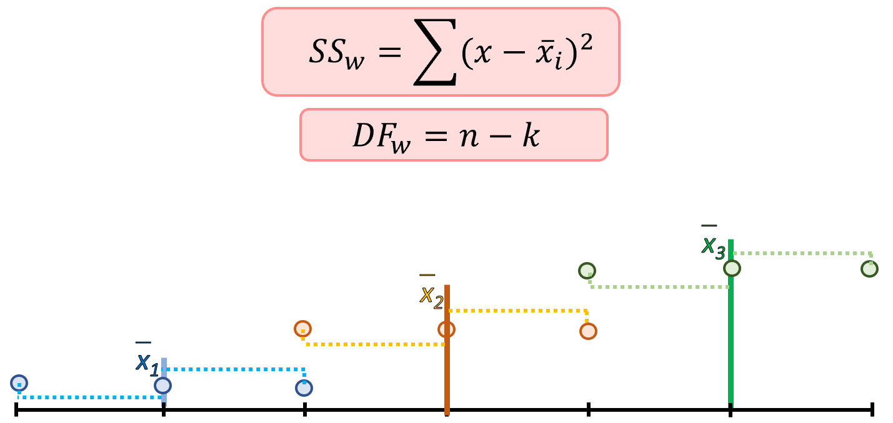
```

If you take the within and between group variance and the within and between degrees of freedom and add them up, you will get the total variance and total degrees of freedom.

The idea behind the ANOVA is to estimate the ration of the variance between groups to the variance within groups, what is also called the F-statistics, after Sir Ronald A. Fisher, who came out with this idea back in the 1920s.

```{r, out.width = "70%", echo= FALSE, fig.align = 'center',fig.cap = 'F-statistics or ratio of between group variance to within group variance'}
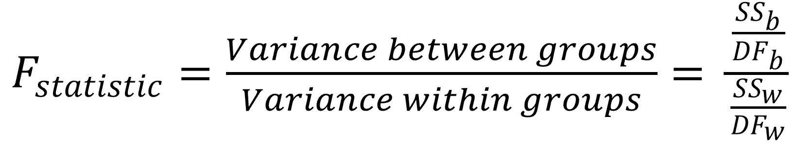
```


If you simply divide the variance between groups by the variance within group, and the the resulting F-value is smaller than one, it indicates that there are no significant difference between the means of the samples being compared.

However, a higher ratio implies that the variation among group means are greatly different from each other compared to the variation of the individual observations in each groups.


## ANOVA by hand {-}

Lets run an ANOVA by hand.

Say a farmer is interested in finding out if there are differences between three available varieties of tomatoes. These were the numbers of tomatoes by the tree varieties:

Variety A = 3, 2, 1

Variety B = 5, 3, 4

Variety C = 5, 6, 7


### Stating Hyphotheses {-}
We start by stating the hypotheses

Ho: Mean Variety A = Mean Variety B  = Mean Variety C 

Ha: Mean Variety A $\neq$ Mean Variety B  $\neq$ Mean Variety C 

Lets test these hyphothses using a level of siginifvnace $\alpha$ of 0.05.

### Total variance {-}
Next we calculate the total variance:

```{r, out.width = "70%", echo= FALSE, fig.align = 'center',fig.cap = 'Total variance and degrees of freedom, DF'}
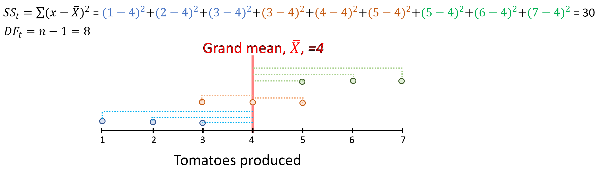
```

### Between group variance {-}
Next we calculate the variance between groups. In other words, how each group mean differs from the grand mean:

```{r, out.width = "70%", echo= FALSE, fig.align = 'center',fig.cap = 'Between group variance and degrees of freedom, DF'}
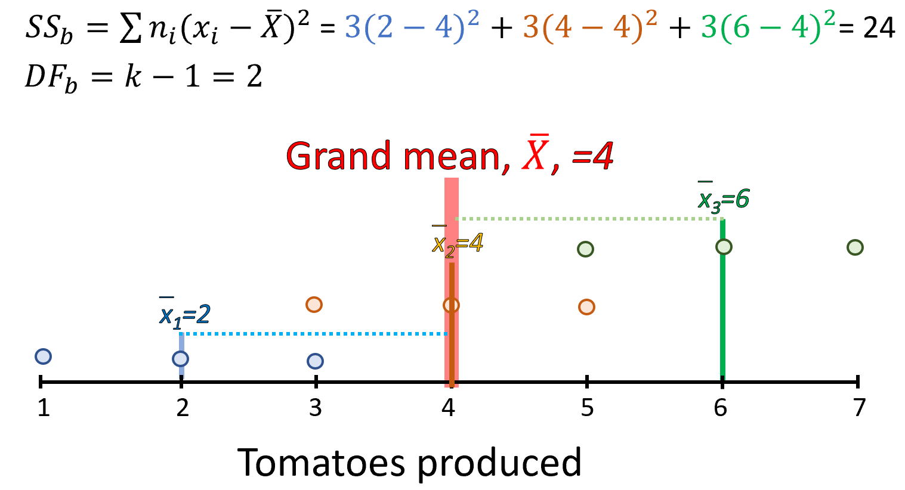
```


### Within group variance {-}
Next we calculate the within group variance. Basically, how each observation differs from the group mean.

```{r, out.width = "70%", echo= FALSE, fig.align = 'center',fig.cap = 'Within group variance and degrees of freedom, DF'}
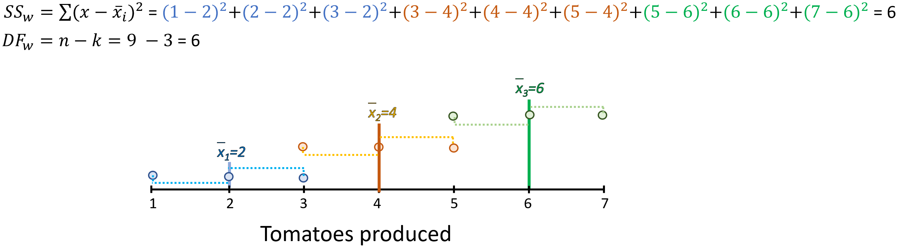
```

### Variance partitioning {-}

As indicated earlier, the within and between group variance and degrees of freedom should add up to the total variance and total degrees of freedom. Lets check this by putting the results above together:

```{r, out.width = "70%", echo= FALSE, fig.align = 'center',fig.cap = 'Within and between group Sums of Aquares and degrees of freedom, DF'}
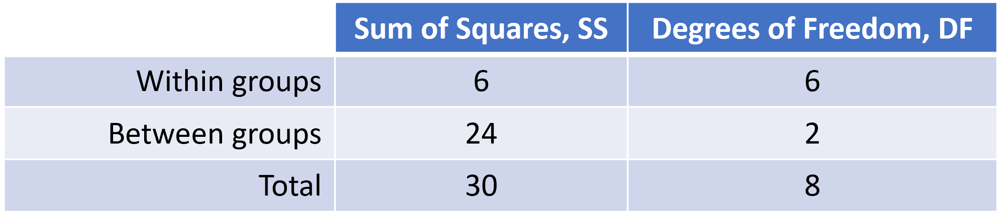
```

### F-Statistics {-}

The F-statistics is simply the ratio of the between group to the within group variance.

```{r, out.width = "70%", echo= FALSE, fig.align = 'center',fig.cap = 'Within group variance and degrees of freedom, DF'}
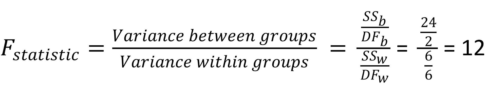
```
So, our F-statistic is 12. The fact that is larger than one provides good hints that this could be significant. But we still need to find out for the given degrees of freedoms, number of groups and level of significance ($\alpha$), what is the critical F-Value.

If our calculated F-value is larger, we reject the null hypothesis and conclude that indeed there are significant differences...same drill as we have done before.

### Critical F-value {-}
The last step in the ANOVA is to find out the critical F-Value, which we get from a F-table for the given $\alpha$. These tables are available on most statistics books or online (Example [HERE](http://www.socr.ucla.edu/Applets.dir/F_Table.html). )

You need to select the specific table for the given ($\alpha$), the columns will represent the between degrees of freedom, and the rows the within group degrees of freedom. In our case, the between degrees of freedom is 2, and our within group degrees of freedoms is 6. 

```{r, out.width = "70%", echo= FALSE, fig.align = 'center',fig.cap = 'Within group variance and degrees of freedom, DF'}
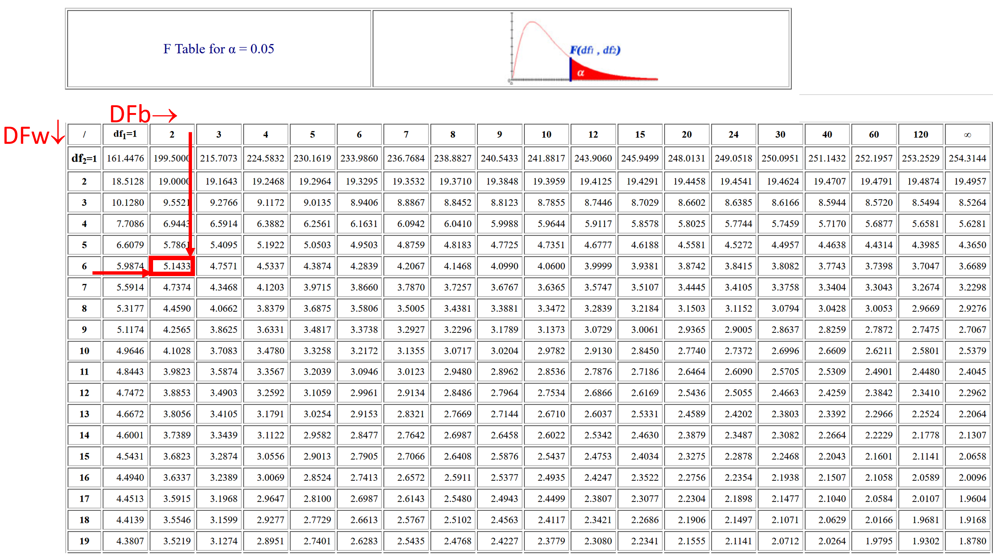
```

At the interception of column DF=2 and row DF= 6, is the cell 5.1433, which is our critical F-statistics.

Just to remember, our calculated F-statistics was 12, which is much larger than the critical F-statistics at $\alpha$ 0.05, which is 5.1433.

Thus, we reject the null hypothesis and conclude that indeed there are significant differences in the amount of tomatoes produced by the three varieties at level of significance of 0.05.

### Ploting the data {-}
As it is always the case, we should visualize the data. In this case, a box plot could be an effective visualization tool.

```{r, message=FALSE,warning=FALSE}
library(tidyverse)
library(ggpubr)
library(rstatix) # we load this libraries, which we use to sumamrise the results

#We start by putting the data in a dataframe, which two columns. one for the variety type, and the other for the number of tomatoes 
Data=data.frame(Variety=c(rep("VarA",3),rep("VarB",3),rep("VarC",3)), NumTomatoes=c(1,2,3, 3,4,5, 5,6,7))

ggboxplot(Data, x = "Variety", y = "NumTomatoes")
``` 

Boxplots allow you to visualize the mean and the standard deviations of each group. From the plot above, you can see clearly that not only the mean tomato production of the three varieties are difference, but their variances do not overlap.

## ANOVA in R {-}
There are numerous R-packages that allow you to run ANOVAs, lets try a couple:
```{r, message=FALSE,warning=FALSE}
library(tidyverse)
library(ggpubr)
library(rstatix) # we load this libraries, which we use to sumamrise the results

#We start by putting the data in a dataframe, which two columns. one for the variety type, and the other for the number of tomatoes 
Data=data.frame(Variety=c(rep("VarA",3),rep("VarB",3),rep("VarC",3)), NumTomatoes=c(1,2,3, 3,4,5, 5,6,7))

#The ANOVA function is anova_test, which simply requires the response variable (number of tomatoes in our case) equal to the independent variable or factor (Variety of tomatoes in our case)
res.aov <- Data %>% anova_test(NumTomatoes ~ Variety)
``` 

The results are identical to our hand calculations:
```{r, out.width = "70%", echo= FALSE, fig.align = 'center',fig.cap = 'Anova in R using anova_test'}
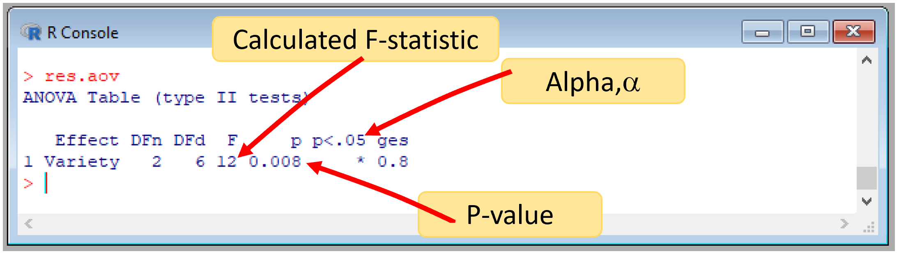
```


We can also run an ANOVA in R using the aov function, which is part of the default functions in R.
```{r, message=FALSE,warning=FALSE,results='hide'}
Data=data.frame(Variety=c(rep("VarA",3),rep("VarB",3),rep("VarC",3)), NumTomatoes=c(1,2,3, 3,4,5, 5,6,7))

aovAnova <- aov(NumTomatoes ~ Variety, data = Data)
```

The results are identical to our hand calculations:
```{r, out.width = "70%", echo= FALSE, fig.align = 'center',fig.cap = 'Anova in R using aov'}
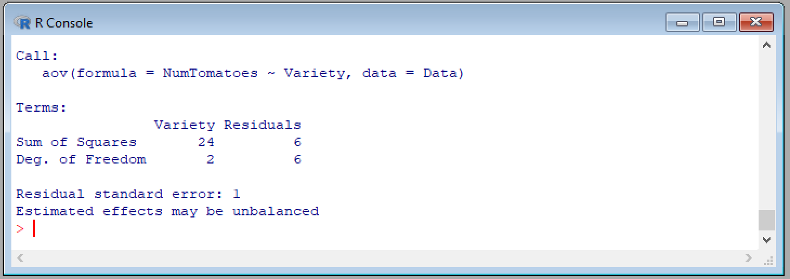
```

You can see a different set of results from the aov function, using the summary function.

```{r, message=FALSE,warning=FALSE,results='hide'}
Data=data.frame(Variety=c(rep("VarA",3),rep("VarB",3),rep("VarC",3)), NumTomatoes=c(1,2,3, 3,4,5, 5,6,7))

aovAnova <- aov(NumTomatoes ~ Variety, data = Data)
summary(aovAnova)
```

```{r, out.width = "70%", echo= FALSE, fig.align = 'center',fig.cap = 'Anova in R using aov'}
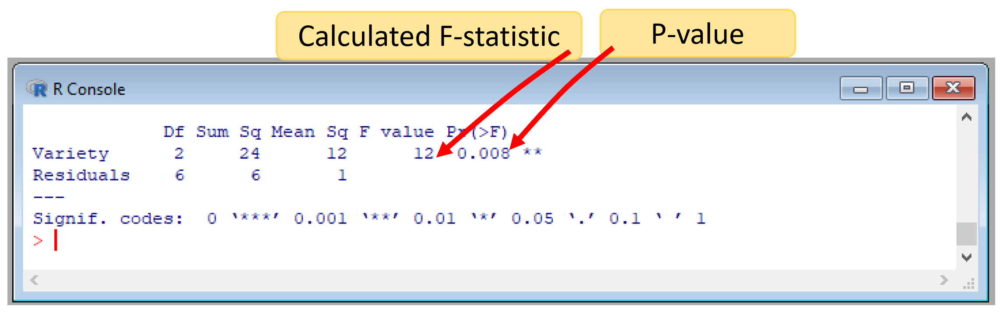
```


## Post-hoc test in R {-}
A significant one-way ANOVA means that at least one of the group means is different from the other ones. But which ones are different?. 

To find this out, you need to run what is called a post-hoc test, which basically compares all possible pair-wise comparisons to find out, which ones are different.

In R, we can run a post-hoc test with the R function: tukey_hsd() [from the packgae rstatix].

Lets try:

```{r, message=FALSE,warning=FALSE}
library(tidyverse)
library(ggpubr)
library(rstatix) # we load this libraries, which we use to sumamrise the results

#We start by putting the data in a dataframe, which two columns. one for the variety type, and the other for the number of tomatoes 
Data=data.frame(Variety=c(rep("VarA",3),rep("VarB",3),rep("VarC",3)), NumTomatoes=c(1,2,3, 3,4,5, 5,6,7))

pwc <- Data %>% tukey_hsd(NumTomatoes ~ Variety) #PairWise Comparisons
pwc
``` 
From that comparison, you can tell that there are significant differences between Variety A and Variety C only. Cool, ah?. 

By looking at the plot, one could have concluded that they are all different. But if you look at the actual data, you will see that variety B, have data in common to varieties A and C, which given the small sample size, led to those pairs to be similar.


## Checking assumptions {-}
Perhaps the first step in doing an ANOVA is to test the different assumptions. But I decided to leave that for last in this chapter, so we could get to understand what the ANOVA is meant to do first.

### Outliers {-}
Outliers can be easily identified using box plot method we used early but spotted mathematically with the R function identify_outliers() [from the rstatix package].

```{r, message=FALSE,warning=FALSE}
Data %>%  group_by(Variety) %>% identify_outliers(NumTomatoes)
``` 
The result of this function yields zero rows meaning that there were not outliers in our database. Should there be outlier, it is recommended to run the analysis with and without them, to see the level of the effect and for you to make a judgment call on whether to remove them or now, and justify any choice you make.

### Normality {-}

The normality assumption can be checked by using one of the following two approaches:

Analyzing the ANOVA model residuals to check the normality for all groups together. This approach is easier and it’s very handy when you have many groups or if there are few data points per group.

To check normality with model residuals, we use QQ plot and Shapiro-Wilk test. QQ plot draws the correlation between a given data and the normal distribution.

```{r, message=FALSE,warning=FALSE}
# Build the linear model
model  <- lm(NumTomatoes ~ Variety, data = Data)
# Create a QQ plot of residuals
ggqqplot(residuals(model))
``` 

From the plot, you can see all values are within the confidence limits expected under normality, but some deviations occurred. The data are prefrecting normal, when each point fall long the normality line (black line in the plot above).

The second method check normality for each group separately, using the Shapiro-Wilk test. This approach might be used when you have only a few groups and many data points per group.

```{r, message=FALSE,warning=FALSE}
# Build the linear model
model  <- lm(NumTomatoes ~ Variety, data = Data)
# run the Shapiro test
shapiro_test(residuals(model))
``` 

This analysis reveals that the data we used is not-normally distributed. In this specific case, it is because we have such a small sample size. And this deviation should not affect our results significantly. Commonly, however, we should transform the data (e.g., applying a log function to each value) to normalize the data. Different data transformations are vailable, and they will need to be run, and tested for normality, before running an ANOVA.

### Homogneity of variance {-}

The Homogeneity of variance can be checked by plotting the residuals versus fits valued.

```{r, message=FALSE,warning=FALSE}
plot(model, 1)
``` 

In the plot above, there is no evident relationships between residuals and fitted values (the mean of each groups), which is good. So, we can assume the homogeneity of variances.

One can also use the Levene’s test to check the homogeneity of variances:
```{r, message=FALSE,warning=FALSE}
Data %>% levene_test(NumTomatoes ~ Variety)
``` 


From the output above, we can see that the p-value is > 0.05, which is not significant. This means that, there is not significant difference between variances across groups. Therefore, we can assume the homogeneity of variances in the different treatment groups.

## Homework {-}

For the problem below do:

1. State the null and alternative hypothesis.
2. Indicate the type of test to use.
3. Test for the assumptions of outliers, normality and homogeneity of variances.
3. Run the ANOVA in R.
4. Report your results on top of a publication quality plot.
6. Describe your conclusion.

**Problem:**
A researcher has grown plants under ambient CO2, and two CO2 treatments in which he increased CO2 by 50ppm (Treatment1) and 100ppm (Treatment2). The weight of the plants in grams were:

Control      = 4.81,	4.17,	4.41,	3.59,	5.87,	3.83,	6.03,	4.89,	4.32,	4.69

Treatment1   = 4.17,	5.58,	5.18,	6.11,	4.5,	4.61,	5.17,	4.53,	5.33,	5.14

Treatment2   = 6.31,	5.12,	5.54,	5.5,	5.37,	5.29,	4.92,	6.15,	5.8,	5.26


Test for significant differences among those three groups using a significant level of 0.05.


