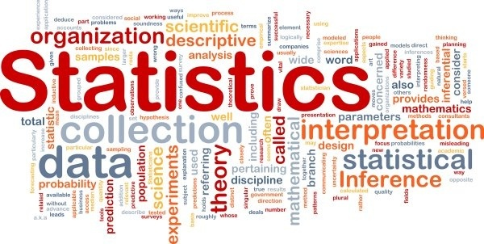
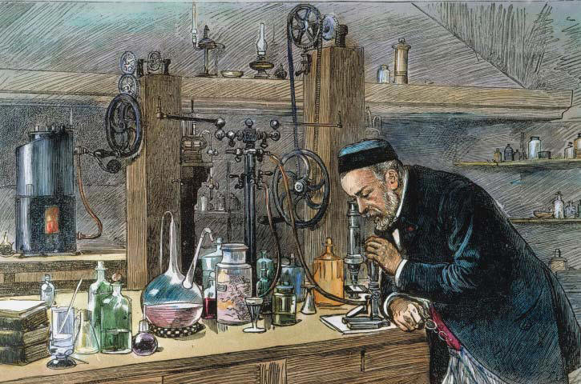
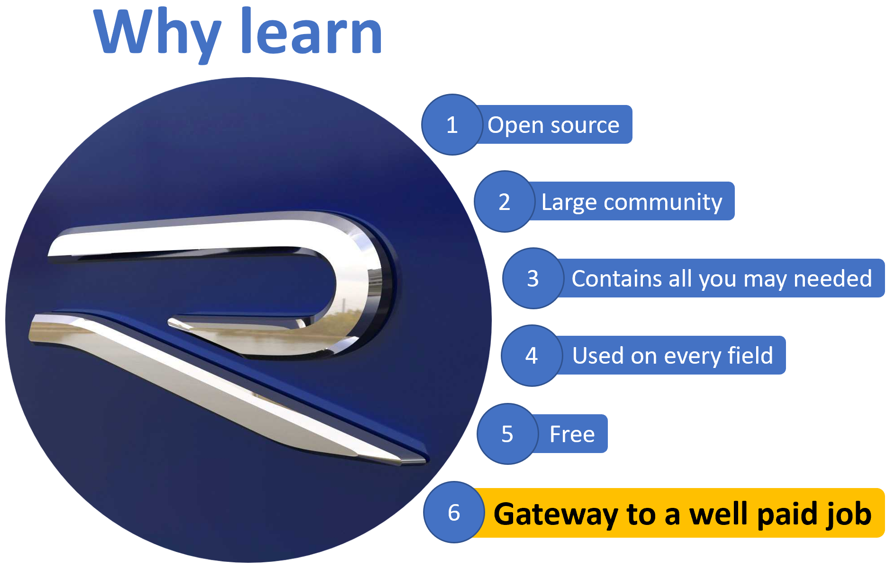

# Welcome {-}

Welcome to GEOG 380 Statistical Methods.
<center>
<iframe width="560" height="315" src="https://www.youtube.com/embed/gd0uY5tJrvk" frameborder="0" allow="accelerometer; autoplay; clipboard-write; encrypted-media; gyroscope; picture-in-picture" allowfullscreen>
</iframe>
</center>

```{js, echo = FALSE}
title=document.getElementById('header');
title.innerHTML = '' + title.innerHTML
```

# Introduction {-}


Most people gets turn off by statistics; but the reality is that Stats have not only allow human development, but we use stats, without even knowing, for almost every life choice that we make.

In theory, Statistics requires some mathematical background, but in practice, stats are simply creating knowledge/information from observations/data.

```{block2, type='rmdtip'}
**Definition**
Statistics is the approach by which knowledge is extracted from data. 
```

Let me provide an example that I find pretty cool.

In the late 1879, just before going into holidays, Louis Pasteur told one of his assistants to inject chickens with a fresh culture of Cholera as part of an experiment to find a vaccine.

By the way, thanks to this guy, Pasteur, you have milk for breakfast this morning; he was the one who discovered Pasteurization or the process to sterilize food without damaging its flavors, which allowed to store highly perishable foods for long time.

Moving on with the story… I presume Pasteur’s assistant have a few other things to do that day, or may be he just wanted to go to his holidays; he not only forgot to inoculate the chickens, he left the bacterial culture outside.

A month later, upon returning from holidays, the assistant injected the chickens with the old culture, but nothing happened to the chickens.

For a moment, put yourself in the position of Pasteur and think what you would have done?.

Sad to admit, but I probably would have been upset. I would have interpreted the action as careless, plus what a psychological torture for the poor chickens staring for a month to a lethal doses of bacteria.

In addition, and more sadly, I probably would have interpreted the results of nothing happening to the chickens, as simply the bacterial culture got ruined from being outside for so long. I would have restarted the experiment with new chickens and new bacterial cultures.

What would you have thought about the result of this “failed” experiment?. Take a moment to think.

```{r, out.width = "100%", echo= FALSE, fig.align = 'center',fig.cap = 'Pasteur'}

```

Intriguingly, Pasteur told the assistant to inoculate the chickens again with fresh bacterial cultures and after a while they observed that the chickens got mildly sick but they did not succumb to the deadly bacteria. The chickens were immune to the bacteria.

Essentially, Pasteour just made one of the major discoveries of humanity: a vaccine.

This discovery came to be called Attenuated Vaccine, in which the virulence of bacteria is reduced by oxygen allowing the body to fight the bug.

The method saved millions of chickens, and people as well. The method was used against many other deadly diseases, and put Pasteur in the history books.

Nothing is known about what happened to the lab assistant.

There are several things that made this case a very successful story. Obviously, Pasteur knew very well what he was doing to get even the smallest of hints from what most other people would have interpreted as failure, but he was also very methodic and knew his stats very well. He was able to gather knowledge from observations. He applied statistics very well.

That is a game-changer example about the use of statistics. But as mentioned earlier, stats are used almost all the time, in almost every decision we made.

Even simple things like the clothes that you are wearing right now was a choice you made most likely based on stats.

If this morning was cold, you probably choose to wear a jacked. Feeling cold was you taking data that then you use analytically to make the decision to wear a jacket.

The aim of this class is to give you basic i) methodological, ii) analytical, and iii) data visualization skills on stats.

In a nutshell, I want you to learn how to identify a question, define a protocol to respond it, analyze the data collected, and display your results convincingly.


## Book data collection  {-}

I have introduced numerous "non-belonging" letters throughout this book. I cannot tell you much about these letters other than they are where they do not belong. From now on those letters are called **tokens**.

You need to collect those tokens as you move along and create your own database of tokens. Collect such data as meticulously as you can.

I have a three motivations with this exercise.

Firsts, make you realize the reality of science. At times, data could be clear, and you may find a letter that clearly does not belong where it is. 

Other times, however, you will wonder if the letter was an error or a token. In real life, nature will not clarify things for you. If the data you collect is not right, it will go to become part of the noise in your data.

Second, at the end of this book, you will analyze your data collected in an statistical test.

Finally, I want to ensure you read this book with much detail. 

Good luck with your token hunting.

Here is goes your first token: a

By the way, please do not stress out over the collection of these tokens, they will come as you move along.
 

## What is R? {-}

The second goal of this course is for you to become familiar with the use of R; we may use Microsoft Excel sporadically.


```{r, out.width = "80%", echo= FALSE, fig.align = 'center'}

```

R is like a Rolls-Royce, the king among softwares; a revolutionary free program that has come to become popular in many disciplines; and there are several reasons for this:

Most importantly, it is free.

By its nature of being open-source, thousands of people around the world have contributed their work in the form of “packages”, which has allowed R to increase in scope, being used for almost anything from doing statistical analysis, to figures, to movies, to animations, to videos, you name it.

[R Packages](https://cran.r-project.org/web/packages/) are like the phone apps that you download and install in your phone and that you use to do a diversity of things. Currently, there are more than 16,000 R-Packages, each providing different tools to do almost anything.

There is also a very large group of users willing to help you if you face any struggle. Oh, and they will help you for free, as well.

```{block2, type='rmdtip'}
[Stackoverflow](https://stackoverflow.com/questions/tagged/r) is a web-page were you can find solutions to any problem you may encourter with R. 
```

Online<span style="color: red;">d</span> platforms such as [Stackoverflow](https://stackoverflow.com/questions/tagged/r) have blogs of people helping each other with any issue about R. Every question is nicely cataloged, and at times there may even be alternative solutions to the same problem.

The reality is that with so many millions of people using R, chances are that if you have a problem, someone else probably had the same problem before, and thus, their solution most likely is already ready for you in the web.

Finally, R can handle the load. In R, you can run codes as small as those run in a calculator to as large as those ones run in super computers.

No matter what professional path you take in life, you will have an use for R.


## Do not dispair, please {-}

R will be new to most of you. In addition, I have found over the years teaching this class that there is a large disparity among students in their prior exposure to mathematical concepts, let alone coding. So let’s be realistic, learning R will be hard initially, but, you can do it.

On my part, I have created this online resource of the course as detailed as possible so you can get there by simply following the steps. I also included a comments section at the bottom of each section, so you can communicate any problem to get feedback from everyone.

You will not be penalized for asking a question on the forum, but you may get rewarded if you answer it correctly. You will not be penalized for answering wrong. So please let’s use that discussion platform.

But please be nice when asking and responding questions.

If you get frustrated figuring out how to do something, you have two likely paths.

One is getting upset, which uses about half of your brain power while the other half is trying to figure out the solution. The other path is to cool down, and have your entire brain power working on solving the problem. Which pathway makes the more sense?

Finding solutions to your R problems is a key skill that could save you hours of labor, and we have a dedicated section on how to find answers in the sea of information that is the web.


Using Nathaniel Phillips word’s from his R Bookdown [YaRrr! The Pirate’s Guide to R](https://bookdown.org/ndphillips/YaRrr/), *R is very much like a relationship. Like relationships, there are two major truths to R programming:*

1) There is nothing more frustrating than when your code does not work

2) There is nothing more satisfying than when your code does work!


```{r, out.width = "80%", echo= FALSE, fig.align = 'center',fig.cap="R is like a love relationship, from Nathaniel Phillips"}
knitr::include_graphics("images/rrelationship.png")
```

There will be times, when You will run into error after error and pound your fists against the table screaming: “WHY ISN’T MY CODE WORKING?!?!? There must be something wrong with this stupid software!!!” You will spend hours trying to find a bug in your code, only to find that - frustratingly enough, you had had an extra space or missed a comma somewhere. [Taken from Nathaniel Phillips.](https://bookdown.org/ndphillips/YaRrr/)


If you go through a “nightmare” with R, you are not alone. We all went through that. I have to tell you, it will not go away. The more proficient you become, the more likely you will be to push the boundaries of what is possible and known, so certainly you will have many times in which your codes does not work. Think about Pasteur, at those moments.

There will be a steep learning curve, but while you get there keep cool, do not desperate. If you face any roadblock; first, calm down. Then, have Google help you.

Please think about this: in the next year or so, hopefully, you will be working at a company and/or doing grad school. At that moment, you really need to have mastered the capacity to solve problems by yourself. Gaining that independence will give you a huge advantage.

So it is important for you to figure out what is the best method for you to find solutions to your R problems. Learning how to find solutions to problems in the web will be part of the learning of this class, and later on we will do exercises on this.

If after you have done your best looking for a solution to a problem, but failed, then, reach out to me. I will be happy to help you. but I want to know that before hand you did your best to figure out the solution to your problem on your own.

Learning R will become increasingly easier over time. As you become more proficient, you will start making more sophisticated things with R. When it comes to doing things, with R, the sky is the limit.
R would become nicer to you over time, from Nathaniel Phillips


```{r, out.width = "80%", echo= FALSE, fig.align = 'center',fig.cap="R would become nicer to you over time, from Nathaniel Phillips"}
knitr::include_graphics("images/gosling.png")
```


I want to caution, however, that this course requires a “good quality” “time commitment”.

Note my double intonation on “good quality” and on “time commitment”.

Please study during times you cannot be distracted. I cannot emphasize enough that spending lots of time studying is not the same as studying well.

As codes become longer and more complex, your mind would eventually need to focus to conceptualize the entire code. I can tell you with certainty that it will be much harder, border line impossible, to visualize large codes, if you are to be distracted.

Learning R will not be done in one hour before the exam. So take as much time as you can to study. With practice will come perfection.

Finally, it is worth mentioning that knowing how to use R is a skill that you want to learn. Of all the classes you will take at the University, this is one you want to put on your CV. Saying that you know **R** will be a very desirable skill for any job you end up doing.

<span style="color: blue;">z</span>


